# ARQUITETURA — EducaFlex

**Versão:** 1.0  
**Data:** 04/09/2026  
**Status:** Aprovado para desenvolvimento  
**Autor:** Arquitetura de Software  
**Referências:** [PRD.md](./PRD.md) · [MODELO-DADOS.md](./MODELO-DADOS.md) · [PLANO-BACKEND.md](./PLANO-BACKEND.md) · [PLANO-FRONTEND-MOBILE.md](./PLANO-FRONTEND-MOBILE.md) · [ESTRATEGIA-QA.md](./ESTRATEGIA-QA.md) · [HISTORIAS-USUARIO.md](./HISTORIAS-USUARIO.md)

---

## 1. Visão geral

O **EducaFlex** é uma plataforma de **treinamento corporativo mobile-first** em que colaboradores consomem cursos pelo **app Flutter**, enquanto gestores de RH gerenciam conteúdo, matrículas e métricas via **painel web Next.js**. A **API REST** (NestJS) persiste em **MySQL 8+** e integra streaming de vídeo via **Vimeo ou AWS CloudFront**.

> **Escopo deste documento:** camadas incluídas no MVP v1 conforme [PRD.md](./PRD.md) §2.1 — Mobile App, Front-end Web, Back-end/API, Banco de dados, Login/Contas e Painel admin.

### 1.1 Camadas em escopo — v1 (MVP)

| Camada | Tecnologia | Responsabilidade |
|--------|------------|------------------|
| **Mobile App** | Flutter (Dart) | Login, onboarding, cursos matriculados, player vídeo, leitor artigo, progresso, perfil, notificações in-app, sync sob demanda |
| **Front-end Web** | Next.js (React) | Login gestor, CRUD curso/módulo/aula, matrículas, dashboard conclusão, gestão de usuários |
| **Back-end / API** | NestJS (Node.js) | REST, JWT, papéis ALUNO/GESTOR, sequenciamento, progresso, agregações dashboard, adapters de integração |
| **Banco de dados** | MySQL 8+ | Entidades do domínio; migrations; seed categorias e departamentos |
| **Login / Contas** | API + Mobile + Web | Autenticação, perfis, recuperação de senha (e-mail mockável) |
| **Painel admin** | Next.js | Gestão de cursos, alunos, departamentos e visualização de métricas |

### 1.2 Fora de escopo v1 — roadmap v2+

| Item | Versão | Tratamento arquitetural |
|------|--------|-------------------------|
| **Testes de múltipla escolha** | v2 | `QuizModule`; nota mínima formal (RN-01 completa) |
| **Certificado PDF automático** | v2 | `CertificadoModule` + fila de geração |
| **Ranking / gamificação** | v2+ | `GamificacaoModule`; leaderboard |
| **Push nativo (FCM/APNs)** | v2 | Substituir `NoOpPushAdapter` |
| **Offline playback / download** | v2+ | Cache de mídia local; fila de sync |
| **SSO / LDAP** | v2+ | `SsoModule` |
| **Multi-tenant** | v2+ | `tenant_id` em entidades |

### 1.3 Objetivos arquiteturais

| Objetivo | Decisão |
|----------|---------|
| Simplicidade operacional (~100 usuários) | Monolito modular NestJS; MySQL single-instance; filas in-process ou BullMQ opcional |
| Consistência mobile ↔ web ↔ API | Contratos OpenAPI versionados; DTOs compartilhados via pacote ou geração |
| Somente online (RNF-001) | Sem cache de escrita offline; operações bloqueadas sem rede |
| Sync sob demanda (RNF-002) | Pull-to-refresh mobile; revalidação web após mutações |
| Streaming eficiente (RNF-006) | URLs assinadas via CDN; API não proxy de bytes de vídeo |
| Integrações desacopladas | Adapters com impl mock desde sprint 1 |

### 1.4 Mapeamento regras stakeholder → camadas (v1)

| Regra | Mobile | Web | API | MySQL |
|-------|--------|-----|-----|-------|
| RN-01 Sequenciamento de aulas | UI bloqueio | — | Validação `ProgressoAula` | FK + ordem |
| RN-02 Certificado 100% | — | — | v2 | — |
| RN-03 Matrícula individual/departamento | — | UI matrícula | `MatriculasService` | `matricula` |
| RN-04 Tempo assistido | Heartbeat player | — | PATCH progresso | `tempo_assistido_seg` |
| RN-05 Curso publicado → app | Sync sob demanda | Publicação | Status `PUBLICADO` | `curso.status` |
| RN-06 Gestor cria; aluno consome | Guards cliente | Role GESTOR | `@Roles('GESTOR')` | `usuario.papel` |
| RN-07 Conclusão ≥ 90% duração | Validação local + API | — | Validação servidor | `progresso_aula` |

---

## 2. Diagrama de contexto (C4 — Nível 1)

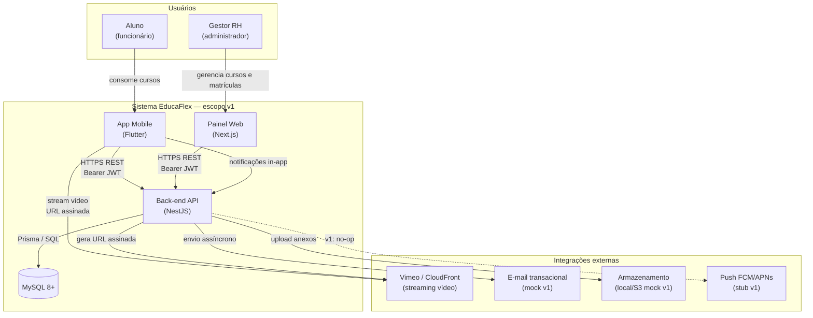

---

## 3. Diagrama de contêineres (C4 — Nível 2)

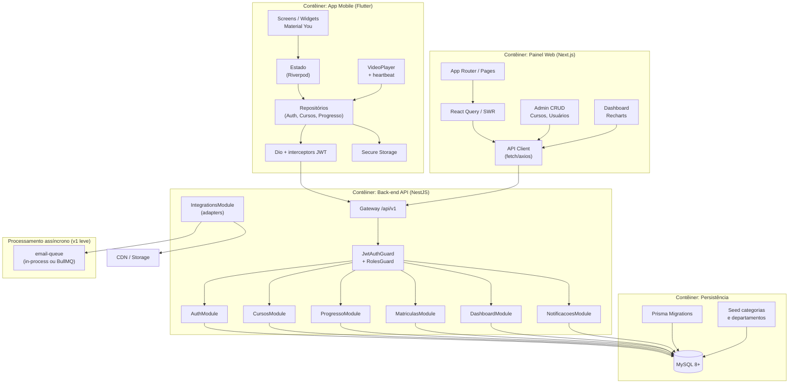

---

## 4. Arquitetura por camada

### 4.1 Mobile App (Flutter)

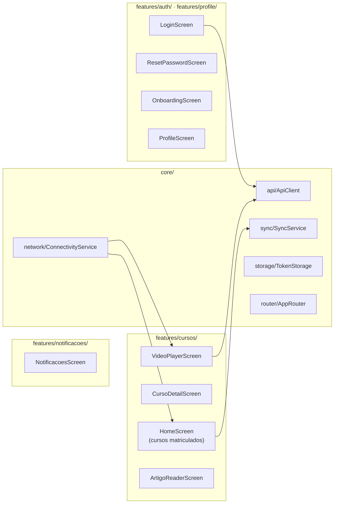

| Módulo | Responsabilidade | Requisitos |
|--------|------------------|------------|
| `features/auth/` | Login, recuperar senha, logout | RF-AUTH-01–05 |
| `features/onboarding/` | Boas-vindas 1x | — |
| `features/cursos/` | Lista, detalhe, player, artigo, conclusão | RF-CURSO, RF-PROG |
| `features/profile/` | Perfil e departamento | RF-AUTH-04 |
| `features/notificacoes/` | Lista in-app | RF-NOTIF-01 |
| `core/sync/` | Pull-to-refresh; refresh pós-escrita | RNF-002 |
| `core/network/` | Detecção offline; bloqueio de escrita | RNF-001 |

**Decisões mobile:**

- **Riverpod** + **GoRouter**; primária `#800000`; Material You com FAB (RNF-008).
- **Somente online:** sem cache persistente de conteúdo; banner quando sem rede; escrita bloqueada (RNF-001).
- **Heartbeat de vídeo:** PATCH a cada 15–30 s com `tempoAssistidoSeg`; flush ao pausar/sair (RN-04).
- **Player:** `video_player` ou `chewie`; URL obtida de `GET /aulas/:id/stream-url`.
- Strings fixas **PT-BR** (RNF-004).

---

### 4.2 Front-end Web (Next.js)

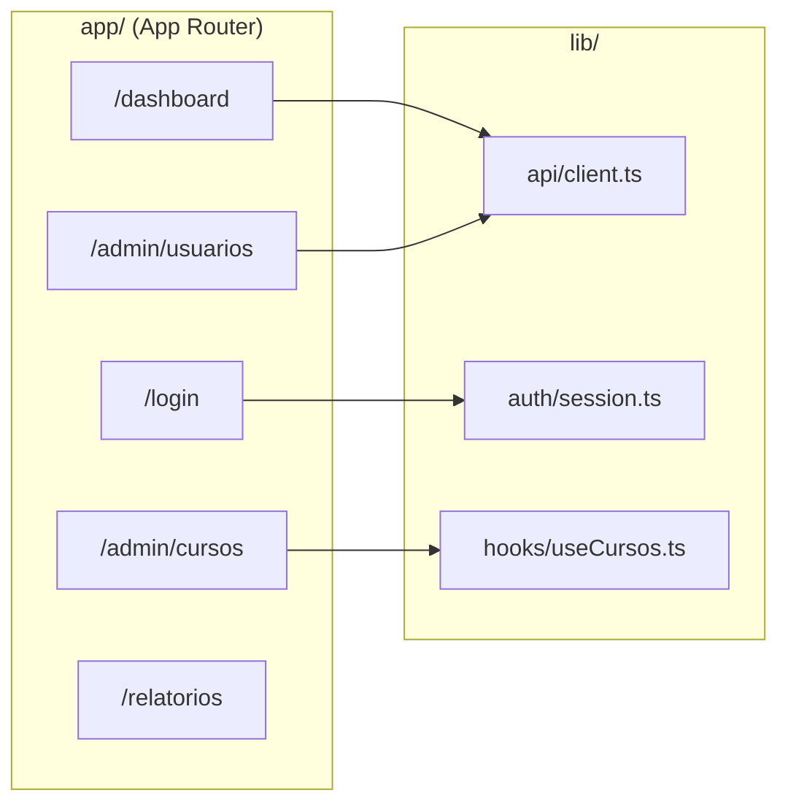

| Área | Rotas v1 | Requisitos |
|------|----------|------------|
| Autenticação | `/login`, `/recuperar-senha` | RF-AUTH |
| Dashboard | `/dashboard` | RF-DASH-01–03 |
| Cursos | `/admin/cursos`, `/admin/cursos/[id]` | RF-CURSO |
| Usuários | `/admin/usuarios`, matrículas | RF-PROG-01–03 |
| Relatórios | `/relatorios` | RF-DASH-02 |

**Decisões web:**

- **App Router** Next.js; layout admin com sidebar limpa; cards KPI `rounded-xl` (RNF-008).
- **React Query** para cache de servidor e invalidação pós-mutação (= sync sob demanda web).
- Guard de rota por papel `GESTOR`; JWT em cookie httpOnly ou memory + refresh strategy.
- Upload de anexos via presigned URL (`StorageAdapter`).

---

### 4.3 Back-end / API (NestJS)

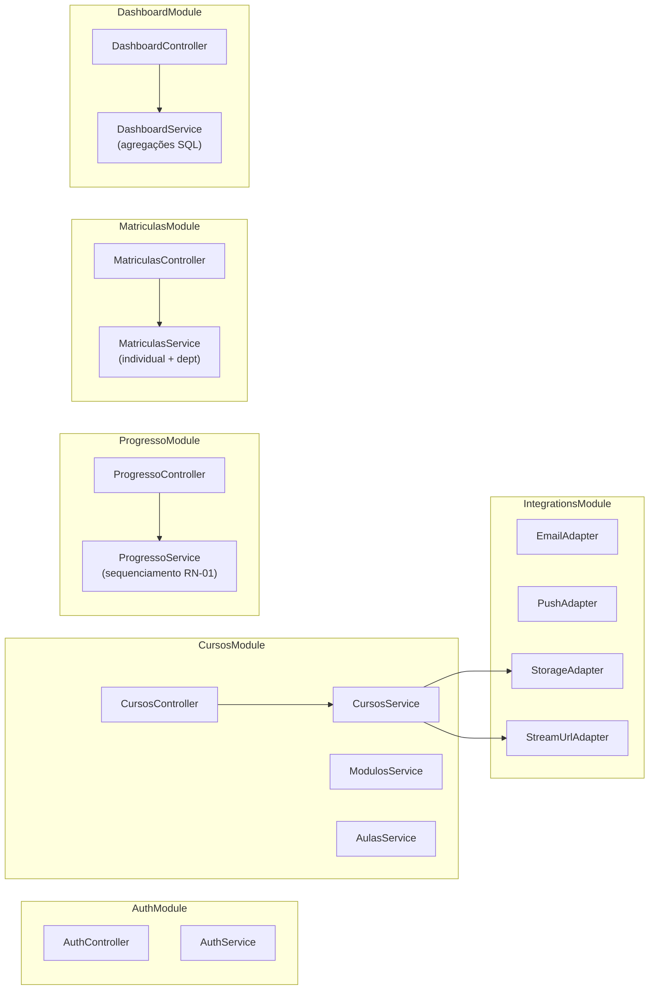

| Módulo | Endpoints principais | Requisitos |
|--------|---------------------|------------|
| `AuthModule` | `/auth/login`, `/auth/forgot-password`, `/auth/me` | RF-AUTH |
| `CursosModule` | CRUD curso, módulo, aula | RF-CURSO |
| `MatriculasModule` | Matrícula individual e por departamento | RF-PROG-01–03 |
| `ProgressoModule` | Tempo assistido, conclusão, stream URL | RF-PROG-04–06 |
| `DashboardModule` | Taxa de conclusão agregada | RF-DASH |
| `UsuariosModule` | Listagem e gestão básica | RF-AUTH |
| `NotificacoesModule` | CRUD in-app | RF-NOTIF |
| `IntegrationsModule` | Adapters e filas | §8 |

**Prefixo global:** `/api/v1` · **OpenAPI:** `/api/docs`.

**Sequenciamento (RN-01 v1):** conclusão da aula anterior obrigatória; nota mínima reservada para v2 (quiz). Ordem global: `modulo.ordem` + `aula.ordem`.

---

### 4.4 Banco de dados (MySQL)

Detalhamento em [MODELO-DADOS.md](./MODELO-DADOS.md).

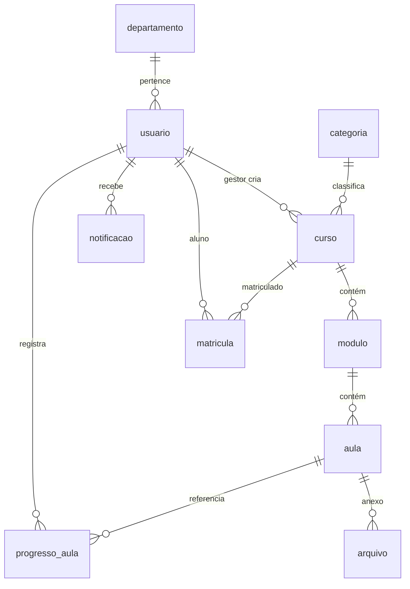

| Aspecto | Decisão |
|---------|---------|
| ORM | Prisma + migrations versionadas |
| Engine | InnoDB; `utf8mb4_unicode_ci` |
| IDs | UUID `CHAR(36)` em entidades principais; `INT` em lookup tables |
| Soft delete | `matricula.removido_em`, `curso.arquivado_em` |
| Índices | `(usuario_id, curso_id)` em progresso; `(curso_id, status)` em matricula |

---

### 4.5 Login / Contas (transversal)

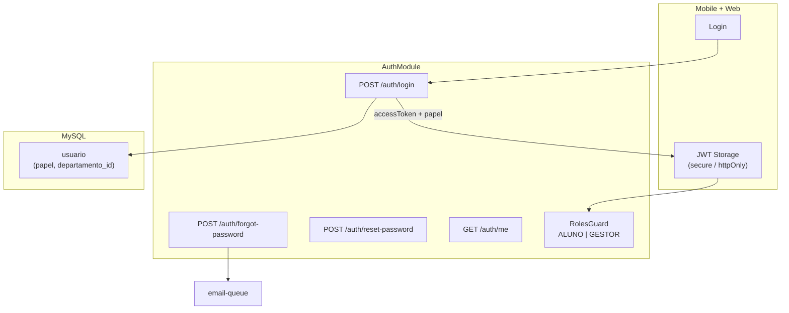

| Aspecto | Decisão v1 |
|---------|------------|
| Papéis | `ALUNO`, `GESTOR` (enum `papel`) |
| Senha | bcrypt/argon2; reset via token temporário |
| JWT | Payload: `sub`, `email`, `papel`; expiração configurável |
| Recuperação | Token hash em DB; e-mail via `MockEmailAdapter` em dev |

---

## 5. Fluxos principais

### 5.1 F1 — Aluno consome treinamento

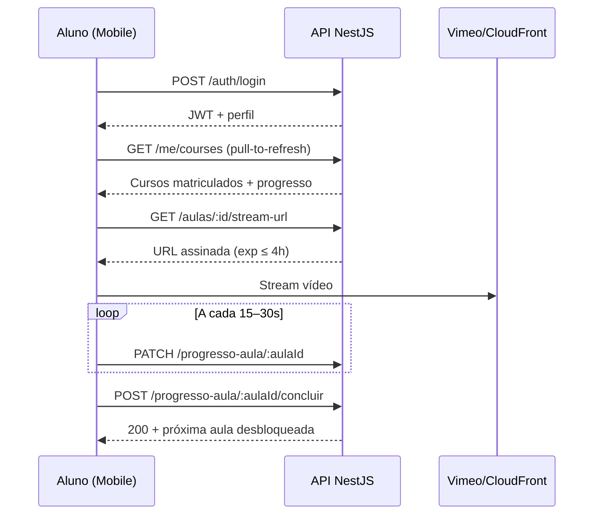

### 5.2 F2 — Gestor cria curso e matricula departamento

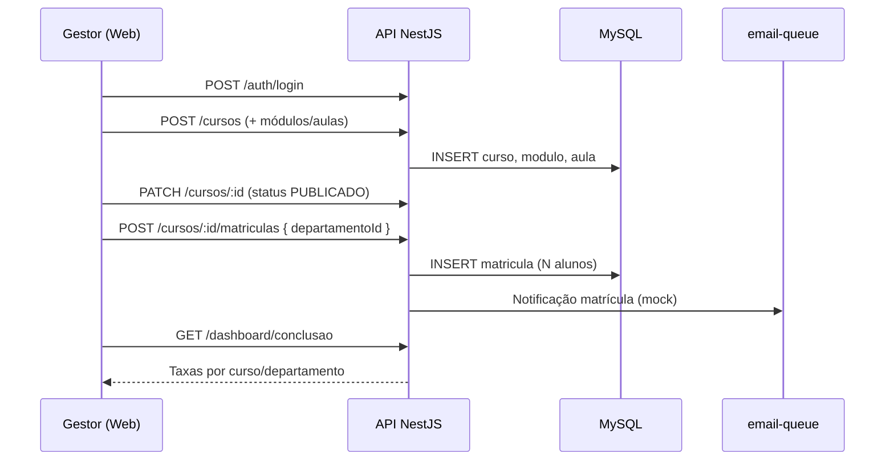

### 5.3 F3 — Sync sob demanda (mobile)

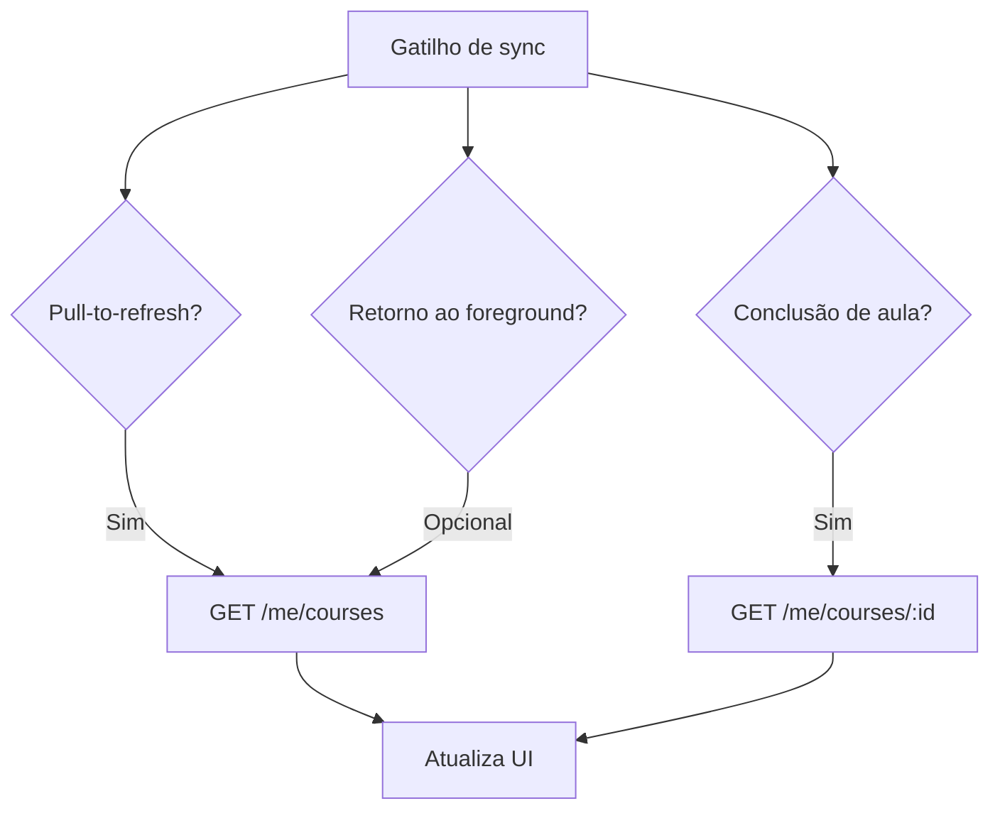

### 5.4 F4 — Publicação reflete no app (CS-02)

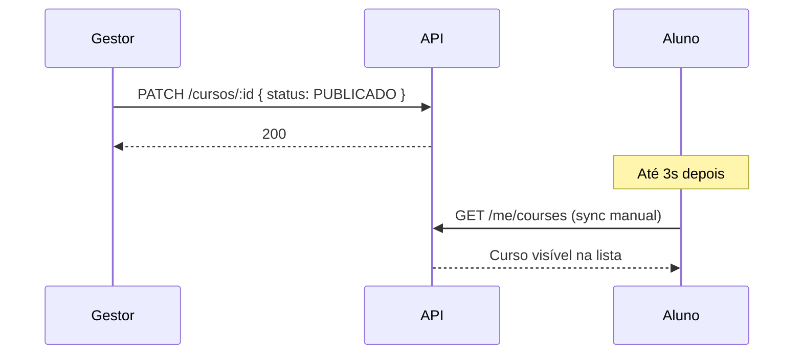

---

## 6. Implicações dos requisitos não funcionais

### 6.1 Conectividade — somente online (RNF-001)

| Aspecto | Decisão v1 |
|---------|------------|
| Modo offline | **Não suportado** — leitura e escrita exigem rede |
| Cache de conteúdo | Apenas em memória durante sessão; sem persistência offline |
| UX sem rede | Banner "Sem conexão"; botões de ação desabilitados |
| Player | Pausa se perder conexão; progresso não enviado = risco de perda parcial — flush ao reconectar |
| Implicação arquitetural | Sem SQLite/Hive de sync; sem fila local de mutações |

### 6.2 Sync — sob demanda (RNF-002)

| Aspecto | Decisão v1 |
|---------|------------|
| Modelo | HTTP request/response; sem WebSocket |
| Gatilhos mobile | Pull-to-refresh; após conclusão de aula; login |
| Gatilhos web | Invalidação React Query pós-mutação; refresh manual dashboard |
| Latência alvo | Dados atualizados em ≤ 3 s após sync (CS-02) |
| Incremental | Opcional: `?updatedSince=` em listagens |

### 6.3 Escala — pequena, ~100 usuários (RNF-003)

| Aspecto | Decisão |
|---------|---------|
| Topologia | Monolito NestJS + MySQL single-instance |
| Pool Prisma | 10–20 conexões |
| CDN | Vimeo/CloudFront absorve carga de vídeo |
| Cache API | Sem Redis obrigatório; considerar cache HTTP em listagens estáticas |
| Projeção | ~100 users × ~5 cursos × ~20 aulas = ~10k `progresso_aula` — trivial |
| p95 API | < 500 ms em carga nominal |

### 6.4 Idiomas — PT-BR (RNF-004)

| Aspecto | Decisão v1 |
|---------|------------|
| UI mobile/web | Strings hardcoded ou arquivo único `pt_BR` |
| API | Mensagens de erro em português |
| Conteúdo | Cursos/aulas em PT-BR (responsabilidade do gestor) |
| i18n | Infraestrutura **não** implementada na v1 |

### 6.5 Privacidade e LGPD — padrão (RNF-005)

| Princípio LGPD | Implementação v1 |
|----------------|------------------|
| Finalidade | Treinamento corporativo; progresso e dados de conta |
| Minimização | Coleta: nome, e-mail, departamento, progresso, tempo assistido |
| Base legal | Execução de contrato / legítimo interesse empregador (B2B) |
| Segurança | HTTPS; senhas hash; JWT; URLs de vídeo temporárias |
| Acesso | Aluno vê apenas seus dados; gestor vê agregados e lista de alunos |
| Retenção | Matrículas soft-deleted; logs sem PII |
| Terceiros | CDN (vídeo), e-mail e storage via adapters — DPA na v1.1 |
| Direitos do titular | Exportação/exclusão de conta — endpoint v1.1 recomendado |
| Registro de operações | Log de ações do gestor (matrícula, publicação) — audit trail leve |

### 6.6 Streaming de vídeo (RNF-006, RNF-007)

| Aspecto | Decisão |
|---------|---------|
| Provedor | Vimeo ou AWS CloudFront + S3 |
| Padrão | API gera **URL assinada**; mobile stream direto no CDN |
| Startup | ≤ 2 s (CS-01) |
| Rebuffer | < 1% das sessões |
| Segurança | Token expira ≤ 4 h; validação de matrícula antes de emitir URL |
| Dev | Vídeo sample estático ou mock URL |

---

## 7. Decisões arquiteturais (ADRs)

### ADR-001 — Back-end: NestJS modular

| Aspecto | Decisão |
|---------|---------|
| Contexto | PRD permite Express ou NestJS |
| Decisão | **NestJS** com módulos por domínio |
| Consequências | Guards, pipes, DI; extensível para v2 |

### ADR-002 — Sync v1: sob demanda (HTTP)

| Aspecto | Decisão |
|---------|---------|
| Contexto | RNF-002; sem tempo real |
| Decisão | Pull-to-refresh + invalidação pós-escrita |
| Consequências | Simplicidade; latência aceitável ≤ 3 s |

### ADR-003 — Conectividade v1: somente online

| Aspecto | Decisão |
|---------|---------|
| Contexto | RNF-001 |
| Decisão | Sem modo offline; operações bloqueadas sem rede |
| Consequências | Menor complexidade; UX clara com banner |

### ADR-004 — Persistência: MySQL 8+ + Prisma

| Aspecto | Decisão |
|---------|---------|
| Decisão | Prisma ORM; migrations versionadas |
| Consequências | Schema alinhado a [MODELO-DADOS.md](./MODELO-DADOS.md) |

### ADR-005 — Autenticação: JWT + papéis

| Aspecto | Decisão |
|---------|---------|
| Decisão | JWT stateless; `RolesGuard` para GESTOR |
| Consequências | Logout client-side; sem revogação centralizada v1 |

### ADR-006 — Streaming: CDN externo

| Aspecto | Decisão |
|---------|---------|
| Decisão | API não proxy de vídeo; URLs assinadas via adapter |
| Consequências | Escala de mídia delegada ao provedor |

### ADR-007 — Integrações: Adapter pattern + mocks

| Aspecto | Decisão |
|---------|---------|
| Decisão | `EmailAdapter`, `PushAdapter`, `StorageAdapter`; flag `INTEGRATIONS_MODE` |
| Consequências | MVP desbloqueado sem credenciais reais |

### ADR-008 — Sequenciamento centralizado na API

| Aspecto | Decisão |
|---------|---------|
| Decisão | `ProgressoService` valida ordem global curso→módulo→aula |
| Consequências | Mobile/web confiam no servidor; 403 se pular aula |

### ADR-009 — Cálculo de conclusão centralizado

| Aspecto | Decisão |
|---------|---------|
| Decisão | Dashboard e mobile consomem mesmo endpoint/cálculo SQL |
| Consequências | CS-03: zero divergência |

---

## 8. Integrações externas

### 8.1 Matriz v1

| Integração | Interface | Impl v1 (mock) | Impl produção | Fila |
|------------|-----------|----------------|---------------|------|
| E-mail transacional | `EmailAdapter` | `MockEmailAdapter` (console/log) | SendGrid / AWS SES | `email-queue` |
| Push notifications | `PushAdapter` | `NoOpPushAdapter` | FCM + APNs (v2) | — |
| Armazenamento | `StorageAdapter` | `LocalStorageAdapter` | AWS S3 + presigned | — |
| Streaming vídeo | `StreamUrlAdapter` | URL estática dev | Vimeo / CloudFront | — |

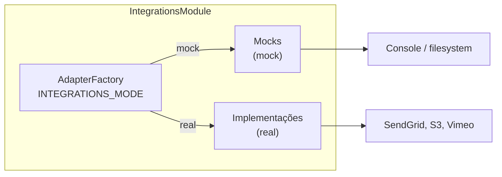

### 8.2 Filas e processamento assíncrono

| Fila | Propósito | v1 |
|------|-----------|-----|
| `email-queue` | Recuperação senha, aviso matrícula | In-process ou BullMQ; mock não exige Redis |
| `progresso-queue` | Batch heartbeat tempo assistido | Opcional; PATCH síncrono aceitável na v1 |

### 8.3 Mocks e stubs

| Componente | Comportamento mock |
|------------|-------------------|
| `MockEmailAdapter` | Loga destinatário/assunto/corpo; retorna `messageId` fake |
| `NoOpPushAdapter` | Retorna sucesso sem enviar |
| `LocalStorageAdapter` | Salva em `./uploads`; URL relativa |
| `MockStreamUrlAdapter` | Retorna URL de vídeo sample (Big Buck Bunny etc.) |

---

## 9. Gestão de secrets e configuração

### 9.1 Variáveis — API

| Variável | Sensível | Descrição |
|----------|----------|-----------|
| `DATABASE_URL` | ✅ | Connection string MySQL |
| `JWT_SECRET` | ✅ | Assinatura JWT |
| `JWT_ACCESS_EXPIRES` | — | Default `8h` |
| `INTEGRATIONS_MODE` | — | `mock` \| `real` |
| `VIMEO_ACCESS_TOKEN` | ✅ | API Vimeo (real) |
| `CLOUDFRONT_KEY_PAIR_ID` | ✅ | Assinatura CloudFront |
| `CLOUDFRONT_PRIVATE_KEY` | ✅ | Chave privada PEM |
| `EMAIL_API_KEY` | ✅ | SendGrid/SES |
| `STORAGE_BUCKET` | — | Bucket S3 |
| `AWS_ACCESS_KEY_ID` | ✅ | S3 (real) |
| `AWS_SECRET_ACCESS_KEY` | ✅ | S3 (real) |
| `CORS_ORIGINS` | — | Origens web + mobile dev |

### 9.2 Variáveis — Mobile / Web

| Variável | Camada | Descrição |
|----------|--------|-----------|
| `API_BASE_URL` | Mobile | Base URL REST |
| `NEXT_PUBLIC_API_URL` | Web | Base URL REST |

### 9.3 Diagrama de secrets

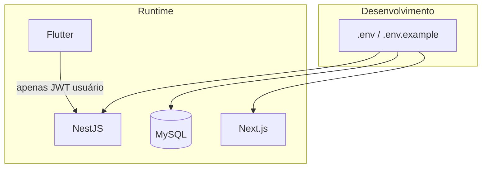

**Checklist:** `.env` no `.gitignore`; secrets diferentes por ambiente; mobile não embute credenciais de servidor.

---

## 10. Contratos da API — v1

| Método | Rota | Descrição | Auth | Papel |
|--------|------|-----------|------|-------|
| GET | `/api/v1/health` | Health check | Não | — |
| POST | `/api/v1/auth/login` | Login | Não | — |
| POST | `/api/v1/auth/forgot-password` | Solicita reset | Não | — |
| POST | `/api/v1/auth/reset-password` | Redefine senha | Não | — |
| GET | `/api/v1/auth/me` | Perfil | Sim | * |
| PATCH | `/api/v1/auth/me` | Atualiza perfil | Sim | * |
| GET/POST | `/api/v1/cursos` | Listar/criar curso | Sim | GESTOR |
| GET/PATCH/DELETE | `/api/v1/cursos/:id` | CRUD curso | Sim | GESTOR |
| POST | `/api/v1/cursos/:id/modulos` | Adicionar módulo | Sim | GESTOR |
| POST | `/api/v1/modulos/:id/aulas` | Adicionar aula | Sim | GESTOR |
| POST | `/api/v1/cursos/:id/matriculas` | Matricular | Sim | GESTOR |
| DELETE | `/api/v1/matriculas/:id` | Remover matrícula | Sim | GESTOR |
| GET | `/api/v1/me/courses` | Cursos do aluno | Sim | ALUNO |
| GET | `/api/v1/me/courses/:id` | Detalhe + progresso | Sim | ALUNO |
| GET | `/api/v1/aulas/:id/stream-url` | URL vídeo assinada | Sim | ALUNO |
| PATCH | `/api/v1/progresso-aula/:aulaId` | Tempo assistido | Sim | ALUNO |
| POST | `/api/v1/progresso-aula/:aulaId/concluir` | Concluir aula | Sim | ALUNO |
| GET | `/api/v1/dashboard/conclusao` | Taxas agregadas | Sim | GESTOR |
| GET | `/api/v1/usuarios` | Lista usuários | Sim | GESTOR |
| GET | `/api/v1/notificacoes` | Notificações | Sim | * |
| GET | `/api/v1/categorias` | Categorias | Sim | * |

---

## 11. Segurança

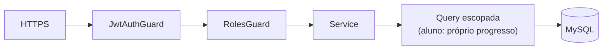

| Controle | Implementação |
|----------|---------------|
| Transporte | TLS 1.2+ em staging/produção |
| Senhas | bcrypt/argon2 |
| Autorização | `RolesGuard`; aluno só acessa cursos matriculados |
| Stream URL | Valida matrícula + expiração curta |
| Input | ValidationPipe whitelist |
| Rate limit | `/auth/login`, `/auth/forgot-password` |

---

## 12. Estrutura de repositório

```
educaflex/
├── backend/                 # NestJS API
│   ├── src/
│   │   ├── auth/
│   │   ├── cursos/
│   │   ├── progresso/
│   │   ├── matriculas/
│   │   ├── dashboard/
│   │   ├── notificacoes/
│   │   ├── usuarios/
│   │   ├── integrations/
│   │   └── common/
│   └── prisma/
├── mobile/                  # Flutter app
│   └── lib/features/
├── frontend/                # Next.js painel
│   └── app/
├── docker-compose.yml
└── docs/
```

---

## 13. Requisitos não funcionais — mapeamento

| ID | Requisito | Como atende (v1) |
|----|-----------|------------------|
| RNF-001 | Somente online | Bloqueio escrita offline; banner UX |
| RNF-002 | Sync sob demanda | Pull-to-refresh; React Query invalidation |
| RNF-003 | ~100 usuários | Monolito + MySQL single-instance |
| RNF-004 | PT-BR | Strings fixas; erros API em português |
| RNF-005 | Privacidade padrão | Hash senha, HTTPS, escopo por papel, LGPD §6.5 |
| RNF-006 | Streaming CDN | Vimeo/CloudFront via adapter |
| RNF-007 | URLs assinadas | Expiração ≤ 4 h |
| RNF-008 | UI moderna | `#800000`; Material You + web limpo |

---

## 14. Riscos arquiteturais

| Risco | Impacto | Mitigação |
|-------|---------|-----------|
| Latência streaming | CS-01 falha | CDN edge; testes 4G |
| Divergência % conclusão | CS-03 falha | Cálculo centralizado API |
| Perda heartbeat offline | RN-04 parcial | Flush ao reconectar; aviso UX |
| Integrações atrasam | E-mail reset | Mocks desde sprint 1 |
| Sequenciamento incorreto | RN-01 violada | Testes TC-PROG-001; state machine |

---

## 15. Glossário

| Termo | Definição |
|-------|-----------|
| Sync sob demanda | Atualização iniciada pelo cliente, não push server-side |
| URL assinada | Link temporário de streaming gerado pelo CDN |
| ProgressoAula | Registro de avanço do aluno em uma aula |
| Adapter | Implementação substituível de integração externa |

---

## 16. Aprovações

| Papel | Nome | Data | Status |
|-------|------|------|--------|
| Tech Lead | | 04/09/2026 | Pendente |
| Product Owner | | | Pendente |
| Mobile Lead | | | Pendente |
| Front-end Lead | | | Pendente |
