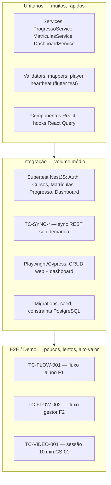

# ESTRATÉGIA DE QA — Educa

**Versão:** 1.0  
**Data:** 07/09/2026  
**Status:** Aprovável para execução  
**Autor:** QA Lead  
**Referências:** [PRD.md](./PRD.md) · [ARQUITETURA.md](./ARQUITETURA.md) · [MODELO-DADOS.md](./MODELO-DADOS.md) · [PLANO-BACKEND.md](./PLANO-BACKEND.md) · [PLANO-FRONTEND-MOBILE.md](./PLANO-FRONTEND-MOBILE.md) · [HISTORIAS-USUARIO.md](./HISTORIAS-USUARIO.md)

---

## 1. Objetivo

Este documento define a **estratégia de testes**, o **Definition of Done (DoD)** e os **casos críticos (P0)** do **Educa v1 (MVP)**, cobrindo exclusivamente as camadas em escopo:

- **Mobile App** (Flutter)
- **Front-end Web** (Next.js — painel gestor)
- **Back-end / API** (NestJS)
- **Banco de dados** (PostgreSQL)
- **Login / Contas** (API + Mobile + Web)
- **Painel admin** (Next.js)

A meta de QA é garantir que colaboradores consumam treinamentos no mobile com **reprodução fluida de vídeo**, gestores gerenciem cursos e matrículas no painel web, o **sync sob demanda** reflita publicações em tempo hábil, o **sequenciamento pedagógico** seja respeitado e o **dashboard** calcule corretamente a taxa de conclusão — conforme critérios de sucesso mensuráveis **CS-01 a CS-06**.

> **Nota de escopo v1:** Quiz/múltipla escolha, certificado PDF automático, ranking/gamificação, push nativo (FCM/APNs), SSO/LDAP, multi-tenant, offline playback/download e WebSocket/SSE **não** fazem parte da v1. A Regra stakeholder #1 (nota mínima com quiz) é parcialmente atendida via sequenciamento + tempo mínimo assistido (RN-07); quiz formal é v2.

---

## 2. Escopo de QA

### 2.1 Dentro do escopo (v1 — MVP)

| Camada | Tecnologia | Foco de teste |
|--------|------------|---------------|
| **Mobile App** | Flutter (Dart) | Auth aluno, home cursos, player vídeo, leitor artigo, progresso, sequenciamento UX, sync pull-to-refresh, banner online-only, perfil, notificações in-app |
| **Front-end Web** | Next.js (React) | Auth gestor, CRUD curso/módulo/aula, matrícula individual/departamento, dashboard conclusão, gestão usuários, sync pós-mutação (React Query) |
| **Back-end / API** | NestJS (Node.js) | REST `/api/v1`, JWT, papéis ALUNO/GESTOR, RN-01/03/04/05/07, progresso, matrículas, dashboard, adapters mock |
| **Banco de dados** | PostgreSQL 15+ | Migrations Prisma, entidades domínio, FKs, enums, seed categorias/departamentos, índices dashboard |
| **Login / Contas** | API + Mobile + Web | Login, forgot/reset password, perfil, guards por papel, privacidade padrão |
| **Painel admin** | Next.js | Gestão cursos, alunos, departamentos, métricas de conclusão |

### 2.2 Fora do escopo de QA (v1)

| Item | Motivo | Tratamento QA |
|------|--------|---------------|
| Quiz/múltipla escolha e nota mínima formal | PRD §2.2; v2 | Não testar; RN-01 parcial via sequenciamento |
| Emissão automática certificado PDF | PRD §2.2; v2 (RN-02) | TC-NEG-001 |
| Ranking/gamificação | PRD §2.2; v2+ | — |
| Push notifications nativas (FCM/APNs) | PRD §2.2; v2 | v1: in-app + e-mail mock |
| SSO / LDAP | PRD §2.2; v2+ | — |
| Multi-tenant | PRD §2.2; v2+ | v1: instância única |
| Offline playback / download de aulas | PRD §2.2; v2+ | v1: somente online (RNF-001) |
| WebSocket / SSE / sync tempo real | ARQUITETURA ADR-004 | v1: HTTP + sync sob demanda |
| Relatórios analíticos avançados | PRD §2.2 | v1: taxa conclusão agregada |
| Publicação App Store / Play Store | Entrega produto | Smoke manual opcional |
| Infraestrutura deploy / observabilidade | Fora camadas marcadas | — |

### 2.3 Regras obrigatórias do stakeholder → cobertura P0

| # | Regra (PRD §2.4) | Atendimento v1 | Casos P0 principais |
|---|------------------|----------------|---------------------|
| **RN-01** | Aluno só avança após concluir aula anterior (nota mínima = v2 quiz) | Sequenciamento + conclusão explícita | TC-PROG-001, TC-MOB-003, CS-04 |
| **RN-02** | Certificado PDF só após 100% | Não emite certificado v1 | TC-NEG-001 (regressão: endpoint ausente) |
| **RN-03** | Matrícula/remoção individual ou por departamento | API + Web + PostgreSQL | TC-MAT-001, TC-MAT-002, TC-MAT-003 |
| **RN-04** | Registrar tempo assistido por vídeoaula | API heartbeat + mobile player | TC-PROG-002, TC-VIDEO-002 |
| **RN-05** | Curso publicado reflete no app após sync | Web publicação + mobile pull-to-refresh | TC-SYNC-001, CS-02 |
| **RN-06** | Gestor cria; aluno consome | Guards API + redirecionamento clientes | TC-AUTH-005, TC-AUTH-006 |
| **RN-07** | Conclusão vídeo exige ≥ 90% duração assistida | API + mobile player | TC-PROG-004, TC-VIDEO-003 |

---

## 3. Princípios de teste

| Princípio | Aplicação |
|-----------|-----------|
| **API como fonte de verdade** | Regras RN-* e cálculos (CS-03) validados na API; UI reflete DTOs |
| **Sync sob demanda é risco P0** | Publicação web → visibilidade mobile; conclusão aluno → dashboard gestor |
| **Somente online (RNF-001)** | Sem cache persistente offline; leitura e escrita exigem rede; testar bloqueios UX |
| **Privacidade por papel e escopo** | Aluno vê só seus cursos/progresso; gestor vê agregados; senhas hasheadas; sem PII em logs |
| **Streaming é caminho crítico** | CS-01 mede startup e rebuffer; URL assinada com expiração (RNF-007) |
| **Shift-left** | Testes integração API acompanham fases F0–F5 do PLANO-BACKEND |
| **Rastreabilidade** | Todo caso P0 mapeia RF-*, RN-*, US-* ou CS-* |
| **Dados isolados** | Usuários distintos por suíte; tokens não compartilhados em testes paralelos |
| **Evidência reprodutível** | Casos manuais críticos registram ambiente, build, timestamp e métricas |
| **Métricas verificáveis** | CS-01 a CS-06 têm procedimento, limiar numérico e critério pass/fail explícito |

---

## 4. Pirâmide de testes



### 4.1 Metas de cobertura (orientativas)

| Camada | Tipo | Meta mínima MVP | Prioridade |
|--------|------|-----------------|------------|
| API — Auth, Cursos, Matrículas, Progresso, Dashboard | Integração | 100% endpoints Must v1 | P0 |
| API — regras RN-01, RN-03, RN-04, RN-05, RN-07 | Unit + integração | 100% regras Must | P0 |
| PostgreSQL — schema e constraints | Integração DB | Migrations + seed + FK/UNIQUE | P0 |
| Mobile — auth, player, progresso, sync | Widget + integration_test | Fluxos F1 P0 | P0 |
| Web — CRUD curso, matrícula, dashboard | E2E + component | Fluxos F2 P0 | P0 |
| Sync sob demanda | Integração + manual | TC-SYNC-001–004 | P0 |
| Comportamento online-only | Manual + widget | TC-ONL-* | P0 |
| Privacidade / LGPD padrão | Integração + DB | TC-PRIV-*, TC-SEC-* | P0 |
| Streaming vídeo | Manual + métricas | TC-VIDEO-001 (CS-01) | P0 |
| Performance API | Smoke k6 | TC-PERF-001 (p95 < 500 ms) | P1 |
| UI corporativa (RNF-008) | Checklist manual | TC-UX-001 | P2 |

### 4.2 Tipos de execução

| Tipo | Quando | Escopo |
|------|--------|--------|
| **Smoke** | A cada PR mergeável | Health API, login aluno/gestor, 1 CRUD curso, 1 matrícula |
| **Regressão de fase** | Fim de cada fase (§6.3) | Casos P0 da fase + regressão anteriores |
| **Regressão MVP** | Pré Go/No-Go | 100% casos §8 + CS-01 a CS-06 |
| **Exploratório** | Paralelo a E2E | Perda rede durante vídeo, matrícula duplicada, curso rascunho |
| **Performance smoke** | Staging, fase F4+ | TC-PERF-001, TC-DASH-001 amostra 20 |
| **Demo cronometrado** | Pré release | TC-VIDEO-001, TC-SYNC-001, TC-FLOW-001 |

---

## 5. Estratégia por camada

### 5.1 Banco de dados (PostgreSQL)

| Fase | Entregável QA | Tipo |
|------|---------------|------|
| F0 | Migrations clean install, encoding UTF-8 | Smoke + DB |
| F0 | Seed idempotente (categorias + departamentos) | Integração |
| F2+ | FKs, UNIQUE email, enums Papel/TipoAula/StatusCurso | Integração |
| F4 | Índices dashboard `(curso_id, usuario_id)`, `(usuario_id, aula_id)` | EXPLAIN + integração |

**Abordagem:**

- Container PostgreSQL dedicado por job CI ou schema isolado por suíte.
- Migrations Prisma aplicadas do zero antes de cada suíte de integração.
- Inspeção SQL para state machine `ProgressoAula` e soft delete matrículas.

| Área | Casos |
|------|-------|
| Migrations | Aplicam em DB vazio; rollback documentado |
| Constraints | UNIQUE `email`; FK curso→gestor, matricula→usuario/curso, progresso→aula |
| Seed | Compliance, Técnico, Integração, Liderança; dept exemplo; idempotência |
| Soft delete | `matricula.removido_em` preenchido; aluno não vê curso removido |
| ProgressoAula | Estados BLOQUEADA → DISPONIVEL → EM_PROGRESSO → CONCLUIDA |
| Privacidade | `password_hash` ≠ senha plain; bcrypt |

### 5.2 Back-end / API (NestJS)

| Fase | Entregável QA | Tipo |
|------|---------------|------|
| F0 | Health, migrations, seed | Smoke + DB |
| F0 | Auth: login, me, forgot/reset, guards | Integração |
| F1 | Categorias, departamentos lookup | Integração |
| F1 | CRUD curso/módulo/aula, publicação | Integração + unit |
| F2 | Matrículas individual e departamento | Integração |
| F2 | Progresso, tempo assistido, conclusão, stream URL | Integração + unit |
| F4 | Dashboard conclusão, notificações, E2E API | Smoke + contrato OpenAPI |

**Abordagem:**

- Suíte integração com PostgreSQL (Testcontainers ou serviço CI).
- Factories: Usuario (ALUNO/GESTOR), Curso, Modulo, Aula, Matricula, ProgressoAula.
- Testes acesso cruzado: aluno A → curso/aula de aluno B = 403/404.
- Contrato OpenAPI validado em `/api/v1/docs`.
- Adapters mock: `MockEmailAdapter`, `NoOpPushAdapter`, `LocalStorageAdapter`, `MockStreamUrlAdapter`.

### 5.3 Mobile App (Flutter)

| Fase | Área | Tipo de teste |
|------|------|---------------|
| M1 | Auth aluno (login, logout, token) | Widget + integration_test |
| M2 | Home cursos + pull-to-refresh | integration_test + manual |
| M2 | Detalhe curso — aulas bloqueadas/concluídas | Widget |
| M3 | Player vídeo + heartbeat + conclusão | integration_test + manual CS-01 |
| M3 | Leitor artigo + conclusão scroll | Widget + manual |
| M4 | Banner offline + bloqueio ações | Manual (modo avião) |
| M4 | Perfil, notificações in-app | Widget |
| M5 | TC-FLOW-001, TC-VIDEO-001 | Manual cronometrado |

### 5.4 Front-end Web / Painel admin (Next.js)

| Fase | Área | Tipo de teste |
|------|------|---------------|
| W1 | Login gestor; bloqueio aluno | E2E + integração API |
| W2 | CRUD curso/módulo/aula; publicação | E2E Playwright/Cypress |
| W3 | Matrícula individual e por departamento | E2E |
| W4 | Dashboard KPIs e gráfico conclusão | E2E + validação vs API |
| W5 | Gestão usuários (listagem, filtros) | E2E P1 |
| W5 | Recuperar senha web | E2E P1 |

**Abordagem:**

- React Query: invalidação pós-mutação = sync web (RNF-002).
- Testes componente para formulários CRUD e validações.
- Dashboard: comparar valores UI vs `GET /dashboard/conclusao` (CS-03).
- UI corporativa estilo Stripe: primária `#A30000`, cards métricas em grid, badges de status, tabelas com filtros.

### 5.5 Login / Contas (transversal)

| Cenário | Mobile | Web | API |
|---------|--------|-----|-----|
| Login aluno válido | ✅ Home | ❌ bloqueado | ✅ 200 + JWT ALUNO |
| Login gestor válido | ❌ bloqueado | ✅ Dashboard | ✅ 200 + JWT GESTOR |
| Credenciais inválidas | ✅ | ✅ | ✅ 401 mensagem genérica |
| Forgot/reset password | ✅ | ✅ | ✅ + MockEmailAdapter |
| Token expirado | ✅ redirect login | ✅ redirect login | ✅ 401 |
| PATCH perfil | ✅ | ✅ | ✅ 200 |
| Logout limpa sessão | ✅ secure storage | ✅ cookie/local | N/A (RF-AUTH-05) |

### 5.6 Sync sob demanda (v1)

> v1 **não** usa WebSocket/SSE. Sincronização via **HTTP request/response** após gatilhos explícitos (RNF-002).

| Cenário | Prioridade | Abordagem |
|---------|------------|-----------|
| Gestor publica curso → aluno pull-to-refresh vê curso | P0 | TC-SYNC-001 (CS-02) |
| Aluno conclui aula → dashboard gestor refresh mostra progresso | P0 | TC-SYNC-002 |
| Matrícula departamento → aluno sync vê curso na Home | P0 | TC-SYNC-003 |
| Web: React Query invalida após POST/PATCH curso | P0 | TC-SYNC-004 |
| Latência sync ≤ 3 s (RNF-002) | P0 | Cronômetro em TC-SYNC-001 |
| Login mobile dispara sync inicial | P1 | integration_test |
| Parâmetro `updatedSince` (delta) | P2 | Integração API |

### 5.7 Comportamento somente online (RNF-001)

> v1 **não** persiste cache offline para escrita. Leitura e escrita exigem rede ativa; leitura do último snapshot em memória permitida apenas durante sessão.

| Cenário | Prioridade | Abordagem |
|---------|------------|-----------|
| Banner "Sem conexão" visível sem rede | P0 | TC-ONL-001 |
| Home/lista não carrega sem rede (sem cache stale persistente) | P0 | TC-ONL-002 |
| POST concluir aula bloqueado offline | P0 | TC-ONL-003 |
| Player pausa ao perder conexão | P0 | TC-ONL-004 |
| Heartbeat flush ao reconectar (tempo parcial não perdido) | P1 | TC-ONL-005 |
| CRUD web bloqueado/desabilitado offline | P1 | TC-ONL-006 |
| Nenhuma mutação enfileirada localmente | P0 | TC-ONL-007 |

### 5.8 Privacidade e LGPD — padrão (RNF-005)

| Cenário | Prioridade | Abordagem |
|---------|------------|-----------|
| Senha armazenada com hash bcrypt | P0 | TC-PRIV-001 |
| Login não enumera e-mail inexistente | P0 | TC-PRIV-002 |
| JWT removido do secure storage no logout mobile | P0 | TC-PRIV-003 |
| Aluno não acessa progresso/dados de outro aluno | P0 | TC-SEC-001–003 |
| Aluno não obtém stream URL de aula não matriculada | P0 | TC-SEC-004 |
| Gestor não consome aulas (403) | P0 | TC-AUTH-006 |
| Logs API sem PII (e-mail, senha, token) | P1 | TC-PRIV-004 |
| URL stream expira ≤ 4 h (RNF-007) | P0 | TC-SEC-005 |
| Respostas erro não expõem dados de terceiros | P0 | TC-SEC-006 |
| Gestor não expõe senha/hash em listagem usuários | P0 | TC-SEC-003 |

### 5.9 Integrações mock (PRD §8)

| Adapter | Caso | Verificação |
|---------|------|-------------|
| `MockEmailAdapter` | TC-INT-001 | Forgot-password enfileira log/console |
| `NoOpPushAdapter` | TC-INT-002 | Matrícula não dispara push nativo |
| `LocalStorageAdapter` | TC-INT-003 | Presign upload retorna URL mock |
| `MockStreamUrlAdapter` | TC-INT-004 | Stream URL válida em dev |
| Flag `INTEGRATIONS_MODE=mock\|real` | TC-INT-005 | DI alterna implementação |

### 5.10 Pipeline CI recomendado

```text
lint (API + Web + Mobile analyze)
  → unit (API + Mobile + Web em paralelo)
  → integração API (PostgreSQL via Testcontainers)
  → smoke REST (auth + CRUD curso + matrícula + progresso)
  → E2E web (Playwright — subset P0)
  → artefato: relatório JUnit + cobertura
```

> Testes `integration_test` Flutter, sessão vídeo 10 min (CS-01) e demos cronometrados executados em pipeline dedicado ou pré-release manual em staging.

---

## 6. Definition of Done (DoD)

### 6.1 DoD — História de usuário

Uma história **não está done** até que:

- [ ] Critérios de aceite da US verificados (manual ou automatizado).
- [ ] Requisitos RF-*, RN-* relacionados cobertos por pelo menos um caso de teste.
- [ ] Validação dupla: cliente (mobile/web quando aplicável) **e** API (fonte de verdade).
- [ ] Testes automatizados adicionados ou atualizados para regressão (quando camada suporta).
- [ ] Casos P0 da história passam em ambiente de integração/staging.
- [ ] Sem defect P0 ou P1 aberto vinculado à história.
- [ ] PR revisado; lint/analyze limpo na camada afetada.
- [ ] OpenAPI atualizado se endpoint novo ou alterado.
- [ ] Migrations aplicadas em staging (histórias de DB).
- [ ] Mensagens user-facing em PT-BR (RNF-004).

### 6.2 DoD — Tarefa de desenvolvimento (nível técnico)

- [ ] Código mergeável na branch de integração.
- [ ] Testes unitários/integração relevantes passando localmente e no CI.
- [ ] Migrations aplicam sem erro (se alterou schema).
- [ ] Sem segredos ou credenciais hardcoded.
- [ ] Tratamento de erro consistente (HTTP status + mensagem PT-BR quando user-facing).

### 6.3 DoD — Sprint / fase

| Fase | Gate QA |
|------|---------|
| **F0 — Fundação DB + API** | TC-DB-001, TC-DB-002; health check |
| **F0 — Auth** | TC-AUTH-001–006; TC-PRIV-001, TC-PRIV-002 |
| **F1 — Lookups + CRUD Cursos** | TC-CURSO-001–003; publicação RN-05 |
| **F2 — Matrículas + Progresso** | TC-MAT-001–003; TC-PROG-001–004; CS-04, CS-05, CS-06 |
| **F3 — Streaming + consumo aluno** | TC-VIDEO-004; TC-SEC-004 |
| **F4 — Dashboard + E2E API** | TC-DASH-001; CS-03; TC-FLOW-002 parcial |
| **M1 — Auth Mobile** | TC-MOB-AUTH-001; TC-PRIV-003 |
| **M2 — Home + Detalhe** | TC-MOB-002, TC-MOB-003; TC-SYNC-001 |
| **M3 — Player + Artigo** | TC-VIDEO-001–003; TC-MOB-004 |
| **M4 — Online-only UX** | TC-ONL-001–004 |
| **W1–W2 — Web Auth + CRUD** | TC-WEB-AUTH-001; TC-CURSO-003; TC-SYNC-004 |
| **W3–W4 — Matrícula + Dashboard** | TC-MAT-001; TC-DASH-001; TC-SYNC-002 |
| **F5/M5 + W5 — E2E + Go/No-Go** | TC-FLOW-001, TC-FLOW-002; CS-01 a CS-06 |

### 6.4 DoD — Release MVP (Go/No-Go)

**Go** somente se **todos** os itens abaixo forem atendidos:

| # | Critério | Referência | Caso / métrica |
|---|----------|------------|----------------|
| G1 | Login aluno (mobile) e gestor (web) funcionam | RF-AUTH-01 | TC-AUTH-001, TC-WEB-AUTH-001 |
| G2 | CRUD curso/módulo/aula + publicação no painel | RF-CURSO-01–06 | TC-CURSO-003, TC-FLOW-002 |
| G3 | Matrícula individual e por departamento | RN-03, CS-06 | TC-MAT-001, TC-MAT-002 |
| G4 | Sequenciamento: aula bloqueada retorna 403 | RN-01, CS-04 | TC-PROG-001 |
| G5 | Tempo assistido registrado com erro ≤ 5 s | RN-04, CS-05 | TC-PROG-002 |
| G6 | Reprodução vídeo fluida (startup ≤ 2 s; rebuffer < 1%) | CS-01, RNF-006 | TC-VIDEO-001 |
| G7 | Publicação web reflete mobile em ≤ 3 s após sync | RN-05, CS-02 | TC-SYNC-001 |
| G8 | Dashboard taxa conclusão 0% divergência (amostra 20) | CS-03 | TC-DASH-001 |
| G9 | Escopo por papel respeitado; dados isolados | RN-06, RNF-005 | TC-AUTH-005, TC-SEC-* |
| G10 | Comportamento online-only correto | RNF-001 | TC-ONL-001–003, TC-ONL-007 |
| G11 | Adapters mock configuráveis | PRD §8 | TC-INT-001–005 |
| G12 | 100% casos P0 deste documento executados e passando | §8 | Matriz §10 |
| G13 | Zero defects P0 abertos; P1 com plano ou waiver PO | — | — |
| G14 | API documentada em `/api/v1/docs` | PLANO-BACKEND | Smoke OpenAPI |
| G15 | Migrations e seed reproduzíveis em ambiente limpo | US-DB-001 | TC-DB-001, TC-DB-002 |
| G16 | Fluxo ponta a ponta aluno e gestor sem erro | F1, F2 | TC-FLOW-001, TC-FLOW-002 |
| G17 | Strings 100% PT-BR | RNF-004 | Checklist TC-UX-002 |

**No-Go automático:** falha em G4, G6, G8, G9, G10 ou qualquer defect de segurança (acesso cruzado, stream URL não autorizada, senha plain text).

---

## 7. Critérios de sucesso → casos de teste mensuráveis

Cada critério CS-* possui procedimento, limiar numérico, amostra mínima e critério pass/fail objetivo.

| ID CS | Meta (PRD §11) | Caso de teste | Procedimento resumido | Métrica / limiar | Pass | Fail |
|-------|----------------|---------------|----------------------|------------------|------|------|
| **CS-01** | Reprodução contínua vídeo mobile sem travamentos | **TC-VIDEO-001** | Aluno autenticado; abrir vídeoaula 10 min; rede 4G/Wi-Fi estável; medir startup e rebuffer | Startup **≤ 2 s**; rebuffer **< 1%** do tempo total; **3 sessões** consecutivas | 3/3 passam | Qualquer sessão fail |
| **CS-02** | Cadastro curso no painel reflete no app | **TC-SYNC-001** | Gestor publica curso e matricula aluno; aluno pull-to-refresh na Home | Curso visível em **≤ 3 s** após sync; dados = `GET /me/courses` | Tempo + dados OK | > 3 s ou divergência |
| **CS-03** | Dashboard calcula % conclusão corretamente | **TC-DASH-001** | Seed 20 alunos com progressos variados; comparar dashboard vs SQL manual | **0% divergência** em 20/20 alunos | 20/20 | ≥ 1 divergência |
| **CS-04** | Sequenciamento respeitado | **TC-PROG-001** | Tentar concluir/acessar aula N+1 sem concluir N | **100%** retornam 403 `AULA_BLOQUEADA` | 0 bypass | Qualquer 200 indevido |
| **CS-05** | Tempo assistido registrado | **TC-PROG-002** | Reproduzir vídeo 5 min; somar PATCH heartbeat vs tempo real | Erro **≤ 5 s** | \|Δ\| ≤ 5 s | \|Δ\| > 5 s |
| **CS-06** | Matrícula por departamento | **TC-MAT-001** | Dept teste N=10; matricular dept inteiro | **10/10** matriculados; 0 duplicatas | count = 10 | count ≠ 10 |

### 7.1 Roteiro TC-FLOW-001 — Fluxo aluno ponta a ponta (F1)

| # | Passo | Resultado esperado | Camada |
|---|-------|-------------------|--------|
| 1 | Gestor cria curso com 2 módulos, 3 aulas (2 vídeo + 1 artigo) e publica | status PUBLICADO | Web + API |
| 2 | Gestor matricula aluno de teste | Matrícula criada; notificação in-app (P2) | Web + API |
| 3 | Aluno login mobile | JWT ALUNO; Home carrega | Mobile + API |
| 4 | Aluno pull-to-refresh | Curso aparece com 0% progresso | Mobile |
| 5 | Aluno abre curso | Aula 1 disponível; aulas 2–3 bloqueadas | Mobile |
| 6 | Aluno assiste vídeo aula 1 (≥ 90%) e conclui | 200; aula 2 desbloqueada | Mobile + API |
| 7 | Aluno lê artigo aula 2 e conclui | 200; aula 3 desbloqueada | Mobile + API |
| 8 | Aluno assiste e conclui aula 3 | Progresso curso = 100% | Mobile + API |
| 9 | Gestor abre dashboard | Taxa conclusão reflete aluno 100% | Web + API |

**Critério pass:** passos 1–9 **sem interrupção** e **sem defect** P0/P1.

### 7.2 Roteiro TC-FLOW-002 — Fluxo gestor ponta a ponta (F2)

| # | Passo | Resultado esperado | Camada |
|---|-------|-------------------|--------|
| 1 | Gestor login web | Dashboard carregado | Web + API |
| 2 | Criar curso rascunho → adicionar módulo → 2 aulas | Persistido; status RASCUNHO | Web + API |
| 3 | Publicar curso | status PUBLICADO; `publicado_em` set | Web + API |
| 4 | Matricular departamento (N=10) | 10 matrículas; feedback sucesso | Web + API |
| 5 | Dashboard refresh | Contagem matriculados +1 curso; taxa inicial 0% | Web + API |
| 6 | Remover 1 matrícula individual | Soft delete; count = 9 | Web + API |

**Critério pass:** passos 1–6 completos; dashboard coerente com API.

### 7.3 Roteiro TC-VIDEO-001 — Sessão reprodução (CS-01)

| # | Ação | Observação |
|---|------|------------|
| 1 | Login aluno com curso matriculado contendo vídeo ≥ 10 min | Conta demo pré-configurada |
| 2 | Abrir player; iniciar cronômetro startup | t_startup = primeiro frame até play |
| 3 | Reproduzir 10 min contínuos | Registrar eventos rebuffer (stall > 500 ms) |
| 4 | Calcular rebuffer% = tempo_stall / 600 s × 100 | Registrar por sessão |
| 5 | Repetir 3 sessões em builds consecutivos | Documentar device, OS, rede |

**Critério pass CS-01:** startup ≤ 2 s **e** rebuffer < 1% em **3/3** sessões.

### 7.4 Roteiro TC-DASH-001 — Validação cálculo conclusão (CS-03)

| # | Ação | Observação |
|---|------|------------|
| 1 | Seed/script: 20 alunos, 1 curso 5 aulas, progressos variados (0%, 40%, 60%, 80%, 100%) | Distribuição documentada |
| 2 | Executar query SQL referência ([MODELO-DADOS.md](./MODELO-DADOS.md) §9.2) | Baseline manual |
| 3 | `GET /dashboard/conclusao?cursoId=X` | Capturar JSON |
| 4 | Comparar taxa global, por curso e por departamento | Campo a campo |
| 5 | Abrir dashboard web | Valores UI = API |

**Critério pass CS-03:** divergência **0%** em todos os 20 registros de aluno.

---

## 8. Casos críticos (P0)

### 8.1 Autenticação e papéis

| ID | Caso | Pré-condição | Passos | Resultado esperado | RF/RN |
|----|------|--------------|--------|-------------------|-------|
| TC-AUTH-001 | Login aluno válido | Conta ALUNO | POST /auth/login mobile | 200; JWT; redirect Home | RF-AUTH-01 |
| TC-AUTH-002 | Login gestor válido | Conta GESTOR | POST /auth/login web | 200; JWT; redirect Dashboard | RF-AUTH-01 |
| TC-AUTH-003 | Credenciais inválidas | — | Login senha errada | 401; mensagem genérica PT-BR | RF-AUTH-01, RNF-005 |
| TC-AUTH-004 | Forgot/reset password | E-mail válido | forgot → token → reset → login | Senha alterada; MockEmailAdapter log | RF-AUTH-03 |
| TC-AUTH-005 | Aluno bloqueado em endpoint gestor | Token ALUNO | POST /cursos | 403 Forbidden | RF-AUTH-02, RN-06 |
| TC-AUTH-006 | Gestor bloqueado em endpoint aluno | Token GESTOR | POST /progresso-aula/:id/concluir | 403 Forbidden | RF-AUTH-02, RN-06 |
| TC-AUTH-007 | Token expirado | JWT expirado | GET /auth/me | 401; redirect login clientes | RF-AUTH-02 |
| TC-AUTH-008 | PATCH perfil | Autenticado | PATCH /auth/me nome | 200; refletido mobile/web | RF-AUTH-04 |
| TC-WEB-AUTH-001 | Login web só gestor | Conta ALUNO | Tentar login painel web | Bloqueado ou redirect; mensagem clara | RN-06 |

### 8.2 Cursos e conteúdo (API + Web)

| ID | Caso | Pré-condição | Passos | Resultado esperado | RF/RN |
|----|------|--------------|--------|-------------------|-------|
| TC-CURSO-001 | CRUD curso gestor | Token GESTOR | POST/GET/PATCH/DELETE /cursos | CRUD completo; curso vinculado ao gestor | RF-CURSO-01 |
| TC-CURSO-002 | CRUD módulo e aula ordenados | Curso existente | POST módulos + aulas VIDEO/ARTIGO | Ordem persistida; campos obrigatórios validados | RF-CURSO-02, RF-CURSO-03 |
| TC-CURSO-003 | Publicação curso | Curso RASCUNHO | PATCH status PUBLICADO via web | Aluno matriculado vê após sync (TC-SYNC-001) | RF-CURSO-06, RN-05 |
| TC-CURSO-004 | Curso rascunho invisível aluno | Curso RASCUNHO; aluno matriculado | GET /me/courses | Curso **não** listado | RF-CURSO-01 |
| TC-CURSO-005 | Aula VIDEO campos obrigatórios | Gestor | POST aula sem url_stream | 400/422 | RF-CURSO-04 |
| TC-CURSO-006 | Aula ARTIGO conteúdo | Gestor | POST aula tipo ARTIGO com conteudo | 201; renderizável no mobile | RF-CURSO-05 |

### 8.3 Matrículas

| ID | Caso | Pré-condição | Passos | Resultado esperado | RF/RN |
|----|------|--------------|--------|-------------------|-------|
| TC-MAT-001 | Matrícula por departamento | Dept N=10; curso PUBLICADO | POST matriculas `{ departamentoId }` | 10 matrículas; 0 duplicatas | RN-03, CS-06 |
| TC-MAT-002 | Matrícula individual | 3 alunos | POST `{ usuarioIds: [a,b,c] }` | 3 matrículas | RN-03, RF-PROG-01 |
| TC-MAT-003 | Remoção matrícula soft delete | Matrícula ativa | DELETE /matriculas/:id | `removido_em` set; curso some da Home aluno | RF-PROG-03 |
| TC-MAT-004 | Matrícula duplicada ignorada | Aluno já matriculado | POST mesmo aluno | 200/409; count não duplica | RF-PROG-01 |

### 8.4 Progresso e sequenciamento

| ID | Caso | Pré-condição | Passos | Resultado esperado | RF/RN |
|----|------|--------------|--------|-------------------|-------|
| TC-PROG-001 | Bloqueio sequencial | Curso 3 aulas; aula 1 não concluída | POST concluir aula 2 ou GET stream aula 2 | 403 `AULA_BLOQUEADA` | RN-01, CS-04 |
| TC-PROG-002 | Tempo assistido heartbeat | Vídeo 5 min | PATCH a cada 15 s durante reprodução | Soma API vs tempo real erro ≤ 5 s | RN-04, CS-05 |
| TC-PROG-003 | Cálculo % conclusão curso | 5 aulas; 2 concluídas | GET /me/courses/:id | percentualConclusao = 40 | RF-PROG-06 |
| TC-PROG-004 | Conclusão vídeo exige 90% | Vídeo 600 s; assistido 500 s | POST concluir | 403 `TEMPO_INSUFICIENTE` | RN-07 |
| TC-PROG-005 | Conclusão vídeo OK com 90%+ | Assistido 540 s+ | POST concluir | 200; próxima aula desbloqueada | RN-07 |
| TC-PROG-006 | Conclusão artigo | Artigo aberto; scroll ≥ 90% | POST concluir | 200 | RN-07 |

### 8.5 Player de vídeo e streaming

| ID | Caso | Pré-condição | Passos | Resultado esperado | RF/RN |
|----|------|--------------|--------|-------------------|-------|
| TC-VIDEO-001 | Reprodução fluida 10 min | CS-01 setup | Sessão contínua §7.3 | Startup ≤ 2 s; rebuffer < 1% | CS-01, RNF-006 |
| TC-VIDEO-002 | Heartbeat durante play | Player ativo | Observar PATCH /progresso-aula | Requests ~15 s; tempo monotônico | RN-04 |
| TC-VIDEO-003 | Botão concluir habilitado após 90% | Player | Assistir até 90% | FAB/botão habilita; antes desabilitado | RN-07 |
| TC-VIDEO-004 | Stream URL só matriculado | Aluno não matriculado | GET /aulas/:id/stream-url | 403/404 | RNF-007 |
| TC-VIDEO-005 | URL stream expira | URL gerada há > 4 h | Tentar reproduzir | Falha CDN; app solicita nova URL | RNF-007 |

### 8.6 Dashboard

| ID | Caso | Pré-condição | Passos | Resultado esperado | RF/RN |
|----|------|--------------|--------|-------------------|-------|
| TC-DASH-001 | Taxa conclusão vs manual | 20 alunos seed §7.4 | GET /dashboard/conclusao + UI web | 0% divergência | CS-03, RF-DASH-01 |
| TC-DASH-002 | Taxa parcial por departamento | 2 dept; progressos distintos | GET com filtro departamentoId | Taxas independentes corretas | RF-DASH-02 |
| TC-DASH-003 | Aluno 100% conta como concluído | 1 aluno completou todas aulas | Dashboard | taxaConclusao incrementa 1/total | RF-DASH-01 |

### 8.7 Sync sob demanda

| ID | Caso | Pré-condição | Passos | Resultado esperado | RF/RN |
|----|------|--------------|--------|-------------------|-------|
| TC-SYNC-001 | Publicação → mobile | Gestor publica + matricula | Aluno pull-to-refresh | Curso visível ≤ 3 s | CS-02, RN-05, RNF-002 |
| TC-SYNC-002 | Conclusão → dashboard | Aluno conclui 100% | Gestor refresh dashboard | Taxa atualizada ≤ 3 s | RNF-002 |
| TC-SYNC-003 | Matrícula → Home aluno | Gestor matricula | Aluno sync | Curso aparece | RF-PROG-01 |
| TC-SYNC-004 | Web invalidação pós-mutação | Gestor edita curso | Listagem web atualiza sem F5 manual | React Query invalidation | RNF-002 |

### 8.8 Comportamento somente online

| ID | Caso | Pré-condição | Passos | Resultado esperado | RF/RN |
|----|------|--------------|--------|-------------------|-------|
| TC-ONL-001 | Banner sem conexão | Modo avião | Abrir app | Banner `#FFF8E6` visível; PT-BR | RNF-001 |
| TC-ONL-002 | Lista não carrega offline | Sem sync prévia em sessão | Modo avião → Home | Empty state ou erro; **sem** dados stale persistidos | RNF-001 |
| TC-ONL-003 | Conclusão bloqueada offline | Player pausado offline | Tap concluir | Erro/bloqueio; API não alterada | RNF-001 |
| TC-ONL-004 | Player pausa sem rede | Reproduzindo | Desligar rede | Playback pausa; banner exibido | RNF-001 |
| TC-ONL-005 | Flush heartbeat reconexão | 2 min play → offline 30 s → online | Reconectar | Tempo parcial enviado; erro ≤ 5 s | RN-04 |
| TC-ONL-007 | Sem fila mutação local | Offline | Tentar ações CRUD | Nenhuma fila SQLite/Hive; sem falso sucesso | RNF-001, ARQUITETURA ADR-004 |

### 8.9 Segurança e privacidade

| ID | Caso | Pré-condição | Passos | Resultado esperado | RF/RN |
|----|------|--------------|--------|-------------------|-------|
| TC-SEC-001 | Aluno A não vê curso de aluno B | A e B matriculados em cursos distintos | GET /me/courses como A | Apenas cursos de A | RNF-005 |
| TC-SEC-002 | Aluno não acessa progresso alheio | — | PATCH progresso aula de outro | 403/404 | RNF-005 |
| TC-SEC-003 | Gestor lista usuários | Token GESTOR | GET /usuarios | 200; sem senhas/hash | RF-DASH |
| TC-SEC-004 | Stream URL sem matrícula | Aluno não matriculado | GET stream-url | 403 | RNF-007 |
| TC-SEC-005 | URL stream expira ≤ 4 h | — | Decodificar token/URL | TTL ≤ 4 h | RNF-007 |
| TC-SEC-006 | Erro não vaza PII | Request inválido | Inspecionar body erro | Sem e-mail/dados de terceiros | RNF-005 |
| TC-PRIV-001 | Senha hasheada | Após registro | Query PostgreSQL `password_hash` | ≠ plain; bcrypt | RNF-005 |
| TC-PRIV-002 | Login não enumera e-mail | E-mail inexistente vs senha errada | 2 POST /auth/login | Mesma mensagem 401 | RNF-005 |
| TC-PRIV-003 | Logout limpa credenciais mobile | Autenticado | Logout | secure storage vazio; redirect login | RF-AUTH-05 |
| TC-PRIV-004 | Logs sem PII | Operações auth | Inspecionar logs API | Sem senha/token/e-mail completo | RNF-005 |

### 8.10 Mobile — UX e telas

| ID | Caso | Pré-condição | Passos | Resultado esperado | RF/RN |
|----|------|--------------|--------|-------------------|-------|
| TC-MOB-AUTH-001 | Login mobile completo | — | Login → Home | Token persistido; restart mantém sessão | US-MOB-001 |
| TC-MOB-002 | Home cards progresso | Matriculado | Abrir Home | Cards com barra %; primária `#A30000` | US-MOB-002 |
| TC-MOB-003 | Aulas bloqueadas UX | Curso sequencial | Abrir detalhe | Cadeado em bloqueadas; snackbar ao toque | US-MOB-003, RN-01 |
| TC-MOB-004 | Leitor artigo | Aula ARTIGO | Abrir leitor | HTML/markdown renderizado; concluir após scroll | US-MOB-005 |

### 8.11 Persistência (PostgreSQL)

| ID | Caso | Passos | Resultado esperado | RF/RN |
|----|------|--------|-------------------|-------|
| TC-DB-001 | Migration clean install | migrate em DB vazio | Schema completo 10 entidades | US-DB-001 |
| TC-DB-002 | Seed categorias e departamentos | Rodar seed | 4 categorias + dept exemplo; idempotente | US-DB-002 |
| TC-DB-003 | UNIQUE email | INSERT duplicado | Falha constraint | RF-AUTH |
| TC-DB-004 | FK matricula→curso | INSERT curso_id inválido | Falha FK | MODELO-DADOS |
| TC-DB-005 | Soft delete matrícula | DELETE matricula | `removido_em` set | RF-PROG-03 |
| TC-DB-006 | ProgressoAula state machine | Concluir sequência | Status CONCLUIDA; timestamps | MODELO-DADOS |
| TC-DB-007 | Índices dashboard | EXPLAIN query conclusão | Usa índices esperados | US-DB-003, RNF-003 |

### 8.12 Integrações mock

| ID | Caso | Passos | Resultado esperado | Ref |
|----|------|--------|-------------------|-----|
| TC-INT-001 | MockEmailAdapter forgot-password | POST forgot-password | Log contém destinatário; sem SMTP real | PRD §8 |
| TC-INT-002 | NoOpPushAdapter | Matricular aluno | Sem chamada FCM/APNs | PRD §8 |
| TC-INT-003 | LocalStorageAdapter presign | POST presign upload | URL mock retornada | PRD §8 |
| TC-INT-004 | MockStreamUrlAdapter dev | GET stream-url | URL reproduzível em dev | RNF-006 |
| TC-INT-005 | INTEGRATIONS_MODE toggle | mock vs real env | DI resolve adapter correto | PRD §8.2 |

### 8.13 Regressão negativa v2 (fora escopo)

| ID | Caso | Passos | Resultado esperado |
|----|------|--------|-------------------|
| TC-NEG-001 | Certificado PDF ausente v1 | GET /certificados ou equivalente | 404 ou não implementado |
| TC-NEG-002 | Quiz ausente v1 | POST resposta quiz | 404 ou não implementado |

### 8.14 Performance e UI

| ID | Caso | Passos | Resultado esperado | Ref |
|----|------|--------|-------------------|-----|
| TC-PERF-001 | API p95 carga nominal | 100 req login + listagem em staging | p95 < 500 ms | RNF-003 |
| TC-PERF-002 | Dashboard p95 | 50 req GET /dashboard/conclusao | p95 < 500 ms | RNF-003, CS-03 |
| TC-UX-001 | UI corporativa mobile/web | Inspeção visual | Primária `#A30000`; cards grid estilo Stripe; badges Sucesso/Pendente/Alerta; tabelas com filtros | RNF-008 |
| TC-UX-002 | Strings PT-BR | Navegar telas P0 | 0 strings EN visíveis | RNF-004 |

---

## 9. Ambiente, dados e ferramentas

### 9.1 Ambientes

| Ambiente | Uso |
|----------|-----|
| Local (dev) | Desenvolvimento; PostgreSQL Docker Compose; adapters mock |
| CI | lint → unit → integração API (PostgreSQL Testcontainers) |
| Staging | E2E web/mobile, vídeo CS-01, performance, regressão MVP |

### 9.2 Massa de dados

| Persona | E-mail teste | Papel | Uso |
|---------|--------------|-------|-----|
| Ana Silva | `ana.aluno@educa.test` | ALUNO | Fluxo F1, player, CS-01 |
| Bruno Gestor | `bruno.gestor@educa.test` | GESTOR | CRUD, matrícula, dashboard |
| Carla Aluno | `carla.aluno@educa.test` | ALUNO | Matrícula dept, isolamento |
| Dept TI | 10 alunos `tiNN@educa.test` | ALUNO | CS-06, TC-MAT-001 |
| Aluno B | `outro.aluno@educa.test` | ALUNO | TC-SEC-* |

**Seed de cursos:**

- **Curso Demo CS-01:** 1 módulo, 1 vídeo ≥ 10 min (CDN Vimeo/CloudFront ou mock).
- **Curso Sequencial:** 3 aulas (2 vídeo + 1 artigo) para TC-PROG-001 e TC-FLOW-001.
- **Curso Dashboard:** 5 aulas; 20 alunos com progressos variados para TC-DASH-001.

### 9.3 Ferramentas recomendadas

| Camada | Ferramenta |
|--------|------------|
| API | Jest + Supertest; `@nestjs/testing` |
| PostgreSQL CI | Testcontainers (`postgres:15`) |
| Mobile unit/widget | `flutter test` |
| Mobile E2E | `integration_test` |
| Web E2E | Playwright ou Cypress |
| Web unit | Vitest + Testing Library |
| API contract | OpenAPI snapshot em `/api/v1/docs` |
| Performance | k6 (TC-PERF-001, TC-PERF-002) |
| Vídeo metrics | Logs player + DevTools network; contador manual rebuffer |
| Offline manual | Modo avião emulador/device |
| DB inspeção | Cliente PostgreSQL; `prisma migrate` |

---

## 10. Matriz de rastreabilidade

### 10.1 Critérios de sucesso → casos

| CS | Casos de teste | Automatizável |
|----|----------------|---------------|
| CS-01 | TC-VIDEO-001, TC-VIDEO-002 | Parcial (manual métricas) |
| CS-02 | TC-SYNC-001, TC-CURSO-003 | Parcial (cronômetro manual) |
| CS-03 | TC-DASH-001, TC-DASH-002, TC-PERF-002 | ✅ API; parcial web |
| CS-04 | TC-PROG-001, TC-MOB-003 | ✅ API |
| CS-05 | TC-PROG-002, TC-VIDEO-002 | ✅ API; parcial mobile |
| CS-06 | TC-MAT-001 | ✅ API + web |

### 10.2 Requisitos funcionais Must Have v1

| Requisito | Casos P0 principais | Automatizável |
|-----------|---------------------|---------------|
| RF-AUTH-01 | TC-AUTH-001, TC-AUTH-002, TC-AUTH-003 | ✅ |
| RF-AUTH-02 | TC-AUTH-005, TC-AUTH-006 | ✅ |
| RF-AUTH-03 | TC-AUTH-004, TC-INT-001 | ✅ |
| RF-AUTH-04 | TC-AUTH-008 | ✅ |
| RF-AUTH-05 | TC-PRIV-003 | ✅ mobile/web |
| RF-CURSO-01 | TC-CURSO-001, TC-CURSO-004 | ✅ |
| RF-CURSO-02 | TC-CURSO-002 | ✅ |
| RF-CURSO-03 | TC-CURSO-002, TC-CURSO-006 | ✅ |
| RF-CURSO-04 | TC-VIDEO-004, TC-INT-004 | ✅ |
| RF-CURSO-05 | TC-CURSO-006, TC-MOB-004 | ✅ |
| RF-CURSO-06 | TC-CURSO-003, TC-SYNC-001 | Parcial |
| RF-PROG-01 | TC-MAT-002, TC-MAT-004 | ✅ |
| RF-PROG-02 | TC-MAT-001 | ✅ |
| RF-PROG-03 | TC-MAT-003, TC-DB-005 | ✅ |
| RF-PROG-04 | TC-PROG-002, TC-VIDEO-002 | ✅ |
| RF-PROG-05 | TC-PROG-001, TC-PROG-005 | ✅ |
| RF-PROG-06 | TC-PROG-003 | ✅ |
| RF-DASH-01 | TC-DASH-001, TC-DASH-003 | ✅ |
| RF-DASH-02 | TC-DASH-002 | ✅ |
| RF-NOTIF-01 | TC-MOB-005 (P2) | Parcial |

### 10.3 Regras de negócio → casos

| RN | Casos P0 |
|----|----------|
| RN-01 | TC-PROG-001, TC-MOB-003, TC-SEC-004 |
| RN-02 | TC-NEG-001 (ausência v1) |
| RN-03 | TC-MAT-001, TC-MAT-002, TC-MAT-003 |
| RN-04 | TC-PROG-002, TC-VIDEO-002, TC-ONL-005 |
| RN-05 | TC-SYNC-001, TC-CURSO-003 |
| RN-06 | TC-AUTH-005, TC-AUTH-006, TC-WEB-AUTH-001 |
| RN-07 | TC-PROG-004, TC-PROG-005, TC-VIDEO-003 |

### 10.4 Histórias de usuário → casos P0

| US | Casos P0 |
|----|----------|
| US-DB-001 | TC-DB-001, TC-DB-003, TC-DB-004 |
| US-DB-002 | TC-DB-002 |
| US-DB-003 | TC-DB-007, TC-PERF-002 |
| US-AUTH-001 | TC-AUTH-001, TC-AUTH-002, TC-AUTH-003 |
| US-AUTH-002 | TC-AUTH-004, TC-INT-001 |
| US-AUTH-003 | TC-AUTH-008 |
| US-AUTH-004 | TC-AUTH-005, TC-AUTH-006 |
| US-API-001 | TC-CURSO-001, TC-CURSO-003 |
| US-API-002 | TC-CURSO-002 |
| US-API-003 | TC-VIDEO-004, TC-SEC-004 |
| US-API-004 | TC-INT-001–005 |
| US-API-005 | TC-MAT-001, TC-MAT-002 |
| US-API-006 | TC-PROG-002, TC-VIDEO-002 |
| US-API-007 | TC-PROG-001, TC-PROG-004, TC-PROG-005 |
| US-API-008 | TC-PROG-003 |
| US-API-009 | TC-DASH-001 |
| US-API-010 | TC-SEC-003, TC-ADMIN-001 (P1) |
| US-MOB-001 | TC-MOB-AUTH-001, TC-PRIV-003 |
| US-MOB-002 | TC-MOB-002, TC-SYNC-001 |
| US-MOB-003 | TC-MOB-003, TC-PROG-001 |
| US-MOB-004 | TC-VIDEO-001–003 |
| US-MOB-005 | TC-MOB-004, TC-PROG-006 |
| US-WEB-001 | TC-WEB-AUTH-001 |
| US-WEB-002 | TC-CURSO-003, TC-SYNC-004 |
| US-WEB-003 | TC-MAT-001, TC-MAT-002 |
| US-WEB-004 | TC-DASH-001 |
| US-FLOW-001 | TC-FLOW-001 |
| US-FLOW-002 | TC-FLOW-002 |

### 10.5 RNF → casos

| RNF | Casos |
|-----|-------|
| RNF-001 | TC-ONL-001–004, TC-ONL-007 |
| RNF-002 | TC-SYNC-001–004 |
| RNF-003 | TC-PERF-001, TC-PERF-002 |
| RNF-004 | TC-UX-002 |
| RNF-005 | TC-PRIV-001–004, TC-SEC-* |
| RNF-006 | TC-VIDEO-001 |
| RNF-007 | TC-SEC-004, TC-SEC-005, TC-VIDEO-005 |
| RNF-008 | TC-UX-001 |

---

## 11. Gestão de defects

### 11.1 Severidade

| Nível | Definição | Exemplo Educa |
|-------|-----------|---------------|
| **P0 — Blocker** | Impede MVP ou compromete segurança/dados | Bypass sequenciamento; stream URL sem matrícula; dashboard divergência > 0%; escrita offline simula sucesso |
| **P1 — Critical** | Must quebrado sem workaround | Player não registra tempo; publicação não aparece após sync; login gestor falha |
| **P2 — Major** | Should quebrado ou Must com workaround | Gráfico dashboard desatualizado com F5; onboarding não exibido |
| **P3 — Minor** | Cosmético ou Could | Cor badge incorreta; typo PT-BR |

### 11.2 SLA de correção (MVP)

| Severidade | Ação |
|------------|------|
| P0 | Correção imediata; bloqueia release |
| P1 | Correção antes Go/No-Go ou waiver PO |
| P2 | Backlog sprint atual ou próximo |
| P3 | Backlog pós-MVP |

---

## 12. Riscos de QA e mitigações

| Risco | Impacto | Mitigação |
|-------|---------|-----------|
| Latência CDN/streaming (Vimeo/CloudFront) | CS-01 fail | MockStreamUrlAdapter em CI; testes reais CDN em staging |
| Divergência cálculo dashboard | CS-03 fail | Query SQL referência centralizada; TC-DASH-001 obrigatório |
| Confusão offline v1 vs v2 | Alto | TC-ONL-* explicitam **sem** cache persistente |
| Heartbeat perdido em rede instável | CS-05 fail | TC-ONL-005 flush; tolerância 5 s |
| Sync mobile vs web diferentes | Médio | TC-SYNC-001 mobile; TC-SYNC-004 web; mesma API |
| Matrícula dept parcial | CS-06 fail | TC-MAT-001 com N=10 fixo; transação batch |
| Guards papel bypass | Alto | TC-AUTH-005/006 em todo release candidate |
| Variabilidade métricas vídeo | Médio | 3 sessões; documentar device/rede; staging CDN |

---

## 13. Cronograma de QA (alinhado roadmap v1)

| Semana | Foco QA | Entregáveis |
|--------|---------|-------------|
| 1 | F0 — DB + Auth | TC-DB-001/002; TC-AUTH-*; TC-PRIV-001/002 |
| 2 | F1 — Lookups + CRUD Cursos | TC-CURSO-*; TC-INT-* |
| 3 | F2 — Matrículas + Progresso | TC-MAT-*; TC-PROG-*; TC-VIDEO-002 |
| 4 | F3–F4 + W1–W2 — Streaming + Dashboard + Web CRUD | TC-DASH-001; TC-WEB-*; TC-SYNC-004 |
| 5 | M1–M3 — Mobile auth, home, player | TC-MOB-*; TC-VIDEO-001; TC-SYNC-001 |
| 6 | M4 + W3–W4 + E2E — Online UX + Go/No-Go | TC-ONL-*; TC-FLOW-001/002; CS-01 a CS-06 |

---

## 14. Registro e evidências

Cada execução de regressão MVP, demo ou sessão vídeo deve registrar:

| Campo | Conteúdo |
|-------|----------|
| Build / commit | SHA e tag |
| Ambiente | local / CI / staging |
| Escopo | smoke / regressão / release candidate / demo CS-* |
| Resultado | pass / fail por suite |
| Métricas | CS-01 startup (s), rebuffer (%); CS-02 sync (s); CS-03 divergência (count); CS-05 erro tempo (s) |
| Device/rede | Modelo, OS, Wi-Fi/4G (para CS-01) |
| Defects | IDs e severidade |
| Executor | QA responsável |
| Data | ISO 8601 |

---

## 15. Aprovações

| Papel | Nome | Data | Status |
|-------|------|------|--------|
| QA Lead | | | Pendente |
| Tech Lead | | | Pendente |
| Product Owner | | | Pendente |

---

*Documento alinhado ao escopo PRD v1 (MVP): mobile/app, front-end web, back-end/API, banco de dados PostgreSQL, login/contas e painel admin. Quiz, certificado PDF, gamificação, push nativo e offline playback são v2+.*
