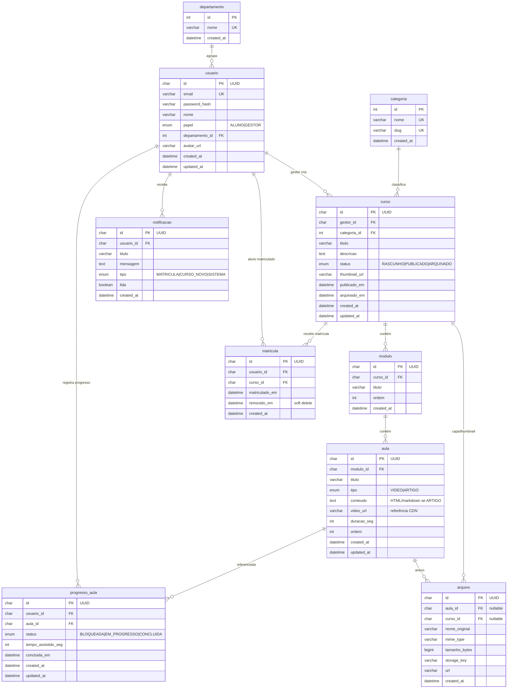
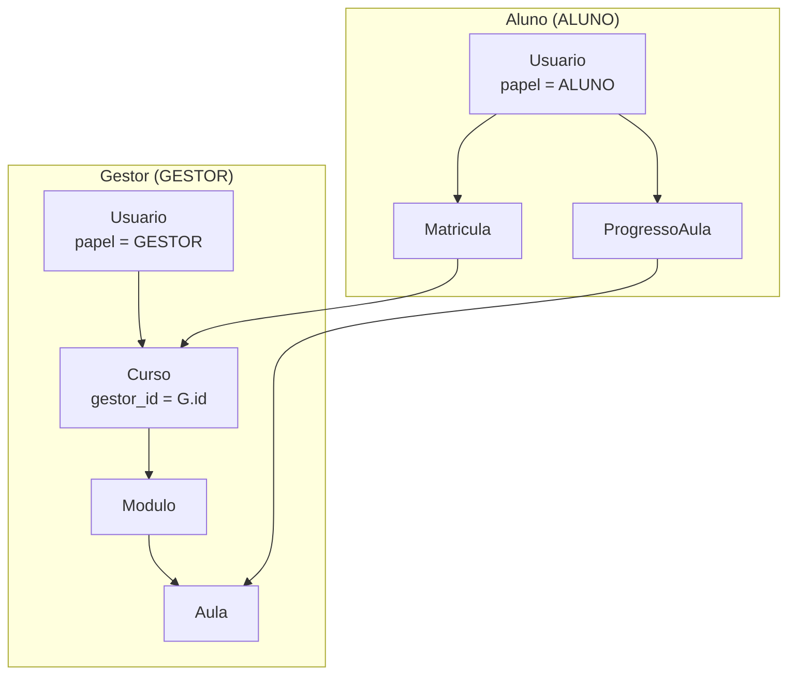
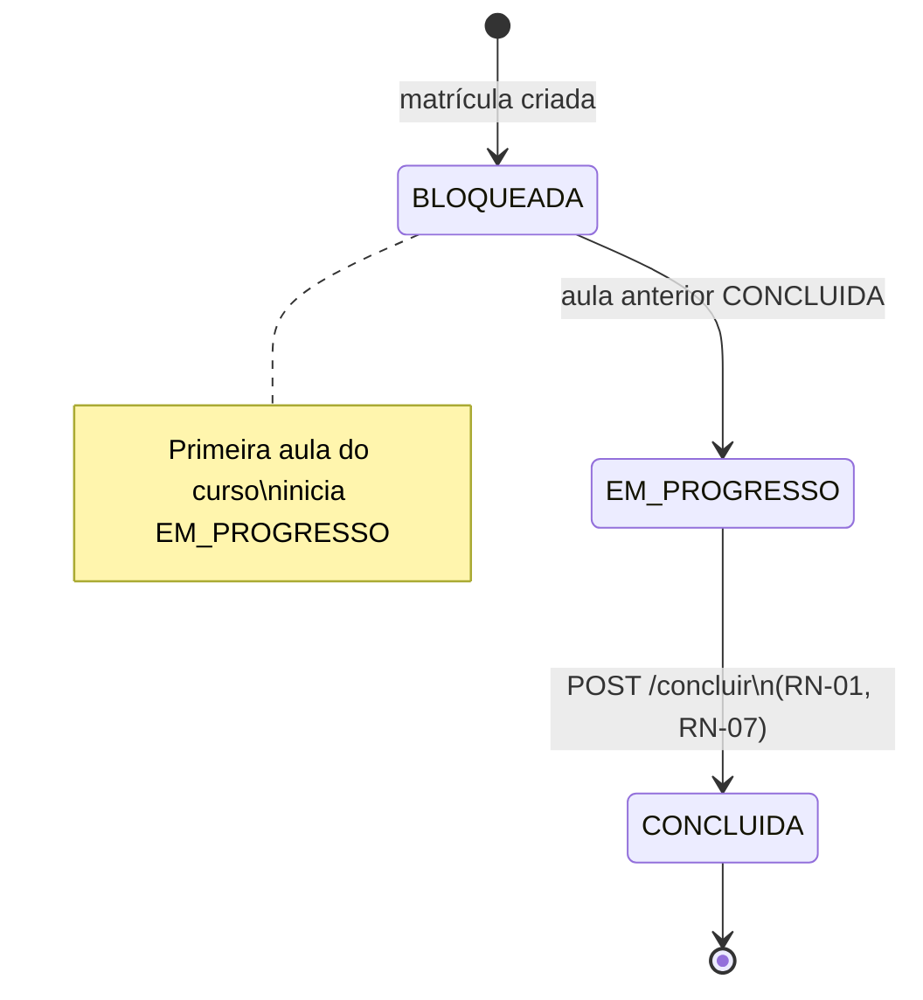
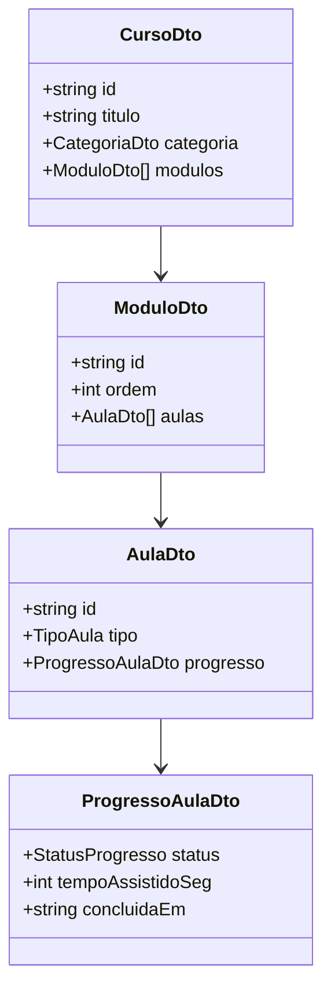

# MODELO DE DADOS — EducaFlex

**Versão:** 1.0  
**Data:** 04/09/2026  
**Status:** Rascunho aprovável para desenvolvimento  
**Autor:** Arquitetura de Software  
**Referências:** [PRD.md](./PRD.md) · [ARQUITETURA.md](./ARQUITETURA.md) · [ESTRATEGIA-QA.md](./ESTRATEGIA-QA.md)  
**SGBD:** MySQL 8+

---

## 1. Visão geral

O modelo de dados do **EducaFlex** suporta treinamento corporativo estruturado em **curso → módulo → aula**, matrículas N:M entre alunos e cursos, registro de **progresso por aula** (tempo assistido e conclusão), notificações in-app e anexos. O vocabulário de domínio usa **Curso** como sinônimo de **Serviço** (catálogo).

### 1.1 Entidades do domínio

| Entidade | Tipo | Versão | Descrição |
|----------|------|--------|-----------|
| **Usuario** | Persistida | v1 | Conta com papel ALUNO ou GESTOR |
| **Departamento** | Persistida | v1 | Agrupamento organizacional para matrícula em lote |
| **Categoria** | Persistida | v1 | Classificação de cursos (Compliance, Técnico, etc.) |
| **Curso** (Serviço) | Persistida | v1 | Catálogo de treinamento; criado por Gestor |
| **Modulo** | Persistida | v1 | Agrupamento ordenado de aulas dentro do curso |
| **Aula** | Persistida | v1 | Unidade de conteúdo (vídeo ou artigo) |
| **Matricula** | Persistida | v1 | Vínculo N:M Usuario (Aluno) ↔ Curso |
| **ProgressoAula** | Persistida | v1 | Status, tempo assistido e data de conclusão |
| **Notificacao** | Persistida | v1 | Mensagens in-app por usuário |
| **Arquivo** | Persistida | v1 | Anexo vinculado a aula ou curso |
| **ConclusaoCurso** | Calculada (DTO) | v1 | % conclusão; **não persistida** — calculada na API |
| **TaxaConclusaoDashboard** | Calculada (DTO) | v1 | Agregação gestor; **não persistida** |

### 1.2 Relações entre entidades

| Relação | Cardinalidade | Versão | Observação |
|---------|---------------|--------|------------|
| Usuario (Gestor) → Curso | 1:N | v1 | `curso.gestor_id` |
| Categoria → Curso | 1:N | v1 | `curso.categoria_id` |
| Curso → Modulo | 1:N | v1 | Ordenado por `ordem` |
| Modulo → Aula | 1:N | v1 | Ordenado por `ordem` |
| Usuario (Aluno) ↔ Curso | N:M | v1 | Via `matricula` |
| Usuario (Aluno) → ProgressoAula | 1:N | v1 | Um registro por par (aluno, aula) |
| Aula → ProgressoAula | 1:N | v1 | FK `aula_id` |
| Departamento → Usuario | 1:N | v1 | `usuario.departamento_id` |
| Aula → Arquivo | 1:N | v1 | Anexos opcionais |
| Usuario → Notificacao | 1:N | v1 | Destinatário |

### 1.3 Princípios

| Princípio | Aplicação |
|-----------|-----------|
| Integridade referencial | FKs com `ON DELETE RESTRICT`; soft delete em matrícula |
| Auditoria temporal | `created_at`, `updated_at` em entidades mutáveis |
| Sequenciamento | Ordem global derivada de `modulo.ordem` + `aula.ordem` |
| Unicidade de progresso | UK `(usuario_id, aula_id)` em `progresso_aula` |
| Nomenclatura consistente | DB: `snake_case`; API/DTO: `camelCase`; Prisma: `PascalCase` |
| Evolução controlada | Migrations versionadas |

### 1.4 Convenção de nomes (backend · mobile · web)

| Camada | Usuario | ProgressoAula | Campo tempoAssistidoSeg |
|--------|---------|---------------|-------------------------|
| MySQL | `usuario` | `progresso_aula` | `tempo_assistido_seg` |
| Prisma | `Usuario` | `ProgressoAula` | `tempoAssistidoSeg` |
| API JSON | — | — | `tempoAssistidoSeg` |
| Flutter (Dart) | `Usuario` | `ProgressoAula` | `tempoAssistidoSeg` |
| TypeScript | `Usuario` | `ProgressoAula` | `tempoAssistidoSeg` |

---

## 2. Diagrama entidade-relacionamento — v1



---

## 3. Diagrama de cardinalidade e regras



| Relacionamento | Cardinalidade | Regra |
|----------------|---------------|-------|
| Gestor → Curso | 1:N | Todo curso tem um gestor criador |
| Curso → Modulo → Aula | 1:N:N | Ordem sequencial define RN-01 |
| Aluno ↔ Curso | N:M | Via `matricula`; aluno só vê cursos matriculados |
| Aluno → ProgressoAula | 1:N | UK `(usuario_id, aula_id)` |
| Departamento → Usuario | 1:N | Matrícula em lote por `departamento_id` |

---

## 4. Definição das tabelas — v1

### 4.1 Tabela `departamento`

| Coluna | Tipo MySQL | Null | Default | Descrição |
|--------|------------|------|---------|-----------|
| `id` | `INT` | NO | AUTO_INCREMENT | PK |
| `nome` | `VARCHAR(100)` | NO | — | UK; ex.: "RH", "TI" |
| `created_at` | `DATETIME(3)` | NO | `CURRENT_TIMESTAMP(3)` | UTC |

**Índices:** `PRIMARY (id)`, `uk_departamento_nome (nome)` UNIQUE

---

### 4.2 Tabela `usuario`

| Coluna | Tipo MySQL | Null | Default | Descrição |
|--------|------------|------|---------|-----------|
| `id` | `CHAR(36)` | NO | — | PK; UUID v4 |
| `email` | `VARCHAR(255)` | NO | — | UK |
| `password_hash` | `VARCHAR(255)` | NO | — | bcrypt/argon2 |
| `nome` | `VARCHAR(100)` | NO | — | Nome exibido |
| `papel` | `ENUM('ALUNO','GESTOR')` | NO | `'ALUNO'` | Papel do usuário |
| `departamento_id` | `INT` | YES | `NULL` | FK → `departamento.id` |
| `avatar_url` | `VARCHAR(500)` | YES | `NULL` | URL avatar opcional |
| `created_at` | `DATETIME(3)` | NO | `CURRENT_TIMESTAMP(3)` | UTC |
| `updated_at` | `DATETIME(3)` | NO | `CURRENT_TIMESTAMP(3) ON UPDATE` | UTC |

**Índices:**

| Nome | Colunas | Tipo |
|------|---------|------|
| `PRIMARY` | `id` | PK |
| `uk_usuario_email` | `email` | UNIQUE |
| `idx_usuario_departamento` | `departamento_id` | INDEX |
| `idx_usuario_papel` | `papel` | INDEX |

**LGPD:** `email`, `nome` são dados pessoais; acesso restrito por papel.

---

### 4.3 Tabela `categoria`

| Coluna | Tipo MySQL | Null | Default | Descrição |
|--------|------------|------|---------|-----------|
| `id` | `INT` | NO | AUTO_INCREMENT | PK |
| `nome` | `VARCHAR(50)` | NO | — | Nome exibido |
| `slug` | `VARCHAR(50)` | NO | — | UK; ex.: `compliance` |
| `created_at` | `DATETIME(3)` | NO | `CURRENT_TIMESTAMP(3)` | UTC |

**Seed obrigatório:**

| nome | slug |
|------|------|
| Compliance | compliance |
| Técnico | tecnico |
| Liderança | lideranca |
| Integração | integracao |
| Outros | outros |

---

### 4.4 Tabela `curso`

| Coluna | Tipo MySQL | Null | Default | Descrição |
|--------|------------|------|---------|-----------|
| `id` | `CHAR(36)` | NO | — | PK; UUID v4 |
| `gestor_id` | `CHAR(36)` | NO | — | FK → `usuario.id` (GESTOR) |
| `categoria_id` | `INT` | NO | — | FK → `categoria.id` |
| `titulo` | `VARCHAR(200)` | NO | — | Título do curso |
| `descricao` | `TEXT` | YES | `NULL` | Descrição |
| `status` | `ENUM('RASCUNHO','PUBLICADO','ARQUIVADO')` | NO | `'RASCUNHO'` | RN-05 |
| `thumbnail_url` | `VARCHAR(500)` | YES | `NULL` | Capa do curso |
| `publicado_em` | `DATETIME(3)` | YES | `NULL` | Data publicação |
| `arquivado_em` | `DATETIME(3)` | YES | `NULL` | Soft archive |
| `created_at` | `DATETIME(3)` | NO | `CURRENT_TIMESTAMP(3)` | UTC |
| `updated_at` | `DATETIME(3)` | NO | `CURRENT_TIMESTAMP(3) ON UPDATE` | UTC |

**Índices:**

| Nome | Colunas | Uso |
|------|---------|-----|
| `idx_curso_gestor` | `gestor_id` | Cursos do gestor |
| `idx_curso_categoria` | `categoria_id` | Filtro por categoria |
| `idx_curso_status` | `status` | Catálogo publicado |

---

### 4.5 Tabela `modulo`

| Coluna | Tipo MySQL | Null | Default | Descrição |
|--------|------------|------|---------|-----------|
| `id` | `CHAR(36)` | NO | — | PK; UUID v4 |
| `curso_id` | `CHAR(36)` | NO | — | FK → `curso.id` |
| `titulo` | `VARCHAR(200)` | NO | — | Título do módulo |
| `ordem` | `INT` | NO | — | Ordem no curso (1-based) |
| `created_at` | `DATETIME(3)` | NO | `CURRENT_TIMESTAMP(3)` | UTC |

**Índices:** `idx_modulo_curso_ordem (curso_id, ordem)` UNIQUE

---

### 4.6 Tabela `aula`

| Coluna | Tipo MySQL | Null | Default | Descrição |
|--------|------------|------|---------|-----------|
| `id` | `CHAR(36)` | NO | — | PK; UUID v4 |
| `modulo_id` | `CHAR(36)` | NO | — | FK → `modulo.id` |
| `titulo` | `VARCHAR(200)` | NO | — | Título da aula |
| `tipo` | `ENUM('VIDEO','ARTIGO')` | NO | — | Tipo de conteúdo |
| `conteudo` | `TEXT` | YES | `NULL` | HTML/markdown (ARTIGO) |
| `video_url` | `VARCHAR(500)` | YES | `NULL` | Referência CDN (VIDEO) |
| `duracao_seg` | `INT` | YES | `NULL` | Duração em segundos (VIDEO) |
| `ordem` | `INT` | NO | — | Ordem no módulo |
| `created_at` | `DATETIME(3)` | NO | `CURRENT_TIMESTAMP(3)` | UTC |
| `updated_at` | `DATETIME(3)` | NO | `CURRENT_TIMESTAMP(3) ON UPDATE` | UTC |

**Índices:** `idx_aula_modulo_ordem (modulo_id, ordem)` UNIQUE

**Regra RN-07:** conclusão exige `tempo_assistido_seg >= duracao_seg * 0.9` (vídeo).

---

### 4.7 Tabela `matricula`

| Coluna | Tipo MySQL | Null | Default | Descrição |
|--------|------------|------|---------|-----------|
| `id` | `CHAR(36)` | NO | — | PK; UUID v4 |
| `usuario_id` | `CHAR(36)` | NO | — | FK → `usuario.id` (ALUNO) |
| `curso_id` | `CHAR(36)` | NO | — | FK → `curso.id` |
| `matriculado_em` | `DATETIME(3)` | NO | `CURRENT_TIMESTAMP(3)` | Data matrícula |
| `removido_em` | `DATETIME(3)` | YES | `NULL` | Soft delete (RN-03) |
| `created_at` | `DATETIME(3)` | NO | `CURRENT_TIMESTAMP(3)` | UTC |

**Índices:**

| Nome | Colunas | Tipo |
|------|---------|------|
| `uk_matricula_usuario_curso` | `usuario_id`, `curso_id` | UNIQUE |
| `idx_matricula_curso` | `curso_id` | INDEX |
| `idx_matricula_removido` | `removido_em` | INDEX |

---

### 4.8 Tabela `progresso_aula`

| Coluna | Tipo MySQL | Null | Default | Descrição |
|--------|------------|------|---------|-----------|
| `id` | `CHAR(36)` | NO | — | PK; UUID v4 |
| `usuario_id` | `CHAR(36)` | NO | — | FK → `usuario.id` |
| `aula_id` | `CHAR(36)` | NO | — | FK → `aula.id` |
| `status` | `ENUM('BLOQUEADA','EM_PROGRESSO','CONCLUIDA')` | NO | `'BLOQUEADA'` | Estado sequencial |
| `tempo_assistido_seg` | `INT` | NO | `0` | RN-04 |
| `concluida_em` | `DATETIME(3)` | YES | `NULL` | Timestamp conclusão |
| `created_at` | `DATETIME(3)` | NO | `CURRENT_TIMESTAMP(3)` | UTC |
| `updated_at` | `DATETIME(3)` | NO | `CURRENT_TIMESTAMP(3) ON UPDATE` | UTC |

**Índices:**

| Nome | Colunas | Uso |
|------|---------|-----|
| `uk_progresso_usuario_aula` | `usuario_id`, `aula_id` | UNIQUE |
| `idx_progresso_usuario` | `usuario_id` | Listagem progresso aluno |
| `idx_progresso_aula` | `aula_id` | Agregações dashboard |

---

### 4.9 Tabela `notificacao`

| Coluna | Tipo MySQL | Null | Default | Descrição |
|--------|------------|------|---------|-----------|
| `id` | `CHAR(36)` | NO | — | PK; UUID v4 |
| `usuario_id` | `CHAR(36)` | NO | — | FK → `usuario.id` |
| `titulo` | `VARCHAR(200)` | NO | — | Título |
| `mensagem` | `TEXT` | NO | — | Corpo |
| `tipo` | `ENUM('MATRICULA','CURSO_NOVO','SISTEMA')` | NO | — | Tipo |
| `lida` | `BOOLEAN` | NO | `FALSE` | Flag leitura |
| `created_at` | `DATETIME(3)` | NO | `CURRENT_TIMESTAMP(3)` | UTC |

**Índices:** `idx_notificacao_usuario_lida (usuario_id, lida, created_at)`

---

### 4.10 Tabela `arquivo`

| Coluna | Tipo MySQL | Null | Default | Descrição |
|--------|------------|------|---------|-----------|
| `id` | `CHAR(36)` | NO | — | PK; UUID v4 |
| `aula_id` | `CHAR(36)` | YES | `NULL` | FK → `aula.id` |
| `curso_id` | `CHAR(36)` | YES | `NULL` | FK → `curso.id` |
| `nome_original` | `VARCHAR(255)` | NO | — | Nome do upload |
| `mime_type` | `VARCHAR(100)` | NO | — | MIME |
| `tamanho_bytes` | `BIGINT` | NO | — | Tamanho |
| `storage_key` | `VARCHAR(500)` | NO | — | Chave no storage |
| `url` | `VARCHAR(500)` | YES | `NULL` | URL pública/assinada |
| `created_at` | `DATETIME(3)` | NO | `CURRENT_TIMESTAMP(3)` | UTC |

**Restrição:** pelo menos um de `aula_id` ou `curso_id` NOT NULL.

---

## 5. Enums e domínios

### 5.1 Papel (`papel`)

| Valor | Descrição |
|-------|-----------|
| `ALUNO` | Consumidor de cursos |
| `GESTOR` | Administrador RH |

### 5.2 Status do curso (`status`)

| Valor | Condição | Visível no app |
|-------|----------|----------------|
| `RASCUNHO` | Em edição | Não |
| `PUBLICADO` | Ativo | Sim (se matriculado) |
| `ARQUIVADO` | Descontinuado | Não |

### 5.3 Tipo de aula (`tipo`)

| Valor | Conteúdo |
|-------|----------|
| `VIDEO` | `video_url` + `duracao_seg`; streaming CDN |
| `ARTIGO` | `conteudo` HTML/markdown |

### 5.4 Status do progresso (`status`)



| Valor | Condição |
|-------|----------|
| `BLOQUEADA` | Aula anterior não concluída |
| `EM_PROGRESSO` | Aula desbloqueada; consumo iniciado |
| `CONCLUIDA` | `concluida_em IS NOT NULL` |

---

## 6. Regras de negócio ↔ colunas

| Regra | Implementação |
|-------|---------------|
| RN-01 | `progresso_aula.status`; validação ordem módulo/aula na API |
| RN-02 | v2: certificado quando 100% aulas CONCLUIDA |
| RN-03 | `matricula` individual; batch INSERT por `departamento_id` |
| RN-04 | `progresso_aula.tempo_assistido_seg`; PATCH periódico |
| RN-05 | `curso.status = PUBLICADO` + matrícula ativa |
| RN-06 | `usuario.papel`; guards ALUNO/GESTOR |
| RN-07 | Conclusão: `tempo_assistido_seg >= duracao_seg * 0.9` (vídeo) |

---

## 7. DTOs — contratos API

### 7.1 UsuarioDto

| Campo JSON | Tipo | Origem |
|------------|------|--------|
| `id` | string (UUID) | `usuario.id` |
| `email` | string | `usuario.email` |
| `nome` | string | `usuario.nome` |
| `papel` | `ALUNO`\|`GESTOR` | `usuario.papel` |
| `departamentoId` | number \| null | `usuario.departamento_id` |
| `departamentoNome` | string \| null | join |
| `avatarUrl` | string \| null | `usuario.avatar_url` |
| `createdAt` | string (ISO 8601) | `usuario.created_at` |

### 7.2 CategoriaDto

| Campo JSON | Tipo | Origem |
|------------|------|--------|
| `id` | number | `categoria.id` |
| `nome` | string | `categoria.nome` |
| `slug` | string | `categoria.slug` |

### 7.3 CursoDto

| Campo JSON | Tipo | Create | Update | Origem |
|------------|------|--------|--------|--------|
| `id` | string | — | — | `curso.id` |
| `titulo` | string | ✅ | ✅ | `curso.titulo` |
| `descricao` | string \| null | ✅ | ✅ | `curso.descricao` |
| `categoriaId` | number | ✅ | ✅ | `curso.categoria_id` |
| `status` | enum | ✅ | ✅ | `curso.status` |
| `thumbnailUrl` | string \| null | — | — | `curso.thumbnail_url` |
| `modulosCount` | number | — | — | agregado |
| `aulasCount` | number | — | — | agregado |
| `publicadoEm` | string \| null | — | — | `curso.publicado_em` |
| `createdAt` | string | — | — | `curso.created_at` |
| `updatedAt` | string | — | — | `curso.updated_at` |

### 7.4 ModuloDto

| Campo JSON | Tipo | Origem |
|------------|------|--------|
| `id` | string | `modulo.id` |
| `cursoId` | string | `modulo.curso_id` |
| `titulo` | string | `modulo.titulo` |
| `ordem` | number | `modulo.ordem` |
| `aulas` | AulaDto[] | nested |

### 7.5 AulaDto

| Campo JSON | Tipo | Origem |
|------------|------|--------|
| `id` | string | `aula.id` |
| `moduloId` | string | `aula.modulo_id` |
| `titulo` | string | `aula.titulo` |
| `tipo` | `VIDEO`\|`ARTIGO` | `aula.tipo` |
| `conteudo` | string \| null | `aula.conteudo` |
| `duracaoSeg` | number \| null | `aula.duracao_seg` |
| `ordem` | number | `aula.ordem` |
| `progresso` | ProgressoAulaDto \| null | join |

> `videoUrl` **não** exposto diretamente; usar endpoint `stream-url`.

### 7.6 MatriculaDto

| Campo JSON | Tipo | Origem |
|------------|------|--------|
| `id` | string | `matricula.id` |
| `usuarioId` | string | `matricula.usuario_id` |
| `cursoId` | string | `matricula.curso_id` |
| `matriculadoEm` | string | `matricula.matriculado_em` |

### 7.7 ProgressoAulaDto

| Campo JSON | Tipo | Origem |
|------------|------|--------|
| `id` | string | `progresso_aula.id` |
| `aulaId` | string | `progresso_aula.aula_id` |
| `status` | enum | `progresso_aula.status` |
| `tempoAssistidoSeg` | number | `progresso_aula.tempo_assistido_seg` |
| `concluidaEm` | string \| null | `progresso_aula.concluida_em` |
| `percentualAssistido` | number | calculado: `tempo/duracao*100` |

### 7.8 CursoAlunoDto (mobile — `/me/courses`)

| Campo JSON | Tipo | Descrição |
|------------|------|-----------|
| `id` | string | curso.id |
| `titulo` | string | |
| `thumbnailUrl` | string \| null | |
| `percentualConclusao` | number | aulas concluídas / total |
| `aulasConcluidas` | number | contagem |
| `aulasTotal` | number | contagem |
| `proximaAulaId` | string \| null | próxima EM_PROGRESSO ou desbloqueada |

### 7.9 DashboardConclusaoDto

| Campo JSON | Tipo | Descrição |
|------------|------|-----------|
| `cursoId` | string | |
| `cursoTitulo` | string | |
| `departamentoId` | number \| null | filtro |
| `departamentoNome` | string \| null | |
| `totalMatriculados` | number | matrículas ativas |
| `totalConcluidos` | number | 100% aulas |
| `taxaConclusao` | number | `concluidos/matriculados*100` |

### 7.10 NotificacaoDto

| Campo JSON | Tipo | Origem |
|------------|------|--------|
| `id` | string | `notificacao.id` |
| `titulo` | string | |
| `mensagem` | string | |
| `tipo` | enum | |
| `lida` | boolean | |
| `createdAt` | string | |

### 7.11 ArquivoDto

| Campo JSON | Tipo | Origem |
|------------|------|--------|
| `id` | string | `arquivo.id` |
| `nomeOriginal` | string | |
| `mimeType` | string | |
| `tamanhoBytes` | number | |
| `url` | string | |

### 7.12 Diagrama de DTOs principais



---

## 8. Schema Prisma (referência conceitual — v1)

```prisma
enum Papel {
  ALUNO
  GESTOR
}

enum StatusCurso {
  RASCUNHO
  PUBLICADO
  ARQUIVADO
}

enum TipoAula {
  VIDEO
  ARTIGO
}

enum StatusProgresso {
  BLOQUEADA
  EM_PROGRESSO
  CONCLUIDA
}

enum TipoNotificacao {
  MATRICULA
  CURSO_NOVO
  SISTEMA
}

model Departamento {
  id        Int        @id @default(autoincrement())
  nome      String     @unique @db.VarChar(100)
  createdAt DateTime   @default(now()) @map("created_at") @db.DateTime(3)
  usuarios  Usuario[]

  @@map("departamento")
}

model Usuario {
  id              String          @id @db.Char(36)
  email           String          @unique @db.VarChar(255)
  passwordHash    String          @map("password_hash") @db.VarChar(255)
  nome            String          @db.VarChar(100)
  papel           Papel           @default(ALUNO)
  departamentoId  Int?            @map("departamento_id")
  avatarUrl       String?         @map("avatar_url") @db.VarChar(500)
  createdAt       DateTime        @default(now()) @map("created_at") @db.DateTime(3)
  updatedAt       DateTime        @updatedAt @map("updated_at") @db.DateTime(3)

  departamento    Departamento?   @relation(fields: [departamentoId], references: [id])
  cursosCriados   Curso[]         @relation("GestorCursos")
  matriculas      Matricula[]
  progressos      ProgressoAula[]
  notificacoes    Notificacao[]

  @@index([departamentoId], map: "idx_usuario_departamento")
  @@index([papel], map: "idx_usuario_papel")
  @@map("usuario")
}

model Categoria {
  id        Int      @id @default(autoincrement())
  nome      String   @db.VarChar(50)
  slug      String   @unique @db.VarChar(50)
  createdAt DateTime @default(now()) @map("created_at") @db.DateTime(3)
  cursos    Curso[]

  @@map("categoria")
}

model Curso {
  id            String       @id @db.Char(36)
  gestorId      String       @map("gestor_id") @db.Char(36)
  categoriaId   Int          @map("categoria_id")
  titulo        String       @db.VarChar(200)
  descricao     String?      @db.Text
  status        StatusCurso  @default(RASCUNHO)
  thumbnailUrl  String?      @map("thumbnail_url") @db.VarChar(500)
  publicadoEm   DateTime?    @map("publicado_em") @db.DateTime(3)
  arquivadoEm   DateTime?    @map("arquivado_em") @db.DateTime(3)
  createdAt     DateTime     @default(now()) @map("created_at") @db.DateTime(3)
  updatedAt     DateTime     @updatedAt @map("updated_at") @db.DateTime(3)

  gestor        Usuario      @relation("GestorCursos", fields: [gestorId], references: [id])
  categoria     Categoria    @relation(fields: [categoriaId], references: [id])
  modulos       Modulo[]
  matriculas    Matricula[]
  arquivos      Arquivo[]

  @@index([gestorId], map: "idx_curso_gestor")
  @@index([categoriaId], map: "idx_curso_categoria")
  @@index([status], map: "idx_curso_status")
  @@map("curso")
}

model Modulo {
  id        String   @id @db.Char(36)
  cursoId   String   @map("curso_id") @db.Char(36)
  titulo    String   @db.VarChar(200)
  ordem     Int
  createdAt DateTime @default(now()) @map("created_at") @db.DateTime(3)

  curso     Curso    @relation(fields: [cursoId], references: [id])
  aulas     Aula[]

  @@unique([cursoId, ordem], map: "idx_modulo_curso_ordem")
  @@map("modulo")
}

model Aula {
  id          String   @id @db.Char(36)
  moduloId    String   @map("modulo_id") @db.Char(36)
  titulo      String   @db.VarChar(200)
  tipo        TipoAula
  conteudo    String?  @db.Text
  videoUrl    String?  @map("video_url") @db.VarChar(500)
  duracaoSeg  Int?     @map("duracao_seg")
  ordem       Int
  createdAt   DateTime @default(now()) @map("created_at") @db.DateTime(3)
  updatedAt   DateTime @updatedAt @map("updated_at") @db.DateTime(3)

  modulo      Modulo          @relation(fields: [moduloId], references: [id])
  progressos  ProgressoAula[]
  arquivos    Arquivo[]

  @@unique([moduloId, ordem], map: "idx_aula_modulo_ordem")
  @@map("aula")
}

model Matricula {
  id            String    @id @db.Char(36)
  usuarioId     String    @map("usuario_id") @db.Char(36)
  cursoId       String    @map("curso_id") @db.Char(36)
  matriculadoEm DateTime  @default(now()) @map("matriculado_em") @db.DateTime(3)
  removidoEm    DateTime? @map("removido_em") @db.DateTime(3)
  createdAt     DateTime  @default(now()) @map("created_at") @db.DateTime(3)

  usuario       Usuario   @relation(fields: [usuarioId], references: [id])
  curso         Curso     @relation(fields: [cursoId], references: [id])

  @@unique([usuarioId, cursoId], map: "uk_matricula_usuario_curso")
  @@index([cursoId], map: "idx_matricula_curso")
  @@map("matricula")
}

model ProgressoAula {
  id                String          @id @db.Char(36)
  usuarioId         String          @map("usuario_id") @db.Char(36)
  aulaId            String          @map("aula_id") @db.Char(36)
  status            StatusProgresso @default(BLOQUEADA)
  tempoAssistidoSeg Int             @default(0) @map("tempo_assistido_seg")
  concluidaEm       DateTime?       @map("concluida_em") @db.DateTime(3)
  createdAt         DateTime        @default(now()) @map("created_at") @db.DateTime(3)
  updatedAt         DateTime        @updatedAt @map("updated_at") @db.DateTime(3)

  usuario           Usuario         @relation(fields: [usuarioId], references: [id])
  aula              Aula            @relation(fields: [aulaId], references: [id])

  @@unique([usuarioId, aulaId], map: "uk_progresso_usuario_aula")
  @@index([usuarioId], map: "idx_progresso_usuario")
  @@map("progresso_aula")
}

model Notificacao {
  id        String          @id @db.Char(36)
  usuarioId String          @map("usuario_id") @db.Char(36)
  titulo    String          @db.VarChar(200)
  mensagem  String          @db.Text
  tipo      TipoNotificacao
  lida      Boolean         @default(false)
  createdAt DateTime        @default(now()) @map("created_at") @db.DateTime(3)

  usuario   Usuario         @relation(fields: [usuarioId], references: [id])

  @@index([usuarioId, lida, createdAt], map: "idx_notificacao_usuario_lida")
  @@map("notificacao")
}

model Arquivo {
  id           String   @id @db.Char(36)
  aulaId       String?  @map("aula_id") @db.Char(36)
  cursoId      String?  @map("curso_id") @db.Char(36)
  nomeOriginal String   @map("nome_original") @db.VarChar(255)
  mimeType     String   @map("mime_type") @db.VarChar(100)
  tamanhoBytes BigInt   @map("tamanho_bytes")
  storageKey   String   @map("storage_key") @db.VarChar(500)
  url          String?  @db.VarChar(500)
  createdAt    DateTime @default(now()) @map("created_at") @db.DateTime(3)

  aula         Aula?    @relation(fields: [aulaId], references: [id])
  curso        Curso?   @relation(fields: [cursoId], references: [id])

  @@map("arquivo")
}
```

---

## 9. Queries de referência

### 9.1 Cursos matriculados do aluno com % conclusão

```sql
SELECT
  c.id,
  c.titulo,
  COUNT(DISTINCT a.id) AS aulas_total,
  COUNT(DISTINCT CASE WHEN pa.status = 'CONCLUIDA' THEN a.id END) AS aulas_concluidas,
  ROUND(
    COUNT(DISTINCT CASE WHEN pa.status = 'CONCLUIDA' THEN a.id END)
    / NULLIF(COUNT(DISTINCT a.id), 0) * 100, 2
  ) AS percentual_conclusao
FROM matricula m
JOIN curso c ON c.id = m.curso_id AND c.status = 'PUBLICADO'
JOIN modulo mo ON mo.curso_id = c.id
JOIN aula a ON a.modulo_id = mo.id
LEFT JOIN progresso_aula pa ON pa.aula_id = a.id AND pa.usuario_id = m.usuario_id
WHERE m.usuario_id = :usuarioId
  AND m.removido_em IS NULL
GROUP BY c.id, c.titulo;
```

### 9.2 Dashboard — taxa de conclusão por curso (CS-03)

```sql
SELECT
  c.id AS curso_id,
  c.titulo,
  COUNT(DISTINCT m.usuario_id) AS total_matriculados,
  COUNT(DISTINCT CASE
    WHEN sub.pct = 100 THEN m.usuario_id
  END) AS total_concluidos
FROM curso c
JOIN matricula m ON m.curso_id = c.id AND m.removido_em IS NULL
LEFT JOIN (
  SELECT
    m2.usuario_id,
    m2.curso_id,
    ROUND(
      COUNT(CASE WHEN pa.status = 'CONCLUIDA' THEN 1 END)
      / NULLIF(COUNT(a.id), 0) * 100
    ) AS pct
  FROM matricula m2
  JOIN modulo mo ON mo.curso_id = m2.curso_id
  JOIN aula a ON a.modulo_id = mo.id
  LEFT JOIN progresso_aula pa ON pa.aula_id = a.id AND pa.usuario_id = m2.usuario_id
  WHERE m2.removido_em IS NULL
  GROUP BY m2.usuario_id, m2.curso_id
) sub ON sub.usuario_id = m.usuario_id AND sub.curso_id = c.id
WHERE c.status = 'PUBLICADO'
GROUP BY c.id, c.titulo;
```

### 9.3 Matrícula em lote por departamento (RN-03)

```sql
INSERT INTO matricula (id, usuario_id, curso_id, matriculado_em, created_at)
SELECT UUID(), u.id, :cursoId, UTC_TIMESTAMP(3), UTC_TIMESTAMP(3)
FROM usuario u
WHERE u.departamento_id = :departamentoId
  AND u.papel = 'ALUNO'
  AND NOT EXISTS (
    SELECT 1 FROM matricula m
    WHERE m.usuario_id = u.id AND m.curso_id = :cursoId AND m.removido_em IS NULL
  );
```

### 9.4 Atualizar tempo assistido (RN-04)

```sql
UPDATE progresso_aula
SET tempo_assistido_seg = GREATEST(tempo_assistido_seg, :novoTempo),
    status = CASE WHEN status = 'BLOQUEADA' THEN 'EM_PROGRESSO' ELSE status END,
    updated_at = UTC_TIMESTAMP(3)
WHERE usuario_id = :usuarioId
  AND aula_id = :aulaId;
```

### 9.5 Concluir aula com validação sequencial (RN-01)

```sql
-- Executado na camada de serviço após verificar:
-- 1) aula anterior concluída (ou é primeira aula)
-- 2) tempo_assistido_seg >= duracao_seg * 0.9 (RN-07, vídeo)
UPDATE progresso_aula
SET status = 'CONCLUIDA',
    concluida_em = UTC_TIMESTAMP(3),
    updated_at = UTC_TIMESTAMP(3)
WHERE usuario_id = :usuarioId AND aula_id = :aulaId;
```

---

## 10. Schema DDL conceitual — v1

```sql
CREATE TABLE departamento (
  id         INT          NOT NULL AUTO_INCREMENT,
  nome       VARCHAR(100) NOT NULL,
  created_at DATETIME(3)  NOT NULL DEFAULT CURRENT_TIMESTAMP(3),
  PRIMARY KEY (id),
  UNIQUE KEY uk_departamento_nome (nome)
) ENGINE=InnoDB DEFAULT CHARSET=utf8mb4 COLLATE=utf8mb4_unicode_ci;

CREATE TABLE usuario (
  id              CHAR(36)     NOT NULL,
  email           VARCHAR(255) NOT NULL,
  password_hash   VARCHAR(255) NOT NULL,
  nome            VARCHAR(100) NOT NULL,
  papel           ENUM('ALUNO','GESTOR') NOT NULL DEFAULT 'ALUNO',
  departamento_id INT          NULL,
  avatar_url      VARCHAR(500) NULL,
  created_at      DATETIME(3)  NOT NULL DEFAULT CURRENT_TIMESTAMP(3),
  updated_at      DATETIME(3)  NOT NULL DEFAULT CURRENT_TIMESTAMP(3) ON UPDATE CURRENT_TIMESTAMP(3),
  PRIMARY KEY (id),
  UNIQUE KEY uk_usuario_email (email),
  KEY idx_usuario_departamento (departamento_id),
  KEY idx_usuario_papel (papel),
  CONSTRAINT fk_usuario_departamento FOREIGN KEY (departamento_id) REFERENCES departamento(id)
) ENGINE=InnoDB DEFAULT CHARSET=utf8mb4 COLLATE=utf8mb4_unicode_ci;

-- demais tabelas conforme seções 4.3–4.10
```

---

## 11. Migrations e evolução

| Versão | Migration | Descrição |
|--------|-----------|-----------|
| `001` | `create_departamento` | Tabela `departamento` + seed |
| `002` | `create_usuario` | Tabela `usuario` |
| `003` | `create_categoria` | Tabela `categoria` + seed |
| `004` | `create_curso` | Tabela `curso` |
| `005` | `create_modulo_aula` | Tabelas `modulo`, `aula` |
| `006` | `create_matricula` | Tabela `matricula` |
| `007` | `create_progresso_aula` | Tabela `progresso_aula` + índices |
| `008` | `create_notificacao_arquivo` | Tabelas `notificacao`, `arquivo` |
| `009` | `create_quiz` | v2: quiz e respostas |

**Política:** migrations imutáveis após merge; seeds idempotentes.

---

## 12. Implicações transversais no modelo

### 12.1 Conectividade — somente online (RNF-001)

| Aspecto | Impacto no modelo |
|---------|-------------------|
| Cache mobile | Sem tabelas locais de sync; dados sempre da API |
| Heartbeat | `progresso_aula.tempo_assistido_seg` atualizado online |
| Perda de rede | Progresso parcial pode não persistir — risco UX |

### 12.2 Sync sob demanda (RNF-002)

| Aspecto | Impacto no modelo |
|---------|-------------------|
| Staleness | `updated_at` em `progresso_aula` e `curso` para detecção |
| Incremental | Query `WHERE updated_at > :since` opcional |
| Publicação | `curso.publicado_em` + `status` disparam visibilidade mobile |

### 12.3 Escala (~100 usuários — RNF-003)

| Entidade | Estimativa v1 | Observação |
|----------|---------------|------------|
| Usuario | ~100 | |
| Curso | ~20 | |
| Aula | ~400 | ~20 aulas/curso |
| ProgressoAula | ~40.000 | 100 alunos × 400 aulas (pior caso) |
| Matricula | ~500 | ~5 cursos/aluno |

Índices em `progresso_aula` e agregações SQL suficientes; sem sharding.

### 12.4 Idiomas — PT-BR (RNF-004)

| Aspecto | Impacto no modelo |
|---------|-------------------|
| Conteúdo | `curso.titulo`, `aula.conteudo` em PT-BR (dados) |
| Enums API | Labels PT-BR na camada de apresentação |
| Schema | Sem colunas i18n na v1 |

### 12.5 LGPD — privacidade padrão (RNF-005)

| Dado | Classificação | Tratamento |
|------|---------------|------------|
| `email`, `nome` | Pessoal | Acesso por titular e gestor autorizado |
| `departamento_id` | Pessoal (contexto emprego) | Usado para matrícula em lote |
| `password_hash` | Sensível | Hash irreversível |
| `tempo_assistido_seg` | Pessoal (comportamento) | Evidência de treinamento |
| `progresso_aula` | Pessoal | Retenção enquanto vínculo empregatício |
| Logs | — | Sem PII em logs de aplicação |
| Exclusão | v1.1 | Anonimizar `usuario` ou cascade controlado |
| Exportação | v1.1 | Endpoint `GET /me/dados-pessoais` |

---

## 13. Mapeamento API ↔ persistência

| Campo JSON | Coluna MySQL | Observação |
|------------|--------------|------------|
| `gestorId` | `curso.gestor_id` | Inferido do JWT na criação |
| `categoriaId` | `curso.categoria_id` | Inteiro |
| `departamentoId` | `usuario.departamento_id` | Inteiro |
| `tempoAssistidoSeg` | `progresso_aula.tempo_assistido_seg` | Monotônico crescente |
| `percentualConclusao` | calculado | Não persistido |
| `taxaConclusao` | calculado | Não persistido |
| `videoUrl` | `aula.video_url` | Não exposto; usar stream-url |

---

## 14. Glossário de dados

| Termo | Definição |
|-------|-----------|
| Curso / Serviço | Treinamento do catálogo; sinônimos de domínio |
| Matricula | Vínculo aluno ↔ curso; soft delete via `removido_em` |
| ProgressoAula | Registro de avanço do aluno em uma aula específica |
| Sequenciamento | Ordem global curso→módulo→aula; RN-01 |
| Taxa de conclusão | Alunos com 100% aulas concluídas / total matriculados |

---

## 15. Aprovações

| Papel | Nome | Data | Assinatura |
|-------|------|------|------------|
| Tech Lead | | | |
| DBA / Infra | | | |
| Product Owner | | | |
