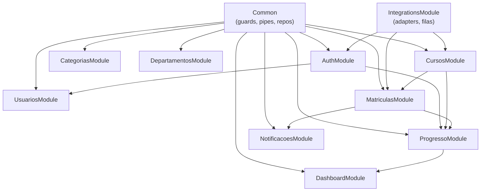
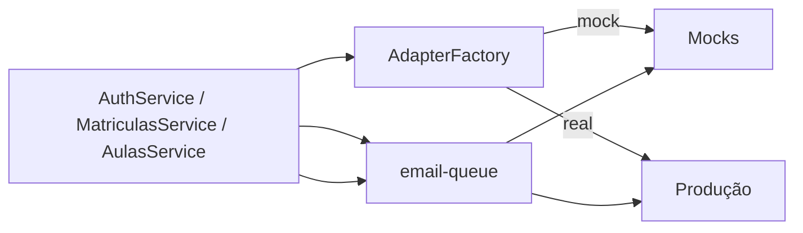
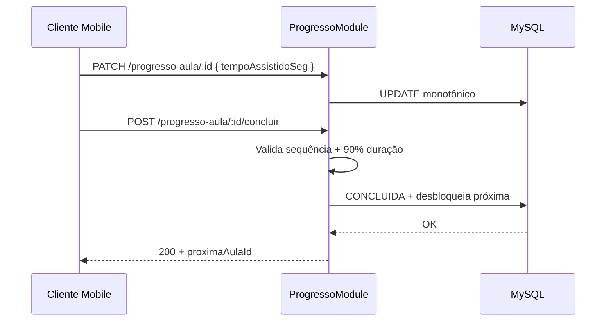

# PLANO DE BACK-END — EducaFlex

**Versão:** 1.0  
**Data:** 04/09/2026  
**Status:** Plano aprovável para desenvolvimento  
**Autor:** Tech Lead Back-end  
**Referências:** [PRD.md](./PRD.md) · [ARQUITETURA.md](./ARQUITETURA.md) · [MODELO-DADOS.md](./MODELO-DADOS.md) · [ESTRATEGIA-QA.md](./ESTRATEGIA-QA.md) · [HISTORIAS-USUARIO.md](./HISTORIAS-USUARIO.md) · [ROADMAP.md](./ROADMAP.md)

---

## 1. Objetivo

Este documento define o **plano de implementação da API EducaFlex** (NestJS + MySQL 8+): ordem de entrega por fases, módulos, contratos REST v1, regras de negócio na camada de serviço, integrações externas com adapters mock, filas, secrets e critérios de aceite mensuráveis.

**Escopo restrito — v1 (MVP):**

| Camada incluída | Responsabilidade |
|-----------------|------------------|
| **Back-end / API** | REST `/api/v1`, JWT, papéis ALUNO/GESTOR, sequenciamento, progresso, matrículas, dashboard, adapters |
| **Banco de dados** | MySQL 8+ — entidades do domínio; migrations; seed categorias e departamentos |
| **Login / Contas** | Autenticação aluno/gestor, perfis, recuperação de senha (e-mail mockável) |

**Clientes consumidores da API v1:** App Mobile (Flutter) e Painel Web (Next.js). Contratos **client-agnostic** — mesmos endpoints e DTOs para ambos.

**Fora de escopo v1 (PRD §2.2):** Quiz/múltipla escolha, certificado PDF automático, ranking/gamificação, push nativo FCM/APNs, SSO/LDAP, multi-tenant, offline playback, WebSocket/SSE.

> **Nota:** UI mobile, UI web e painel admin são camadas separadas; este plano cobre exclusivamente a **API**, **persistência** e **contas**.

---

## 2. Visão geral da API

| Aspecto | Decisão |
|---------|---------|
| Framework | NestJS modular (ADR-001) |
| Persistência | MySQL 8+ via Prisma + migrations versionadas (ADR-004) |
| Autenticação | JWT stateless; payload `sub`, `email`, `papel` (ADR-005) |
| Autorização | `JwtAuthGuard` + `RolesGuard` — `ALUNO` \| `GESTOR` |
| Sync v1 | HTTP request/response — sob demanda; sem WebSocket (ADR-002) |
| Conectividade | Somente online — API não aceita fila local de mutações (RNF-001) |
| Documentação | OpenAPI/Swagger em `/api/docs` |
| Prefixo global | `/api/v1` |
| Formato | JSON; timestamps ISO 8601 UTC |
| Idioma | Mensagens de erro em PT-BR (RNF-004) |
| Performance alvo | p95 < 500 ms em carga nominal ~100 usuários (RNF-003) |
| Nomenclatura | DB `snake_case`; API/DTO `camelCase`; Prisma `PascalCase` — ver [MODELO-DADOS.md](./MODELO-DADOS.md) §1.4 |

### 2.1 Módulos NestJS — v1

| Módulo | Responsabilidade | Requisitos |
|--------|------------------|------------|
| `AuthModule` | Login, forgot/reset password, perfil, emissão JWT | RF-AUTH-01–05 |
| `UsuariosModule` | Listagem e gestão básica de usuários (gestor) | RF-AUTH, PRD §3.2 |
| `CursosModule` | CRUD curso, módulo, aula; publicação | RF-CURSO-01–06 |
| `MatriculasModule` | Matrícula individual e por departamento; remoção soft | RF-PROG-01–03, RN-03 |
| `ProgressoModule` | Tempo assistido, conclusão, sequenciamento, stream URL | RF-PROG-04–06, RN-01, RN-04, RN-07 |
| `DashboardModule` | Agregações taxa de conclusão | RF-DASH-01–02 |
| `NotificacoesModule` | CRUD in-app | RF-NOTIF-01 |
| `CategoriasModule` | Listagem categorias seed | RF-CURSO-01 |
| `DepartamentosModule` | Listagem departamentos (lookup matrícula) | RN-03 |
| `IntegrationsModule` | Adapters e filas (e-mail, push, storage, streaming) | PRD §8 |
| `Common` | Guards, pipes, filtros exceção, repositórios base | RNF-005, RNF-007 |

> **v2+ (não implementar na v1):** `QuizModule`, `CertificadoModule`, `GamificacaoModule`, `SsoModule`.

### 2.2 Mapa de dependências entre módulos



### 2.3 Banco de dados MySQL

| Aspecto | Decisão |
|---------|---------|
| ORM | Prisma com migrations versionadas |
| Engine | InnoDB; charset `utf8mb4_unicode_ci` |
| Entidades v1 | `departamento`, `usuario`, `categoria`, `curso`, `modulo`, `aula`, `matricula`, `progresso_aula`, `notificacao`, `arquivo` |
| Seed | 5 categorias + departamentos exemplo (US-DB-002) |
| Soft delete | `matricula.removido_em`; `curso.arquivado_em` |
| IDs | UUID `CHAR(36)` em entidades principais; `INT` em lookup tables |
| Índices críticos | `(usuario_id, aula_id)` progresso; `(curso_id)` matricula; ver MODELO-DADOS §4 |

---

## 3. Ordem de implementação

A ordem prioriza **desbloqueio paralelo mobile + web**, **fundação de dados**, **risco de sequenciamento/progresso** e **integrações mock desde sprint 1**.

### Fase B0 — Fundação (Semana 1)

| # | Entrega | Descrição | Histórias | Bloqueia |
|---|---------|-----------|-----------|----------|
| B0.1 | Scaffold NestJS | Projeto em `backend/`, config, env, health check | US-DB-001 | Tudo |
| B0.2 | Prisma + MySQL | Schema completo v1; migrations 001–008 | US-DB-001 | B0.3+ |
| B0.3 | Seed | Categorias + departamentos idempotentes | US-DB-002 | B2, B4 |
| B0.4 | IntegrationsModule (mock) | `MockEmailAdapter`, `NoOpPushAdapter`, `LocalStorageAdapter`, `MockStreamUrlAdapter`; flag `INTEGRATIONS_MODE` | PRD §8 | B1, B5 |
| B0.5 | Common layer | ValidationPipe, ExceptionFilter, JwtAuthGuard stub, RolesGuard stub | US-AUTH-004 | B1+ |
| B0.6 | OpenAPI base | Swagger `/api/docs`; tags por módulo | — | Paralelo |
| B0.7 | Docker Compose | MySQL local + variáveis `.env.example` | US-DB-001 | Paralelo |

**Critério de done B0:** `GET /api/v1/health` retorna 200; migrations aplicam clean; seed idempotente; adapters mock registrados; Swagger acessível.

---

### Fase B1 — Autenticação e contas (Semana 1–2)

| # | Entrega | Endpoints | Histórias | Requisitos |
|---|---------|-----------|-----------|------------|
| B1.1 | Login | `POST /auth/login` | US-AUTH-001 | RF-AUTH-01, RF-AUTH-02 |
| B1.2 | Perfil | `GET /auth/me`, `PATCH /auth/me` | US-AUTH-003 | RF-AUTH-04 |
| B1.3 | Recuperação senha | `POST /auth/forgot-password`, `POST /auth/reset-password` | US-AUTH-002 | RF-AUTH-03 |
| B1.4 | Guards JWT + Roles | `@Roles('GESTOR')`, `@Roles('ALUNO')` | US-AUTH-004 | RF-AUTH-02, RN-06 |
| B1.5 | Fila e-mail | `email-queue` in-process; forgot-password enfileira | PRD §8.2 | RF-AUTH-03 |
| B1.6 | Testes Auth | Unit + integração login, guards, reset | — | TC-AUTH-* |

> **Logout (RF-AUTH-05):** invalidação client-side; sem blacklist JWT na v1 (ADR-005).

> **Registro público:** v1 assume usuários pré-provisionados pelo gestor ou seed; `POST /auth/register` opcional P2 — não bloqueia MVP.

**Critério de done B1:** Login aluno/gestor retorna JWT + `papel`; token inválido → 401; gestor bloqueado em rotas aluno e vice-versa (403); reset senha funciona com `MockEmailAdapter`.

---

### Fase B2 — Lookups e usuários (Semana 2)

| # | Entrega | Endpoints | Histórias | Requisitos |
|---|---------|-----------|-----------|------------|
| B2.1 | Categorias | `GET /categorias` | US-DB-002 | RF-CURSO-01 |
| B2.2 | Departamentos | `GET /departamentos` | US-DB-002 | RN-03 |
| B2.3 | Listagem usuários | `GET /usuarios` (filtros: papel, departamentoId) | US-AUTH-* | PRD §5.2 |
| B2.4 | Criação usuário (gestor) | `POST /usuarios` (opcional P1) | — | Gestão básica |

**Critério de done B2:** Gestor autenticado lista categorias, departamentos e alunos para matrícula.

---

### Fase B3 — Cursos, módulos e aulas (Semana 2–3)

| # | Entrega | Endpoints | Histórias | Requisitos |
|---|---------|-----------|-----------|------------|
| B3.1 | CRUD curso | `GET/POST /cursos`, `GET/PATCH/DELETE /cursos/:id` | US-API-001 | RF-CURSO-01 |
| B3.2 | CRUD módulo | `POST /cursos/:id/modulos`, `PATCH/DELETE /modulos/:id` | US-API-002 | RF-CURSO-02 |
| B3.3 | CRUD aula | `POST /modulos/:id/aulas`, `PATCH/DELETE /aulas/:id` | US-API-003 | RF-CURSO-03–05 |
| B3.4 | Publicação | `PATCH /cursos/:id` `{ status: PUBLICADO }` | US-API-001 | RF-CURSO-06, RN-05 |
| B3.5 | Upload anexos | `POST /aulas/:id/arquivos/presign` + confirmação | US-API-003 | RF-CURSO-05 |
| B3.6 | Thumbnail curso | Upload via `StorageAdapter` | — | RF-CURSO-01 |
| B3.7 | Validações | Ordem única módulo/aula; tipo VIDEO exige `videoUrl` + `duracaoSeg` | — | MODELO-DADOS §4.6 |
| B3.8 | Testes CRUD | Integração gestor-only | — | TC-CURSO-* |

**Critério de done B3:** Gestor cria curso RASCUNHO → adiciona módulos/aulas → publica; aluno **não** vê curso não matriculado ou RASCUNHO; apenas GESTOR acessa CRUD (403 para ALUNO).

---

### Fase B4 — Matrículas (Semana 3)

| # | Entrega | Endpoints | Histórias | Requisitos |
|---|---------|-----------|-----------|------------|
| B4.1 | Matrícula individual | `POST /cursos/:id/matriculas` `{ usuarioIds: [] }` | US-API-004 | RF-PROG-01, RN-03 |
| B4.2 | Matrícula departamento | `POST /cursos/:id/matriculas` `{ departamentoId }` | US-API-004 | RF-PROG-02, RN-03, CS-06 |
| B4.3 | Remoção matrícula | `DELETE /matriculas/:id` (soft `removido_em`) | US-API-004 | RF-PROG-03 |
| B4.4 | Bootstrap progresso | INSERT `progresso_aula` para todas aulas; 1ª aula `EM_PROGRESSO` | — | MODELO-DADOS §5.4 |
| B4.5 | Notificação matrícula | INSERT `notificacao` + enqueue e-mail mock | US-NOTIF-* | RF-NOTIF-01, RF-NOTIF-02 |
| B4.6 | Testes matrícula | Dept N=10 → 100% matriculados | — | TC-MAT-001, CS-06 |

**Critério de done B4:** Matrícula por departamento cria N registros; duplicata ignorada; remoção soft; progresso inicializado corretamente.

---

### Fase B5 — Progresso e consumo aluno (Semana 3–4)

| # | Entrega | Endpoints | Histórias | Requisitos |
|---|---------|-----------|-----------|------------|
| B5.1 | Cursos matriculados | `GET /me/courses` | US-API-005 | RF-PROG-06 |
| B5.2 | Detalhe curso aluno | `GET /me/courses/:id` (módulos, aulas, progresso) | US-API-005 | RF-PROG-06 |
| B5.3 | Stream URL | `GET /aulas/:id/stream-url` | US-API-006 | RF-CURSO-04, RNF-006, RNF-007 |
| B5.4 | Tempo assistido | `PATCH /progresso-aula/:aulaId` | US-API-007 | RF-PROG-04, RN-04, CS-05 |
| B5.5 | Conclusão aula | `POST /progresso-aula/:aulaId/concluir` | US-API-007 | RF-PROG-05, RN-01, RN-07, CS-04 |
| B5.6 | Sequenciamento | `ProgressoService` valida ordem global; desbloqueia próxima | — | RN-01, ADR-008 |
| B5.7 | Sync incremental | Query `?updatedSince=` em `/me/courses` (opcional P1) | — | RNF-002 |
| B5.8 | Testes progresso | Sequenciamento 403; heartbeat monotônico; 90% duração | — | TC-PROG-*, CS-04, CS-05 |

**Critério de done B5:** Aluno consome apenas cursos matriculados PUBLICADO; pular aula bloqueada → 403; conclusão vídeo exige ≥ 90% `duracaoSeg`; próxima aula desbloqueada; stream URL expira ≤ 4 h.

---

### Fase B6 — Dashboard, notificações e entrega (Semana 4–5)

| # | Entrega | Endpoints | Histórias | Requisitos |
|---|---------|-----------|-----------|------------|
| B6.1 | Dashboard conclusão | `GET /dashboard/conclusao` (filtros: cursoId, departamentoId) | US-API-008 | RF-DASH-01–02, CS-03 |
| B6.2 | Alunos ativos | Campo `alunosAtivos30d` no dashboard (P1) | — | RF-DASH-03 |
| B6.3 | Notificações | `GET /notificacoes`, `PATCH /notificacoes/:id/lida` | US-NOTIF-* | RF-NOTIF-01 |
| B6.4 | Índices performance | EXPLAIN queries dashboard e listagens | US-DB-003 | RNF-003, CS-03 |
| B6.5 | OpenAPI final | Todos endpoints v1 documentados | — | DoD PRD §13 |
| B6.6 | Testes E2E API | Fluxo gestor cria → publica → matricula → aluno conclui → dashboard | — | CS-02, CS-03 |
| B6.7 | README API | Setup, env, migrations, seed, modos mock/real | — | — |

**Critério de done B6:** Dashboard taxa conclusão bate cálculo manual (0% divergência amostra 20 alunos — CS-03); notificações in-app listáveis; Swagger completo; critérios CS-01 a CS-06 verificáveis via API.

---

## 4. Contratos REST — Autenticação

Base: `/api/v1/auth`

### 4.1 POST `/auth/login`

**Auth:** Pública  
**Body:**

| Campo | Tipo | Obrigatório |
|-------|------|-------------|
| `email` | string | Sim |
| `password` | string | Sim |

**Respostas:**

| Status | Corpo |
|--------|-------|
| 200 | `{ accessToken, usuario: UsuarioDto }` — inclui `papel` |
| 401 | Credenciais inválidas (mensagem genérica) |
| 429 | Rate limit excedido |

---

### 4.2 POST `/auth/forgot-password`

**Auth:** Pública  
**Body:** `{ email }`

| Status | Corpo |
|--------|-------|
| 202 | `{ message: "Se o e-mail existir, enviaremos instruções." }` — sempre 202 (anti-enumeração) |
| 429 | Rate limit |

**Comportamento:** Gera token hash em DB (expira 1 h); enfileira `email-queue` com link reset.

---

### 4.3 POST `/auth/reset-password`

**Auth:** Pública  
**Body:** `{ token, newPassword }`

| Status | Corpo |
|--------|-------|
| 200 | `{ message: "Senha redefinida com sucesso." }` |
| 400 | Token inválido ou expirado |
| 422 | Senha não atende política (mín. 8 caracteres) |

---

### 4.4 GET `/auth/me`

**Auth:** JWT (ALUNO ou GESTOR)

| Status | Corpo |
|--------|-------|
| 200 | `UsuarioDto` |
| 401 | Token inválido |

---

### 4.5 PATCH `/auth/me`

**Auth:** JWT  
**Body:** `{ nome?, avatarUrl? }` — e-mail imutável v1

| Status | Corpo |
|--------|-------|
| 200 | `UsuarioDto` atualizado |
| 422 | Validação |

---

## 5. Contratos REST — Lookups e usuários

### 5.1 GET `/categorias`

**Auth:** JWT · **Papel:** *  
**Resposta 200:** `{ items: CategoriaDto[] }`

---

### 5.2 GET `/departamentos`

**Auth:** JWT · **Papel:** GESTOR  
**Resposta 200:** `{ items: [{ id, nome }] }`

---

### 5.3 GET `/usuarios`

**Auth:** JWT · **Papel:** GESTOR

**Query:**

| Param | Tipo | Descrição |
|-------|------|-----------|
| `papel` | `ALUNO` \| `GESTOR` | Filtro |
| `departamentoId` | number | Filtro |
| `page`, `limit` | int | Paginação |

**Resposta 200:** `{ items: UsuarioDto[], meta: { page, limit, total } }`

---

## 6. Contratos REST — Cursos (gestor)

Base: `/api/v1/cursos` · **Papel:** GESTOR

### 6.1 POST `/cursos`

**Body:**

| Campo | Obrigatório | Validação |
|-------|-------------|-----------|
| `titulo` | Sim | 1–200 chars |
| `descricao` | Não | text |
| `categoriaId` | Sim | FK válida |

**Resposta 201:** `CursoDto` com `status: RASCUNHO`, `gestorId` inferido do JWT.

---

### 6.2 GET `/cursos`

**Query:** `status?`, `categoriaId?`, `page`, `limit`

**Resposta 200:** `{ items: CursoDto[], meta }` — gestor vê cursos que criou (v1 single-gestor ou filtro `gestorId`).

---

### 6.3 GET `/cursos/:id`

**Resposta 200:** `CursoDto` com `modulos[]` aninhados e `aulas[]` — **sem** `videoUrl` exposto.

---

### 6.4 PATCH `/cursos/:id`

**Body parcial:** `titulo`, `descricao`, `categoriaId`, `status`

**Regras RN-05:** Ao `status → PUBLICADO`, preenche `publicado_em`; curso passa visível para alunos matriculados após sync.

---

### 6.5 DELETE `/cursos/:id`

**Comportamento:** Soft archive — `status: ARQUIVADO`, `arquivado_em` preenchido.

---

### 6.6 POST `/cursos/:id/modulos`

**Body:** `{ titulo, ordem }`

**Resposta 201:** `ModuloDto`

---

### 6.7 PATCH `/modulos/:id` · DELETE `/modulos/:id`

Atualização/remoção com validação de ordem e cascata restrita (RESTRICT FK).

---

### 6.8 POST `/modulos/:id/aulas`

**Body:**

| Campo | Obrigatório | Condição |
|-------|-------------|----------|
| `titulo` | Sim | |
| `tipo` | Sim | `VIDEO` \| `ARTIGO` |
| `ordem` | Sim | |
| `conteudo` | Se ARTIGO | HTML/markdown |
| `videoUrl` | Se VIDEO | Referência CDN (não exposta ao aluno) |
| `duracaoSeg` | Se VIDEO | Inteiro > 0 |

---

### 6.9 POST `/aulas/:id/arquivos/presign`

**Body:** `{ nomeOriginal, mimeType, tamanhoBytes }`  
**Resposta 200:** `{ uploadUrl, arquivoId, expiresAt }` — via `StorageAdapter`.

---

## 7. Contratos REST — Matrículas

Base: `/api/v1` · **Papel:** GESTOR

### 7.1 POST `/cursos/:id/matriculas`

**Body (um dos modos):**

```json
{ "usuarioIds": ["uuid1", "uuid2"] }
```

```json
{ "departamentoId": 1 }
```

| Status | Corpo |
|--------|-------|
| 201 | `{ criadas: number, ignoradas: number, matriculas: MatriculaDto[] }` |
| 404 | Curso ou departamento inexistente |
| 409 | Curso não PUBLICADO (opcional — permitir matrícula em RASCUNHO conforme decisão PO; default: apenas PUBLICADO) |

**Efeitos colaterais:** Bootstrap `progresso_aula`; notificação in-app; e-mail mock enfileirado.

---

### 7.2 DELETE `/matriculas/:id`

**Comportamento:** Soft delete — `removido_em = now()`; progresso preservado para auditoria.

---

## 8. Contratos REST — Consumo aluno

Base: `/api/v1` · **Papel:** ALUNO

### 8.1 GET `/me/courses`

**Query:** `updatedSince?` (ISO 8601, opcional)

**Resposta 200:**

```json
{
  "items": [
    {
      "id": "uuid",
      "titulo": "string",
      "thumbnailUrl": "string|null",
      "percentualConclusao": 45.5,
      "aulasConcluidas": 9,
      "aulasTotal": 20,
      "proximaAulaId": "uuid|null"
    }
  ]
}
```

**Regras:** Apenas cursos `PUBLICADO` + matrícula ativa (`removido_em IS NULL`).

---

### 8.2 GET `/me/courses/:id`

**Resposta 200:** Curso com `modulos[].aulas[]` e `progresso: ProgressoAulaDto` por aula — inclui `status` (`BLOQUEADA` \| `EM_PROGRESSO` \| `CONCLUIDA`).

---

### 8.3 GET `/aulas/:id/stream-url`

**Pré-condições:** Aluno matriculado; aula tipo VIDEO; aula desbloqueada (`EM_PROGRESSO` ou retomada).

| Status | Corpo |
|--------|-------|
| 200 | `{ streamUrl, expiresAt }` — expiração ≤ 4 h |
| 403 | Não matriculado ou aula bloqueada |
| 404 | Aula inexistente |

**Implementação:** `StreamUrlAdapter.sign(aula.videoUrl, usuarioId)` — mock retorna URL sample (Big Buck Bunny).

---

### 8.4 PATCH `/progresso-aula/:aulaId`

**Body:** `{ tempoAssistidoSeg: number }`

**Regras RN-04:**
- Valor **monotônico crescente** — `GREATEST(atual, novo)`.
- Atualiza `updated_at`.
- Se status `BLOQUEADA` e aula desbloqueada → transiciona `EM_PROGRESSO`.

| Status | Corpo |
|--------|-------|
| 200 | `ProgressoAulaDto` |
| 403 | Aula bloqueada |
| 404 | Progresso inexistente |

---

### 8.5 POST `/progresso-aula/:aulaId/concluir`

**Body:** vazio

**Validações:**
1. Aula anterior concluída (RN-01) — ordem global `modulo.ordem` + `aula.ordem`.
2. Vídeo: `tempoAssistidoSeg >= duracaoSeg * 0.9` (RN-07).
3. Artigo: conclusão explícita permitida quando desbloqueada.

| Status | Corpo |
|--------|-------|
| 200 | `{ progresso: ProgressoAulaDto, proximaAulaId: string|null }` |
| 403 | Sequenciamento violado ou tempo insuficiente |
| 409 | Idempotente se já CONCLUIDA → 200 |

**Efeito:** Desbloqueia próxima aula (`EM_PROGRESSO`); demais permanecem `BLOQUEADA`.

---

## 9. Contratos REST — Dashboard e notificações

### 9.1 GET `/dashboard/conclusao`

**Auth:** GESTOR

**Query:** `cursoId?`, `departamentoId?`

**Resposta 200:**

```json
{
  "items": [
    {
      "cursoId": "uuid",
      "cursoTitulo": "string",
      "departamentoId": 1,
      "departamentoNome": "TI",
      "totalMatriculados": 25,
      "totalConcluidos": 10,
      "taxaConclusao": 40.0
    }
  ],
  "geral": {
    "totalMatriculados": 100,
    "totalConcluidos": 35,
    "taxaConclusao": 35.0
  }
}
```

**Cálculo (CS-03):** Aluno **concluído** = 100% aulas do curso com `progresso_aula.status = CONCLUIDA`. Query de referência em [MODELO-DADOS.md](./MODELO-DADOS.md) §9.2.

---

### 9.2 GET `/notificacoes`

**Auth:** JWT · **Papel:** *

**Query:** `lida?`, `page`, `limit`

**Resposta 200:** `{ items: NotificacaoDto[], meta }`

---

### 9.3 PATCH `/notificacoes/:id/lida`

**Body:** `{ lida: true }`

---

## 10. Integrações externas

### 10.1 Matriz v1

| Integração | Interface | Impl v1 (mock) | Impl produção | Fila |
|------------|-----------|----------------|---------------|------|
| E-mail transacional | `EmailAdapter` | `MockEmailAdapter` (console/log) | SendGrid / AWS SES (v1.1) | `email-queue` |
| Push notifications | `PushAdapter` | `NoOpPushAdapter` | FCM + APNs (v2) | — |
| Armazenamento | `StorageAdapter` | `LocalStorageAdapter` (`./uploads`) | AWS S3 + presigned | — |
| Streaming vídeo | `StreamUrlAdapter` | `MockStreamUrlAdapter` (URL sample) | Vimeo / CloudFront | — |

### 10.2 AdapterFactory

| Flag | Comportamento |
|------|---------------|
| `INTEGRATIONS_MODE=mock` | Todas impl mock — default dev/staging inicial |
| `INTEGRATIONS_MODE=real` | Impl produção; exige secrets configurados |



### 10.3 Filas e processamento assíncrono

| Fila | Propósito | Implementação v1 | Retry |
|------|-----------|------------------|-------|
| `email-queue` | Forgot-password, aviso matrícula | In-process (`EventEmitter`) ou BullMQ opcional | 3 tentativas; log falha |
| `progresso-queue` | Batch heartbeat (opcional) | **Não obrigatório** — PATCH síncrono aceitável | — |

> Mock e-mail **não exige Redis** — fila in-process suficiente para MVP.

### 10.4 Comportamento dos mocks

| Adapter | Comportamento |
|---------|---------------|
| `MockEmailAdapter` | Loga `{ to, subject, body }`; retorna `{ messageId: "mock-uuid" }` |
| `NoOpPushAdapter` | `{ success: true }` sem side-effect |
| `LocalStorageAdapter` | Salva filesystem; retorna URL relativa `/uploads/{key}` |
| `MockStreamUrlAdapter` | Retorna URL vídeo sample HTTPS; `expiresAt = now + 4h` |

### 10.5 Stubs para testes

| Stub | Uso |
|------|-----|
| `EmailAdapterStub` | Captura payloads para assert em testes |
| `StreamUrlAdapterStub` | Retorna URL fixa previsível |
| `StorageAdapterStub` | Simula presign sem I/O |

---

## 11. Gestão de secrets e configuração

### 11.1 Variáveis — API

| Variável | Sensível | Obrigatória | Descrição |
|----------|----------|-------------|-----------|
| `DATABASE_URL` | ✅ | Sim | Connection string MySQL |
| `JWT_SECRET` | ✅ | Sim | Assinatura JWT |
| `JWT_ACCESS_EXPIRES` | — | Não | Default `8h` |
| `INTEGRATIONS_MODE` | — | Não | `mock` \| `real` (default `mock`) |
| `PORT` | — | Não | Default `3000` |
| `CORS_ORIGINS` | — | Não | Origens web + mobile dev |
| `NODE_ENV` | — | Não | `development` \| `staging` \| `production` |
| `VIMEO_ACCESS_TOKEN` | ✅ | Se real | API Vimeo |
| `CLOUDFRONT_KEY_PAIR_ID` | ✅ | Se real | Assinatura CloudFront |
| `CLOUDFRONT_PRIVATE_KEY` | ✅ | Se real | Chave PEM |
| `EMAIL_API_KEY` | ✅ | Se real | SendGrid/SES |
| `EMAIL_FROM` | — | Se real | Remetente transacional |
| `STORAGE_BUCKET` | — | Se real | Bucket S3 |
| `AWS_ACCESS_KEY_ID` | ✅ | Se real | S3 |
| `AWS_SECRET_ACCESS_KEY` | ✅ | Se real | S3 |
| `UPLOAD_MAX_BYTES` | — | Não | Default 10 MB |

### 11.2 Variáveis — Clientes (referência)

| Variável | Camada | Descrição |
|----------|--------|-----------|
| `API_BASE_URL` | Mobile | Base URL REST |
| `NEXT_PUBLIC_API_URL` | Web | Base URL REST |

### 11.3 Checklist secrets

- [ ] `.env` no `.gitignore`; `.env.example` documentado sem valores reais
- [ ] Secrets distintos por ambiente (dev/staging/prod)
- [ ] Mobile/web **não** embutem credenciais de servidor (Vimeo, S3, e-mail)
- [ ] Rotação `JWT_SECRET` documentada para v1.1

---

## 12. Sync sob demanda — padrões REST (v1)

### 12.1 Gatilhos e endpoints

| Gatilho (cliente) | Endpoint API | Observação |
|-------------------|--------------|------------|
| Pull-to-refresh mobile | `GET /me/courses` | CS-02: latência ≤ 3 s |
| Após conclusão aula | `GET /me/courses/:id` | Atualiza progresso local |
| Login / foreground | `GET /me/courses` + `GET /notificacoes` | Bootstrap sessão |
| Publicação curso (web) | Aluno sync manual | Sem push server-side v1 |
| Pós-mutação web | Resposta HTTP completa + invalidação cache | React Query |

### 12.2 Delta incremental (opcional P1)

1. Cliente armazena `lastSyncedAt` (maior `updatedAt` conhecido).
2. `GET /me/courses?updatedSince=<ISO>` retorna apenas cursos alterados.
3. Fallback: full refresh sem param.

### 12.3 Fluxo conclusão (RN-01, RN-07)



---

## 13. Regras de negócio na API

| ID | Serviço | Comportamento HTTP |
|----|---------|-------------------|
| RN-01 | `ProgressoService.concluir` | 403 `AULA_BLOQUEADA` se anterior não concluída |
| RN-02 | — | v2: certificado após 100% |
| RN-03 | `MatriculasService` | Individual ou batch por `departamentoId`; soft delete remoção |
| RN-04 | `ProgressoService.atualizarTempo` | PATCH monotônico; heartbeat 15–30 s (cliente) |
| RN-05 | `CursosService.publicar` | `status=PUBLICADO`; visível após sync aluno |
| RN-06 | `RolesGuard` | GESTOR: CRUD; ALUNO: consumo |
| RN-07 | `ProgressoService.concluir` | 403 `TEMPO_INSUFICIENTE` se vídeo < 90% |

### 13.1 Formato padrão de erro

```json
{
  "statusCode": 403,
  "error": "Proibido",
  "message": "Conclua a aula anterior antes de avançar",
  "code": "AULA_BLOQUEADA",
  "timestamp": "2026-09-04T18:00:00.000Z",
  "path": "/api/v1/progresso-aula/uuid/concluir"
}
```

### 13.2 Códigos de erro de domínio

| Code | HTTP | Contexto |
|------|------|----------|
| `AULA_BLOQUEADA` | 403 | Sequenciamento RN-01 |
| `TEMPO_INSUFICIENTE` | 403 | RN-07 vídeo |
| `NAO_MATRICULADO` | 403 | Acesso curso/aula |
| `PAPEL_INSUFICIENTE` | 403 | RolesGuard |
| `CURSO_NAO_PUBLICADO` | 404 | Aluno tenta acessar RASCUNHO |
| `TOKEN_RESET_INVALIDO` | 400 | Reset senha |

---

## 14. Segurança

| Controle | Implementação |
|----------|---------------|
| Transporte | TLS 1.2+ staging/produção |
| Senhas | bcrypt cost ≥ 10 ou argon2 |
| JWT | Expiração configurável; logout client-side v1 |
| Autorização | `RolesGuard`; queries escopadas por `usuarioId` |
| Stream URL | Valida matrícula + expiração ≤ 4 h |
| Input | ValidationPipe `whitelist` + `forbidNonWhitelisted` |
| Rate limit | `/auth/login`, `/auth/forgot-password`: 10 req/min/IP |
| SQL injection | Prisma parametrizado |
| PII logs | Sem e-mail/senha em logs (RNF-005) |
| CORS | Origens explícitas via env |

---

## 15. Mapeamento requisitos → API

| Requisito (PRD) | Implementação back-end v1 |
|-----------------|---------------------------|
| RF-AUTH-01 | `POST /auth/login` + JWT |
| RF-AUTH-02 | `RolesGuard` ALUNO/GESTOR |
| RF-AUTH-03 | forgot/reset + `MockEmailAdapter` |
| RF-AUTH-04 | `GET/PATCH /auth/me` |
| RF-AUTH-05 | Sem endpoint; doc client-side |
| RF-CURSO-01–03 | CRUD `/cursos`, `/modulos`, `/aulas` |
| RF-CURSO-04 | `videoUrl` + `StreamUrlAdapter` |
| RF-CURSO-05 | `conteudo` artigo + presign anexos |
| RF-CURSO-06 | `PATCH status PUBLICADO` |
| RF-PROG-01–03 | `/cursos/:id/matriculas`, `DELETE /matriculas/:id` |
| RF-PROG-04 | `PATCH /progresso-aula/:aulaId` |
| RF-PROG-05 | `POST /progresso-aula/:aulaId/concluir` |
| RF-PROG-06 | Cálculo em `/me/courses` |
| RF-DASH-01–02 | `GET /dashboard/conclusao` |
| RF-NOTIF-01 | `GET /notificacoes` + insert na matrícula |

| Critério CS | Verificação API |
|-------------|-----------------|
| CS-01 | Stream URL válida; startup ≤ 2 s (CDN/mock) |
| CS-02 | Publicação → `GET /me/courses` ≤ 3 s |
| CS-03 | Dashboard vs SQL manual — 0% divergência |
| CS-04 | POST concluir aula bloqueada → 403 |
| CS-05 | Soma PATCH vs tempo reportado — erro ≤ 5 s |
| CS-06 | Matrícula dept N=10 → count = 10 |

---

## 16. Endpoints — resumo v1

| Método | Rota | Auth | Papel | Fase |
|--------|------|------|-------|------|
| GET | `/health` | Pública | — | B0 |
| POST | `/auth/login` | Pública | — | B1 |
| POST | `/auth/forgot-password` | Pública | — | B1 |
| POST | `/auth/reset-password` | Pública | — | B1 |
| GET | `/auth/me` | JWT | * | B1 |
| PATCH | `/auth/me` | JWT | * | B1 |
| GET | `/categorias` | JWT | * | B2 |
| GET | `/departamentos` | JWT | GESTOR | B2 |
| GET | `/usuarios` | JWT | GESTOR | B2 |
| GET/POST | `/cursos` | JWT | GESTOR | B3 |
| GET/PATCH/DELETE | `/cursos/:id` | JWT | GESTOR | B3 |
| POST | `/cursos/:id/modulos` | JWT | GESTOR | B3 |
| PATCH/DELETE | `/modulos/:id` | JWT | GESTOR | B3 |
| POST | `/modulos/:id/aulas` | JWT | GESTOR | B3 |
| PATCH/DELETE | `/aulas/:id` | JWT | GESTOR | B3 |
| POST | `/aulas/:id/arquivos/presign` | JWT | GESTOR | B3 |
| POST | `/cursos/:id/matriculas` | JWT | GESTOR | B4 |
| DELETE | `/matriculas/:id` | JWT | GESTOR | B4 |
| GET | `/me/courses` | JWT | ALUNO | B5 |
| GET | `/me/courses/:id` | JWT | ALUNO | B5 |
| GET | `/aulas/:id/stream-url` | JWT | ALUNO | B5 |
| PATCH | `/progresso-aula/:aulaId` | JWT | ALUNO | B5 |
| POST | `/progresso-aula/:aulaId/concluir` | JWT | ALUNO | B5 |
| GET | `/dashboard/conclusao` | JWT | GESTOR | B6 |
| GET | `/notificacoes` | JWT | * | B6 |
| PATCH | `/notificacoes/:id/lida` | JWT | * | B6 |

**v2+ (fora do escopo v1):**

| Método | Rota | Versão |
|--------|------|--------|
| POST | `/modulos/:id/quiz` | v2 |
| GET | `/me/certificados/:cursoId` | v2 |
| GET | `/gamificacao/ranking` | v2+ |
| POST | `/integrations/push/register` | v2 |

---

## 17. Estratégia de testes (back-end)

| Tipo | Escopo | Fase |
|------|--------|------|
| Unitário | Sequenciamento, 90% duração, cálculo conclusão, guards | B1, B5, B6 |
| Integração | Auth, CRUD cursos, matrícula dept, progresso | B3–B5 |
| Integração | Dashboard vs query SQL MODELO-DADOS §9.2 | B6 |
| Integração | Adapters mock — e-mail enfileirado, stream URL | B0, B1 |
| Performance | Dashboard p95 < 500 ms; listagens ~100 users | B6 |
| E2E API | Fluxo F1 + F2 completos (ARQUITETURA §5) | B6 |

> Casos detalhados em [ESTRATEGIA-QA.md](./ESTRATEGIA-QA.md) — TC-AUTH-*, TC-PROG-*, TC-DASH-*, TC-MAT-*.

---

## 18. Critérios de aceite globais (API v1)

- [ ] Todos endpoints Must do PRD §10 implementados e documentados no Swagger.
- [ ] Papéis ALUNO/GESTOR enforced — 403 nos cruzamentos (RN-06).
- [ ] Sequenciamento RN-01 — 100% bloqueios corretos (CS-04).
- [ ] Tempo assistido monotônico; erro ≤ 5 s em vídeo 5 min (CS-05).
- [ ] Matrícula departamento 100% alunos dept teste (CS-06).
- [ ] Dashboard taxa conclusão 0% divergência amostra 20 alunos (CS-03).
- [ ] Publicação curso visível em `GET /me/courses` após sync ≤ 3 s (CS-02).
- [ ] Adapters mock configuráveis via `INTEGRATIONS_MODE`.
- [ ] Migrations MySQL aplicáveis from scratch.
- [ ] Mensagens de erro 100% PT-BR.
- [ ] p95 API < 500 ms carga nominal (RNF-003).

---

## 19. Riscos e mitigações (back-end)

| Risco | Impacto | Mitigação |
|-------|---------|-----------|
| Sequenciamento incorreto | CS-04 falha | State machine explícita; testes TC-PROG-001 |
| Divergência % conclusão | CS-03 falha | Cálculo centralizado; query única dashboard + mobile |
| Integrações atrasam | Bloqueio e-mail reset | Mocks desde B0 (ADR-007) |
| Heartbeat perdido offline | RN-04 parcial | Monotônico; flush ao reconectar (cliente) |
| Latência streaming | CS-01 falha | CDN real staging; mock dev |
| Escopo creep quiz/certificado | Atraso MVP | Delimitar módulos v2 explícitos |

---

## 20. Extensões futuras (v2+)

| Item | Módulo / endpoint | Observação |
|------|-------------------|------------|
| Quiz múltipla escolha | `QuizModule` | Nota mínima RN-01 completa |
| Certificado PDF | `CertificadoModule` + fila geração | RN-02 |
| Gamificação | `GamificacaoModule` | Ranking, badges |
| Push nativo | `PushAdapter` FCM/APNs | Substituir NoOp |
| SSO/LDAP | `SsoModule` | Enterprise |
| Multi-tenant | `tenant_id` em entidades | SaaS |
| Refresh token + revogação | Tabela sessões ou Redis | Segurança |
| Exportação LGPD | `GET /me/dados-pessoais` | v1.1 recomendado |

---

## 21. Glossário

| Termo | Definição |
|-------|-----------|
| ProgressoAula | Registro de avanço do aluno em uma aula específica |
| Sequenciamento | Ordem global curso→módulo→aula; RN-01 |
| Sync sob demanda | Atualização HTTP quando cliente solicita (RNF-002) |
| URL assinada | Link temporário de streaming gerado pelo CDN |
| Adapter | Implementação substituível de integração externa |
| Curso / Serviço | Sinônimos de domínio para treinamento do catálogo |
| Taxa de conclusão | Alunos com 100% aulas concluídas / total matriculados |

---

## 22. Aprovações

| Papel | Nome | Data | Status |
|-------|------|------|--------|
| Tech Lead Back-end | — | 04/09/2026 | Rascunho |
| Arquiteto | — | — | Pendente |
| Product Owner | — | — | Pendente |
| Mobile Lead | — | — | Pendente |
| Front-end Lead | — | — | Pendente |

---

*Plano alinhado ao escopo PRD v1 EducaFlex: back-end/API NestJS, MySQL 8+, login/contas, adapters mock para integrações externas, filas leves e contratos REST para mobile Flutter e painel web Next.js. Sem código de aplicativo.*
