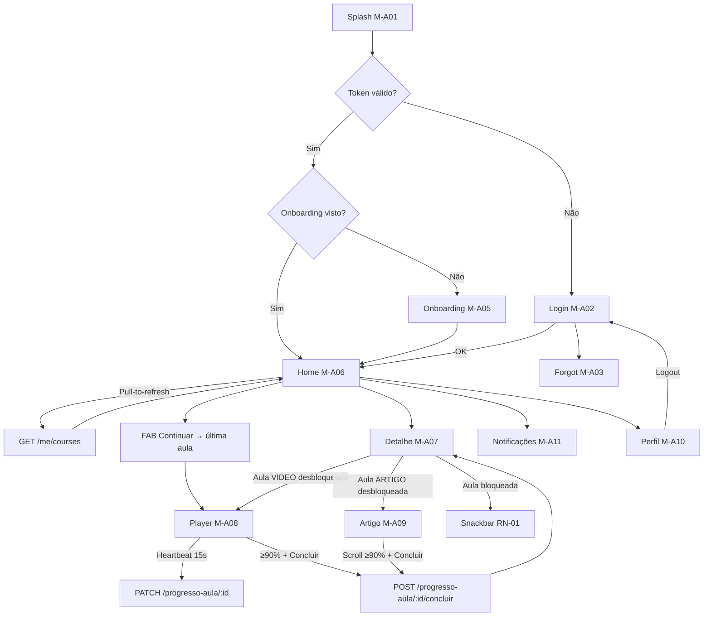
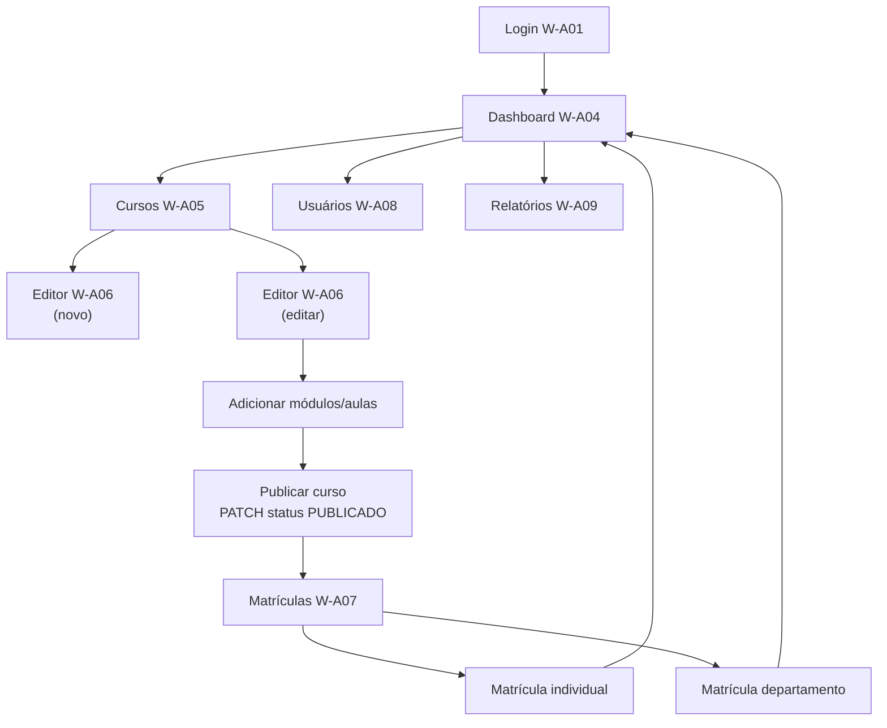
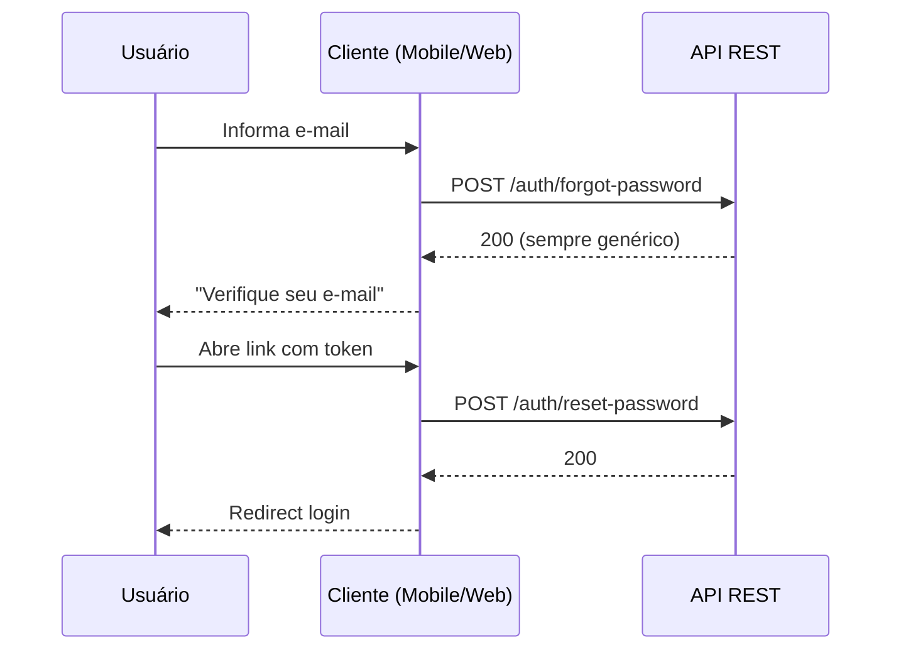
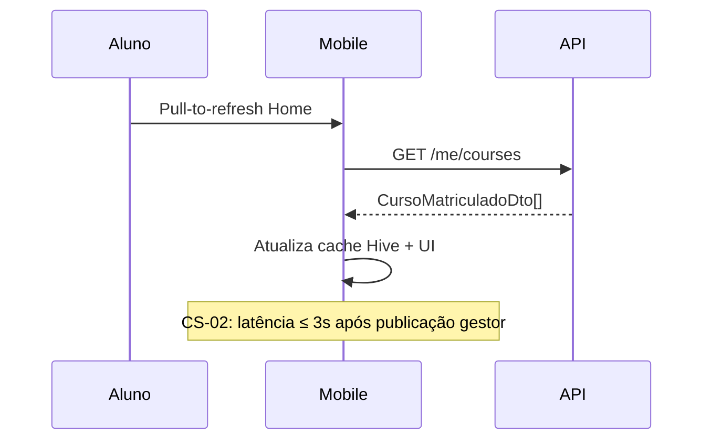
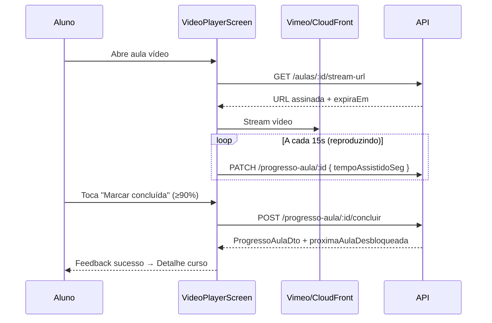

# Plano Front-end / Mobile — Educa

**Versão:** 1.0  
**Data:** 07/09/2026  
**Status:** Plano aprovável para desenvolvimento  
**Autor:** Tech Lead Front-end / Mobile  
**Referências:** [PRD.md](./PRD.md) · [ARQUITETURA.md](./ARQUITETURA.md) · [MODELO-DADOS.md](./MODELO-DADOS.md) · [PLANO-BACKEND.md](./PLANO-BACKEND.md) · [HISTORIAS-USUARIO.md](./HISTORIAS-USUARIO.md) · [ESTRATEGIA-QA.md](./ESTRATEGIA-QA.md)

---

## 1. Objetivo

Este documento define o **plano de implementação das camadas cliente Educa**: aplicativo **mobile** (Flutter/Dart) e **painel web** (Next.js/React). Cobre diretrizes visuais, inventário de telas/páginas, fluxos de navegação, ordem de construção, integração com a API REST v1, estratégia de sync sob demanda e critérios de aceite mensuráveis por fase.

**Escopo restrito — v1 (MVP):**

| Camada incluída | Responsabilidade |
|-----------------|------------------|
| **Mobile App** | Login, recuperar senha, onboarding, home de cursos matriculados, detalhe curso/aula, player vídeo, leitor artigo, marcar aula concluída, perfil, notificações in-app, sync sob demanda |
| **Front-end Web** | Login gestor, painel admin, CRUD curso/módulo/aula, matrícula individual e por departamento, dashboard taxa de conclusão, gestão básica de usuários, recuperar senha |
| **Login / Contas (cliente)** | Telas de autenticação mobile e web, persistência JWT, guards de navegação por papel, fluxo forgot/reset password |
| **Painel admin (UI)** | Gestão de cursos, alunos, departamentos e visualização de métricas — interface Next.js |

**Fora de escopo v1 (PRD §2.2):** Quiz/múltipla escolha, certificado PDF automático, ranking/gamificação, push nativo FCM/APNs, SSO/LDAP, multi-tenant, offline playback/download, WebSocket/SSE, relatórios analíticos avançados além da taxa de conclusão agregada.

**Não coberto neste plano:** implementação de back-end/API, banco de dados PostgreSQL, migrations, infraestrutura de deploy, adapters de integração server-side (e-mail, storage, streaming) — ver [PLANO-BACKEND.md](./PLANO-BACKEND.md).

**Clientes v1:** App Mobile (Flutter) e Painel Web (Next.js). Ambos consomem contratos REST `/api/v1` documentados em [PLANO-BACKEND.md](./PLANO-BACKEND.md) e DTOs de [MODELO-DADOS.md](./MODELO-DADOS.md).

> **Papéis:** **Usuário final (Aluno)** consome exclusivamente pelo **mobile**; **Administrador (Gestor)** gerencia exclusivamente pelo **web** (RN-06). Guards de cliente bloqueiam redirecionamentos cruzados.

---

## 2. Diretriz visual

Estilo **corporativo (corporate)** com referência de alta fidelidade ao ecossistema visual da **Stripe**: hierarquia clara, densidade informacional controlada, superfícies limpas e dados como protagonistas. Mobile mantém legibilidade e toque confortável; painel web prioriza grids de métricas, gráficos refinados e tabelas operacionais.

### 2.1 Paleta de cores

| Token | Hex | Uso |
|-------|-----|-----|
| `primary` | `#A30000` | AppBar mobile, botões primários web, links de ação, indicadores de progresso, destaques de marca |
| `primaryLight` | `#C41E1E` | Hover/pressed em elementos primários; estados ativos |
| `primaryDark` | `#7A0000` | AppBar em scroll; contraste em fundos claros |
| `primaryContainer` | `#FCEAEA` | Fundo de chips selecionados; badges de categoria; preenchimento gradiente suave em gráficos |
| `primaryGradientEnd` | `#A3000000` → transparente | Área sob linhas de gráfico (web) |
| `surface` | `#FFFFFF` | Fundo de cards, sheets, modais e painéis |
| `background` | `#F6F9FC` | Fundo geral (referência Stripe Dashboard) |
| `surfaceVariant` | `#EEF2F6` | Sidebar web; zebra alternada sutil em tabelas |
| `textPrimary` | `#0A2540` | Títulos e texto principal (tom azul-escuro corporativo) |
| `textSecondary` | `#425466` | Metadados (duração, departamento, datas) |
| `border` | `#E3E8EE` | Bordas de cards; divisores ultra-finos em tabelas |
| `borderSubtle` | `#F0F4F8` | Linhas divisórias internas de tabelas |
| `success` | `#09825D` | Badge **Sucesso**; aula concluída; KPI positivo |
| `warning` | `#C87800` | Badge **Pendente**; aula em progresso |
| `alert` | `#DF1B41` | Badge **Alerta**; erros críticos; ações destrutivas |
| `locked` | `#8898AA` | Aulas bloqueadas (RN-01) |
| `offlineBanner` | `#FFF8E6` | Banner sem conexão (RNF-001) |
| `offlineText` | `#7A4E00` | Texto do banner offline |

**Badges de status (web — padrão Stripe):**

| Variante | Label PT-BR | Fundo | Texto |
|----------|-------------|-------|-------|
| `success` | Sucesso / Concluído / Publicado | `#D7F5E9` | `#09825D` |
| `pending` | Pendente / Em progresso / Rascunho | `#FFF4E0` | `#C87800` |
| `alert` | Alerta / Bloqueado / Erro | `#FFE8EC` | `#DF1B41` |
| `neutral` | Arquivado / Inativo | `#EEF2F6` | `#425466` |

**Status de aula (mobile):**

| Estado API | Label PT-BR | Cor / ícone |
|------------|-------------|-------------|
| `BLOQUEADA` | Bloqueada | `locked` + ícone cadeado |
| `EM_PROGRESSO` | Em progresso | `warning` + barra parcial |
| `CONCLUIDA` | Concluída | `success` + ícone check |

### 2.2 Tipografia

| Estilo | Família | Tamanho | Peso | Uso |
|--------|---------|---------|------|-----|
| `display` | Inter (web) / SF Pro / Roboto (mobile) | 28 px / 24 sp | 600 | Título de tela (Login, Dashboard) |
| `headline` | Inter / SF Pro / Roboto | 22 px / 20 sp | 600 | Título de seção (Home, Detalhe curso) |
| `title` | Inter / SF Pro / Roboto | 18 px / 16 sp | 600 | Título de card (curso, módulo) |
| `body` | Inter / SF Pro / Roboto | 16 px / 14 sp | 400 | Descrição, labels de formulário |
| `caption` | Inter / SF Pro / Roboto | 14 px / 12 sp | 400 | Duração, % progresso, timestamps |
| `overline` | Inter | 12 px / 11 sp | 500 | Labels de KPI e cabeçalhos de coluna |
| `button` | Inter / SF Pro / Roboto | 16 px / 14 sp | 600 | Botões, tabs |
| `kpi` | Inter | 32–40 px | 700 | Valores numéricos no dashboard web |
| `kpiLabel` | Inter | 14 px | 500 | Rótulo abaixo do valor KPI |

- **Idioma:** PT-BR em todos os rótulos fixos (RNF-004).
- **Line-height:** 1.5 (body), 1.25 (títulos), 1.0 (KPI).
- Web: fonte **Inter** via next/font; mobile: system font stack com fallback Roboto.
- Sem variação tipográfica decorativa; consistência entre mobile e web.

### 2.3 Espaçamento e forma

| Token | Valor | Uso |
|-------|-------|-----|
| `radiusCard` | 12 px / 12 dp | Cards de curso, módulos, KPIs |
| `radiusButton` | 8 px / 8 dp | Botões, chips, inputs |
| `radiusBadge` | 6 px | Badges de status |
| `spacingXs` | 4 px / 4 dp | Gaps internos mínimos |
| `spacingSm` | 8 px / 8 dp | Padding interno de chips |
| `spacingMd` | 16 px / 16 dp | Padding de tela e cards |
| `spacingLg` | 24 px / 24 dp | Separação entre seções |
| `spacingXl` | 32 px / 32 dp | Margem entre blocos do dashboard |
| `elevationCard` | shadow-sm (web) / elevation 1 (mobile) | Sombra sutil; hover eleva +1 nível no web |
| `maxContentWidth` | 1280 px | Container centralizado no painel web |
| `tableRowHeight` | 48 px | Altura mínima de linha em DataTable |
| `dividerWidth` | 1 px | Divisores ultra-finos (`borderSubtle`) |

### 2.4 Componentes base

#### 2.4.1 Mobile (Flutter)

| Componente | Descrição | Variantes |
|------------|-----------|-----------|
| `AppButton` | Botão primário/secundário/texto | `primary`, `secondary`, `destructive`, `disabled` |
| `AppTextField` | Campo com label, erro inline | `text`, `email`, `password` |
| `CourseCard` | Card arredondado com thumbnail, título, barra progresso | `emProgresso`, `concluido`, `naoIniciado` |
| `LessonListTile` | Item de aula com ícone tipo, status e duração | `video`, `artigo` × `bloqueada`, `progresso`, `concluida` |
| `ProgressBar` | Barra linear % conclusão | cor `primary` (#A30000) |
| `ModuleAccordion` | Seção expansível de módulo com lista de aulas | expandido/colapsado |
| `VideoPlayerShell` | Container player + controles + botão concluir | loading, playing, error |
| `ArticleReader` | ScrollView com conteúdo rich text + anexos | — |
| `EmptyState` | Ilustração leve + mensagem + CTA | sem cursos, sem notificações |
| `OfflineBanner` | Banner persistente topo quando sem rede | — |
| `ConfirmDialog` | Modal de confirmação | logout, ação destrutiva |
| `LoadingOverlay` | Spinner em submit e pull-to-refresh | — |
| `SnackbarFeedback` | Feedback sucesso/erro/retry | — |
| `NotificationBadge` | Badge contador no ícone sino | — |
| `FabContinue` | FAB destacado "Continuar" na Home | cor `primary` |

#### 2.4.2 Web (Next.js — estética Stripe)

| Componente | Descrição | Variantes |
|------------|-----------|-----------|
| `Button` | Botão shadcn/ui ou equivalente | `default` (#A30000), `outline`, `destructive`, `ghost` |
| `Input` / `Textarea` | Campos de formulário com validação | — |
| `Select` / `Combobox` | Seletores categoria, departamento, papel | — |
| `DataTable` | Tabela moderna com linhas divisórias ultra-finas, filtro nativo e paginação | usuários, cursos |
| `MetricCard` | Card KPI em grid: valor grande + label + delta opcional | taxa global, cursos ativos, alunos |
| `LineChartGradient` | Gráfico de linha limpo com preenchimento em gradiente (`primary` → transparente) | evolução conclusão |
| `BarChart` | Gráfico de barras por curso/departamento | Recharts |
| `StatusBadge` | Badge colorido Sucesso / Pendente / Alerta | curso, matrícula, progresso |
| `CourseForm` | Formulário curso (título, categoria, descrição, thumbnail) | create, edit |
| `ModuleLessonEditor` | Editor aninhado módulos → aulas | drag-and-drop ordem (P1) |
| `EnrollmentPanel` | Matrícula individual (multi-select) e por departamento | — |
| `SidebarNav` | Navegação lateral fixa painel admin | colapsável em tablet |
| `PageHeader` | Título + breadcrumbs + ação primária | — |
| `FilterBar` | Barra de filtros inline acima de tabelas | departamento, status, busca |
| `ConfirmModal` | Confirmação remoção matrícula/curso | — |
| `Toast` | Feedback assíncrono de mutações | success, error |
| `Skeleton` | Loading states em tabelas, cards e gráficos | — |

### 2.5 Princípios de UX visual

- **Hierarquia clara:** título → metadados → ação; uma ação primária por tela.
- **Web estilo Stripe:** grid de `MetricCard` no dashboard; gráficos com linhas finas e área em gradiente; tabelas com `borderSubtle` e filtros integrados.
- **Mobile corporativo:** cards bem espaçados; FAB `#A30000` na Home para "Continuar última aula"; sem poluição visual.
- **Feedback imediato:** loading em botões; estados vazios com CTA contextual.
- **Sequenciamento visível:** aulas bloqueadas sempre distinguíveis (RN-01).
- **Online only:** banner amarelo quando sem rede; ações de escrita desabilitadas (RNF-001).
- **Acessibilidade mínima v1:** contraste WCAG AA; área de toque ≥ 48 dp no mobile.

---

## 3. Visão geral — Mobile App

| Aspecto | Decisão |
|---------|---------|
| Framework | Flutter 3.x (Dart) |
| Estrutura | `mobile/` — `lib/features/`, `lib/core/`, `lib/shared/` |
| Autenticação | JWT em secure storage (`flutter_secure_storage`) |
| Estado | Riverpod |
| HTTP | Dio com interceptors JWT |
| Cache local | Hive — snapshot de `CursoMatriculadoDto[]` e `NotificacaoDto[]` (somente leitura) |
| Sync v1 | **Sob demanda:** pull-to-refresh + revalidação após mutações + bootstrap no login |
| Navegação | GoRouter com redirect por sessão e papel ALUNO |
| Player vídeo | `video_player` + `chewie` (ou equivalente); URL via `GET /aulas/:id/stream-url` |
| Plataformas | Android 8+ e iOS 14+ |

### 3.1 Decisões de mobile

| ID | Decisão | Referência |
|----|---------|------------|
| FE-M01 | App mobile em projeto isolado `mobile/` consumindo API `/api/v1` | ARQUITETURA §4.1 |
| FE-M02 | Validação de formulários no cliente **e** na API; API é fonte de verdade | RNF-008 |
| FE-M03 | Sync **HTTP sob demanda**; sem WebSocket/SSE na v1 | RNF-002 |
| FE-M04 | **Somente online** — sem fila de escrita offline; leitura do último snapshot permitida | RNF-001 |
| FE-M05 | Heartbeat tempo assistido a cada **15 s** durante reprodução ativa | RN-04, CS-05 |
| FE-M06 | Botão "Marcar concluída" habilitado após **≥ 90%** duração (vídeo) ou scroll (artigo) | RN-07 |
| FE-M07 | Aulas bloqueadas: toque exibe snackbar explicativa; não navega | RN-01, CS-04 |
| FE-M08 | Logout invalida token **localmente**; sem endpoint logout na v1 | RF-AUTH-05 |
| FE-M09 | Token expirado (401) redireciona para login | PLANO-BACKEND F0 |
| FE-M10 | UI primária `#A30000`; estilo corporativo limpo | PRD estilo visual |
| FE-M11 | DTOs Dart alinhados a [MODELO-DADOS.md](./MODELO-DADOS.md) §1.4 | Consistência |
| FE-M12 | Onboarding exibido **1x** por instalação; flag em SharedPreferences | US-MOB-006 |

---

## 4. Visão geral — Painel Web

| Aspecto | Decisão |
|---------|---------|
| Framework | Next.js 14+ (App Router) |
| Estrutura | `src/app/` — rotas por feature; `src/components/`, `src/lib/` |
| Autenticação | JWT em httpOnly cookie ou localStorage + middleware Next.js |
| Estado servidor | React Query (TanStack Query) para cache e revalidação |
| HTTP | fetch ou axios com interceptor Bearer |
| UI kit | Tailwind CSS + componentes base §2.4.2 |
| Gráficos | Recharts — linha com gradiente + barras por curso/departamento |
| Navegação | Sidebar fixa + App Router layouts aninhados |
| Upload | Presigned URL via `POST /aulas/:id/arquivos/presign` |
| Público | Exclusivo papel **GESTOR** (Administrador) |

### 4.1 Decisões de web

| ID | Decisão | Referência |
|----|---------|------------|
| FE-W01 | Painel web em `src/app/` | ARQUITETURA §4.2 |
| FE-W02 | Middleware bloqueia rotas admin para token ALUNO ou ausente | RN-06 |
| FE-W03 | Após mutação CRUD curso, invalidar cache React Query; mobile reflete via sync aluno | RN-05, CS-02 |
| FE-W04 | Publicação curso = `PATCH /cursos/:id` `{ status: "PUBLICADO" }` com confirmação | RF-CURSO-06 |
| FE-W05 | Dashboard consome `GET /dashboard/conclusao`; exibir exatamente valores da API | CS-03 |
| FE-W06 | Matrícula por departamento via dropdown + confirmação em modal | RN-03, CS-06 |
| FE-W07 | Formulários com validação Zod alinhada a DTOs API | Consistência |
| FE-W08 | Layout corporativo `#A30000`; dashboard estilo Stripe (MetricCard grid + gráficos gradiente) | PRD estilo visual |
| FE-W09 | Recuperar senha web compartilha fluxo API com mobile | RF-AUTH-03 |
| FE-W10 | Tabelas com divisores ultra-finos, filtro e paginação nativos | PRD referência UI |

---

## 5. Mapa de dependências — Clientes ↔ API

```mermaid
flowchart TB
    subgraph API["Back-end (referência — PLANO-BACKEND)"]
        F0["F0 Fundação"]
        F1["F1 Conteúdo gestor"]
        F2["F2 Matrículas/Progresso"]
        F3["F3 Streaming/Consumo"]
        F4["F4 Dashboard/Admin"]
        F5["F5 Polimento"]
    end

    subgraph Mobile["App Flutter"]
        M0["M0 Fundação + DS"]
        M1["M1 Auth Mobile"]
        M2["M2 Home + Sync"]
        M3["M3 Curso + Player"]
        M4["M4 Perfil + Notif"]
        M5["M5 Qualidade E2E"]
    end

    subgraph Web["Painel Next.js"]
        W0["W0 Fundação + DS"]
        W1["W1 Auth Web"]
        W2["W2 CRUD Cursos"]
        W3["W3 Matrículas"]
        W4["W4 Dashboard"]
        W5["W5 Usuários + QA"]
    end

    F0 --> M0
    F0 --> W0
    F0 --> M1
    F0 --> W1
    F1 --> W2
    F2 --> W3
    F2 --> M2
    F3 --> M3
    F4 --> W4
    F4 --> W5
    F4 --> M4
    F5 --> M5
    F5 --> W5
```

---

## 6. Inventário de telas e páginas

### 6.1 Mobile — v1

| ID | Tela / Rota | Responsabilidade | Elementos principais | Requisitos / Histórias |
|----|-------------|------------------|----------------------|------------------------|
| M-A01 | `SplashScreen` `/` | Verificar JWT em storage; redirecionar Login, Onboarding (1x) ou Home | Logo Educa, indicador carregamento | US-MOB-001 |
| M-A02 | `LoginScreen` `/login` | Autenticar aluno; link recuperar senha | E-mail, senha, botão Entrar, erro genérico 401 | RF-AUTH-01, US-MOB-001 |
| M-A03 | `ForgotPasswordScreen` `/forgot-password` | Solicitar reset por e-mail | Campo e-mail, confirmação envio | RF-AUTH-03, US-AUTH-002 |
| M-A04 | `ResetPasswordScreen` `/reset-password` | Redefinir senha com token da URL deep link | Nova senha, confirmar, submit | RF-AUTH-03 |
| M-A05 | `OnboardingScreen` `/onboarding` | Tour boas-vindas (3 slides); pulável; 1x | Ilustrações, CTA "Começar" | US-MOB-006, P2 |
| M-A06 | `HomeScreen` `/home` | **Hub principal:** listar cursos matriculados com % progresso; sync sob demanda | AppBar (perfil, notificações), lista `CourseCard`, FAB Continuar, pull-to-refresh | RF-PROG-06, CS-02, US-MOB-002 |
| M-A07 | `CourseDetailScreen` `/courses/:id` | Trilha módulos/aulas; status bloqueado/progresso/concluído | `ModuleAccordion`, `LessonListTile`, header curso | RN-01, US-MOB-003 |
| M-A08 | `VideoPlayerScreen` `/courses/:courseId/lessons/:id/video` | Reproduzir vídeo CDN; heartbeat tempo; concluir aula | Player, barra progresso, botão concluir (≥90%) | RN-04, RN-07, CS-01, CS-05, US-MOB-004 |
| M-A09 | `ArticleReaderScreen` `/courses/:courseId/lessons/:id/article` | Renderizar artigo HTML/markdown; anexos; concluir após scroll | `ArticleReader`, lista anexos, botão concluir | RF-CURSO-05, US-MOB-005 |
| M-A10 | `ProfileScreen` `/profile` | Visualizar/editar nome e avatar; logout | Formulário perfil, departamento (read-only), Sair | RF-AUTH-04, US-AUTH-003 |
| M-A11 | `NotificationsScreen` `/notifications` | Listar notificações in-app; marcar como lida | Lista com badge, tap para ler | RF-NOTIF-01, US-MOB-006 |
| M-A12 | `OfflineBanner` (global) | Informar ausência de rede; desabilitar escrita | Banner topo persistente | RNF-001 |

### 6.2 Mobile — componentes transversais (não são rotas)

| ID | Componente | Responsabilidade |
|----|------------|------------------|
| M-C01 | `CourseCard` | Card curso com thumbnail, título, % e barra progresso |
| M-C02 | `LessonListTile` | Item aula com tipo, duração e status visual |
| M-C03 | `ProgressBar` | Barra % conclusão curso |
| M-C04 | `VideoPlayerShell` | Wrapper player + heartbeat + gate conclusão |
| M-C05 | `EmptyState` | Estado vazio contextual |
| M-C06 | `SyncIndicator` | Ícone AppBar: sincronizado / sem rede / sincronizando |
| M-C07 | `LockedLessonDialog` | Snackbar/dialog ao tocar aula bloqueada |

### 6.3 Web — v1

| ID | Página / Rota | Responsabilidade | Elementos principais | Requisitos / Histórias |
|----|---------------|------------------|----------------------|------------------------|
| W-A01 | `LoginPage` `/login` | Autenticar gestor; redirecionar dashboard | Form e-mail/senha, layout corporativo `#A30000` | RF-AUTH-01, US-WEB-001 |
| W-A02 | `ForgotPasswordPage` `/forgot-password` | Solicitar reset senha | Campo e-mail, feedback | RF-AUTH-03 |
| W-A03 | `ResetPasswordPage` `/reset-password` | Redefinir senha com token | Form nova senha | RF-AUTH-03 |
| W-A04 | `DashboardPage` `/dashboard` | **Hub gestor:** KPIs em grid e gráfico taxa conclusão | `MetricCard` grid, `LineChartGradient`, `BarChart`, `FilterBar` | RF-DASH-01–02, CS-03, US-WEB-004 |
| W-A05 | `CoursesListPage` `/admin/cursos` | Listar cursos do gestor com status e ações | `DataTable`, `StatusBadge`, botão "Novo curso", filtros | RF-CURSO-01, US-WEB-002 |
| W-A06 | `CourseEditorPage` `/admin/cursos/novo` · `/admin/cursos/:id` | CRUD curso + módulos + aulas aninhados | `CourseForm`, `ModuleLessonEditor`, publicar, upload thumbnail | RF-CURSO-01–06, CS-02, US-WEB-002 |
| W-A07 | `EnrollmentPage` `/admin/cursos/:id/matriculas` | Matricular/remover alunos individual ou departamento | `EnrollmentPanel`, multi-select, dropdown dept, confirmação | RN-03, CS-06, US-WEB-003 |
| W-A08 | `UsersListPage` `/admin/usuarios` | Listar/filtrar usuários; ação rápida matricular | `DataTable` paginada, `FilterBar`, `StatusBadge` | US-WEB-005 |
| W-A09 | `ReportsPage` `/admin/relatorios` | Gráficos taxa conclusão por curso e departamento (v1 básico) | `BarChart` expandido, filtros, export CSV opcional P2 | RF-DASH-02, P1 |
| W-A10 | `ProfilePage` `/perfil` | Perfil gestor e logout | Form nome/avatar, botão Sair | RF-AUTH-04 |
| W-A11 | `AdminLayout` `(admin)/layout` | Shell sidebar + header com navegação | `SidebarNav`, breadcrumbs, avatar gestor | FE-W08 |

### 6.4 Web — v2+ (referência roadmap; **não implementar na v1**)

| ID | Página | Responsabilidade prevista | Versão |
|----|--------|---------------------------|--------|
| W-B01 | `QuizEditorPage` | CRUD questões múltipla escolha por módulo | v2 |
| W-B02 | `CertificadosPage` | Emissão e download certificados PDF | v2 |
| W-B03 | `GamificacaoPage` | Ranking e badges entre funcionários | v2+ |
| W-B04 | `AnalyticsPage` | Relatórios avançados além taxa conclusão | v2+ |

---

## 7. Fluxos de navegação

### 7.1 Fluxo F1 — Aluno consome treinamento (mobile)

### 7.2 Fluxo F2 — Gestor cria curso e matricula (web)

### 7.3 Fluxo F3 — Recuperação de senha (mobile + web)

### 7.4 Fluxo — Sync sob demanda (mobile)

Gatilhos de sincronização na v1:

1. **Pull-to-refresh** na Home (`GET /me/courses`).
2. **Login / retorno ao foreground** — bootstrap `GET /me/courses` + `GET /notificacoes`.
3. **Pós-conclusão aula** — `GET /me/courses/:id` para atualizar trilha.
4. **Pós-matricula gestor** — aluno vê curso após próximo refresh (CS-02: ≤ 3 s).

### 7.5 Fluxo — Player vídeo e tempo assistido

---

## 8. Integração com API (cliente)

### 8.1 Endpoints consumidos — Mobile

| Operação | Método / Rota | Tela(s) | Fase |
|----------|---------------|---------|------|
| Login | `POST /auth/login` | M-A02 | M1 |
| Perfil | `GET/PATCH /auth/me` | M-A10 | M4 |
| Forgot/Reset | `POST /auth/forgot-password`, `POST /auth/reset-password` | M-A03, M-A04 | M1 |
| Cursos matriculados | `GET /me/courses` | M-A06 | M2 |
| Detalhe curso | `GET /me/courses/:id` | M-A07 | M3 |
| Stream URL | `GET /aulas/:id/stream-url` | M-A08 | M3 |
| Tempo assistido | `PATCH /progresso-aula/:aulaId` | M-A08 | M3 |
| Concluir aula | `POST /progresso-aula/:aulaId/concluir` | M-A08, M-A09 | M3 |
| Notificações | `GET /notificacoes`, `PATCH /notificacoes/:id/lida` | M-A11 | M4 |

### 8.2 Endpoints consumidos — Web

| Operação | Método / Rota | Página(s) | Fase |
|----------|---------------|-----------|------|
| Login | `POST /auth/login` | W-A01 | W1 |
| Forgot/Reset | `POST /auth/forgot-password`, `POST /auth/reset-password` | W-A02, W-A03 | W1 |
| Perfil | `GET/PATCH /auth/me` | W-A10 | W1 |
| Dashboard | `GET /dashboard/conclusao` | W-A04, W-A09 | W4 |
| CRUD cursos | `GET/POST/PATCH/DELETE /cursos` | W-A05, W-A06 | W2 |
| CRUD módulos | `POST /cursos/:id/modulos`, `PATCH/DELETE /modulos/:id` | W-A06 | W2 |
| CRUD aulas | `POST /modulos/:id/aulas`, `PATCH/DELETE /aulas/:id` | W-A06 | W2 |
| Upload | `POST /aulas/:id/arquivos/presign` | W-A06 | W2 |
| Categorias | `GET /categorias` | W-A06 | W2 |
| Matrículas | `POST /cursos/:id/matriculas`, `DELETE /matriculas/:id` | W-A07 | W3 |
| Usuários | `GET /usuarios` | W-A07, W-A08 | W3, W5 |
| Departamentos | `GET /departamentos` | W-A07 | W3 |

### 8.3 DTOs principais (referência MODELO-DADOS)

| DTO | Campos-chave exibidos na UI | Cliente |
|-----|----------------------------|---------|
| `UsuarioDto` | `id`, `nome`, `email`, `papel`, `departamentoId`, `avatarUrl` | Mobile, Web |
| `CursoMatriculadoDto` | `id`, `titulo`, `thumbnailUrl`, `percentualConclusao`, `ultimaAulaId` | Mobile Home |
| `CursoDetalheAlunoDto` | `modulos[]`, `aulas[]`, `progressoPorAula` | Mobile Detalhe |
| `AulaDto` | `id`, `titulo`, `tipo`, `duracaoSeg`, `ordem`, `statusProgresso` | Mobile, Web |
| `ProgressoAulaDto` | `tempoAssistidoSeg`, `status`, `concluidaEm` | Mobile Player |
| `CursoDto` | `titulo`, `descricao`, `categoriaId`, `status`, `modulos[]` | Web Admin |
| `TaxaConclusaoDashboardDto` | `taxaGlobal`, `porCurso[]`, `porDepartamento[]` | Web Dashboard |
| `NotificacaoDto` | `id`, `titulo`, `mensagem`, `lida`, `createdAt` | Mobile |
| `MatriculaDto` | `id`, `usuarioId`, `cursoId`, `matriculadoEm` | Web Matrículas |

### 8.4 Tratamento de erros (cliente)

| Código HTTP | Comportamento Mobile | Comportamento Web |
|-------------|---------------------|-------------------|
| 401 | Redirect login; limpar storage | Redirect `/login` |
| 403 | Snackbar "Ação não permitida" (aula bloqueada, papel errado) | Toast + redirect dashboard |
| 404 | EmptyState contextual | Página 404 admin |
| 422 | Erros inline nos campos do formulário | Validação inline Zod + API |
| 5xx / rede | Snackbar + retry manual; `OfflineBanner` se timeout | Toast + botão retry |
| 503 stream | Player exibe "Vídeo indisponível; tente novamente" | — |

Mensagens de erro exibidas em **PT-BR** conforme payload API ou fallback local.

---

## 9. Mocks, stubs e desenvolvimento paralelo

Quando a API não estiver disponível, clientes usam **adapters mock** intercambiáveis por variável de ambiente.

| Mock | Variável | Comportamento |
|------|----------|---------------|
| `MockAuthRepository` | `USE_MOCK_API=true` | Login aceita credenciais seed; retorna JWT fake |
| `MockCoursesRepository` | idem | Retorna 3 cursos matriculados com progresso simulado |
| `MockProgressRepository` | idem | Aceita PATCH/POST; simula desbloqueio sequencial |
| `MockDashboardRepository` | idem | Retorna KPIs estáticos para layout web |
| `MockStreamUrl` | idem | URL vídeo sample (CDN dev ou sample público) |
| `MockNotificationsRepository` | idem | Lista 2 notificações de matrícula |

**Contrato:** mocks implementam as mesmas interfaces dos repositórios reais; troca via DI (Riverpod / factory TS) sem alterar telas.

**Fixtures JSON:** arquivos em `mobile/test/fixtures/` e `src/lib/mocks/` espelhando respostas OpenAPI de [PLANO-BACKEND.md](./PLANO-BACKEND.md).

**MSW (web):** Mock Service Worker opcional para desenvolvimento UI paralelo ao back-end (Sprint 2+).

**Push notifications (v2):** v1 usa apenas notificações in-app; stub de interface `PushNotificationAdapter` documentado sem implementação nativa.

---

## 10. Ordem de implementação

A ordem prioriza **desbloqueio pela API** (fases F0–F5 em [PLANO-BACKEND.md](./PLANO-BACKEND.md)) e **fluxos ponta a ponta** (US-FLOW-001, US-FLOW-002).

### 10.1 Mobile — Fase M0: Fundação e Design System (Sprint 1)

| # | Entrega | Descrição | Depende API |
|---|---------|-----------|-------------|
| M0.1 | Scaffold Flutter | Projeto `mobile/`, análise estática, flavors dev/staging | — |
| M0.2 | Design System | ThemeData, paleta §2.1 (#A30000), tipografia §2.2, componentes §2.4.1 | — |
| M0.3 | Cliente HTTP | Dio, base URL env, interceptors JWT, tratamento 401 | F0 health |
| M0.4 | Models Dart | `Usuario`, `Curso`, `Modulo`, `Aula`, `ProgressoAula`, enums | F0 OpenAPI |
| M0.5 | Navegação base | GoRouter rotas placeholder M-A01–M-A11 | — |
| M0.6 | Repositórios mock | Interfaces + `Mock*Repository` para dev paralelo | — |

**Done M0:** `flutter run` compila; tema `#A30000`; rotas renderizam placeholders; health check OK.

---

### 10.2 Mobile — Fase M1: Autenticação (Sprint 1)

| # | Entrega | Telas | Histórias | Depende API |
|---|---------|-------|-----------|-------------|
| M1.1 | Login + Splash | M-A01, M-A02 | US-MOB-001 | F0 auth |
| M1.2 | Secure storage | Persistência JWT | US-MOB-001 | F0 |
| M1.3 | Guards redirect | GoRouter protegido; 401 → login | US-MOB-001 | F0 |
| M1.4 | Recuperar senha | M-A03, M-A04 | US-AUTH-002 | F5 forgot/reset |
| M1.5 | Onboarding | M-A05 | US-MOB-006 | — |

**Done M1:** TC-MOB-AUTH-001 passa; fluxo login → home com JWT real ou mock.

---

### 10.3 Mobile — Fase M2: Home e Sync (Sprint 2–3)

| # | Entrega | Telas | Histórias | Depende API |
|---|---------|-------|-----------|-------------|
| M2.1 | Home cursos | M-A06, `CourseCard`, `ProgressBar` | US-MOB-002 | F2 GET /me/courses |
| M2.2 | Pull-to-refresh | Sync sob demanda + cache Hive | US-MOB-002, CS-02 | F2 |
| M2.3 | FAB Continuar | Navega para `ultimaAulaId` | US-MOB-002 | F2 |
| M2.4 | OfflineBanner | M-A12 leitura último snapshot | RNF-001 | — |
| M2.5 | EmptyState | Sem matrículas | US-MOB-002 | F2 |

**Done M2:** TC-SYNC-001, TC-MOB-002 passam; curso publicado visível em ≤ 3 s após refresh.

---

### 10.4 Mobile — Fase M3: Curso, Player e Artigo (Sprint 3–4)

| # | Entrega | Telas | Histórias | Depende API |
|---|---------|-------|-----------|-------------|
| M3.1 | Detalhe curso | M-A07, `ModuleAccordion`, `LessonListTile` | US-MOB-003 | F2 GET /me/courses/:id |
| M3.2 | Bloqueio sequencial | UI + snackbar RN-01 | US-MOB-003, CS-04 | F2 concluir 403 |
| M3.3 | Player vídeo | M-A08, stream URL, heartbeat 15 s | US-MOB-004, CS-01, CS-05 | F3 stream + progresso |
| M3.4 | Gate conclusão 90% | Habilitar botão após critério RN-07 | US-MOB-004 | F2 concluir |
| M3.5 | Leitor artigo | M-A09, scroll tracking, anexos | US-MOB-005 | F2 |
| M3.6 | Pós-conclusão | Refresh trilha; feedback próxima aula | US-MOB-003 | F2 |

**Done M3:** TC-VIDEO-001, TC-PROG-001, TC-PROG-002, TC-MOB-003, TC-MOB-004 passam.

---

### 10.5 Mobile — Fase M4: Perfil e Notificações (Sprint 4–5)

| # | Entrega | Telas | Histórias | Depende API |
|---|---------|-------|-----------|-------------|
| M4.1 | Perfil | M-A10 editar nome/avatar | US-AUTH-003 | F0 /auth/me |
| M4.2 | Logout | Limpar storage; redirect login | RF-AUTH-05 | — |
| M4.3 | Notificações | M-A11 listar e marcar lida | US-MOB-006 | F4 notificações |

**Done M4:** TC-MOB-005, TC-AUTH-004 passam.

---

### 10.6 Mobile — Fase M5: Qualidade e E2E (Sprint 6)

| # | Entrega | Descrição | Critérios |
|---|---------|-----------|-----------|
| M5.1 | Testes widget | Login, Home, CourseCard, LessonListTile | Cobertura crítica |
| M5.2 | Testes integração | Fluxo F1 com API staging | TC-FLOW-001 |
| M5.3 | Performance player | Startup ≤ 2 s; rebuffer < 1% | CS-01 |
| M5.4 | Acessibilidade | Contraste, labels semânticos | WCAG AA básico |
| M5.5 | Build release | APK/IPA assinados dev | — |

**Done M5:** US-FLOW-001 passa; CS-01 a CS-05 evidenciados no mobile.

---

### 10.7 Web — Fase W0: Fundação e Design System (Sprint 1)

| # | Entrega | Descrição | Depende API |
|---|---------|-----------|-------------|
| W0.1 | Scaffold Next.js | App Router, Tailwind, ESLint | — |
| W0.2 | Design tokens | CSS variables paleta §2.1 (#A30000), tipografia Inter §2.2 | — |
| W0.3 | Componentes base | §2.4.2 Button, Input, MetricCard, StatusBadge, SidebarNav | — |
| W0.4 | API client | fetch/axios + interceptor JWT | F0 health |
| W0.5 | AdminLayout shell | W-A11 sidebar + header placeholder | — |
| W0.6 | Mocks MSW/fixtures | Dados estáticos dashboard e cursos | — |

**Done W0:** `npm run dev` compila; layout admin renderiza; tema corporativo `#A30000` aplicado.

---

### 10.8 Web — Fase W1: Autenticação (Sprint 1)

| # | Entrega | Páginas | Histórias | Depende API |
|---|---------|---------|-----------|-------------|
| W1.1 | Login gestor | W-A01 | US-WEB-001 | F0 auth |
| W1.2 | Middleware papel | Bloqueio rotas admin para não-GESTOR | US-WEB-001 | F0 |
| W1.3 | Recuperar senha | W-A02, W-A03 | US-AUTH-002 | F5 |
| W1.4 | Perfil | W-A10 | US-AUTH-003 | F0 /auth/me |

**Done W1:** TC-WEB-AUTH-001 passa; gestor acessa dashboard; aluno bloqueado.

---

### 10.9 Web — Fase W2: CRUD Cursos (Sprint 2)

| # | Entrega | Páginas | Histórias | Depende API |
|---|---------|---------|-----------|-------------|
| W2.1 | Lista cursos | W-A05 DataTable + FilterBar | US-WEB-002 | F1 GET /cursos |
| W2.2 | Editor curso | W-A06 formulário curso | US-WEB-002 | F1 POST/PATCH |
| W2.3 | Módulos/aulas | Editor aninhado; tipos VIDEO/ARTIGO | US-WEB-002 | F1 módulos/aulas |
| W2.4 | Upload thumbnail | Presigned URL flow | US-WEB-002 | F1 presign |
| W2.5 | Publicação | Ação publicar + confirmação + StatusBadge | US-WEB-002, CS-02 | F1 PATCH status |

**Done W2:** TC-CURSO-003, TC-SYNC-001 passam (publicação → mobile em ≤ 3 s).

---

### 10.10 Web — Fase W3: Matrículas (Sprint 3)

| # | Entrega | Páginas | Histórias | Depende API |
|---|---------|---------|-----------|-------------|
| W3.1 | Matrícula individual | W-A07 multi-select alunos | US-WEB-003 | F2 POST matriculas |
| W3.2 | Matrícula departamento | W-A07 dropdown + confirmação | US-WEB-003, CS-06 | F2 + GET departamentos |
| W3.3 | Remoção matrícula | Ação com ConfirmModal | US-WEB-003 | F2 DELETE |
| W3.4 | Feedback | Toast sucesso/erro | US-WEB-003 | — |

**Done W3:** TC-MAT-001 passa.

---

### 10.11 Web — Fase W4: Dashboard e Relatórios (Sprint 4–5)

| # | Entrega | Páginas | Histórias | Depende API |
|---|---------|---------|-----------|-------------|
| W4.1 | Dashboard KPIs | W-A04 grid `MetricCard` | US-WEB-004 | F4 dashboard |
| W4.2 | Gráficos | W-A04 `LineChartGradient`, W-A09 `BarChart` | US-WEB-004, CS-03 | F4 |
| W4.3 | Filtros | Por cursoId e departamentoId | RF-DASH-02 | F4 query params |

**Done W4:** TC-DASH-001 passa; 0% divergência vs cálculo manual (CS-03).

---

### 10.12 Web — Fase W5: Usuários e QA (Sprint 5–6)

| # | Entrega | Páginas | Histórias | Depende API |
|---|---------|---------|-----------|-------------|
| W5.1 | Lista usuários | W-A08 DataTable paginada + FilterBar | US-WEB-005 | F4 GET /usuarios |
| W5.2 | Ação rápida matricular | Link para W-A07 | US-WEB-005 | F2 |
| W5.3 | Testes E2E | Playwright fluxo F2 | US-FLOW-002 | API staging |
| W5.4 | Responsividade | Layout admin ≥ 1024 px; tablet colapsável | — | — |

**Done W5:** TC-ADMIN-001, TC-FLOW-002 passam.

---

### 10.13 Cronograma integrado (Sprints)

| Sprint | Mobile | Web | API (referência) | Entregável integrado |
|--------|--------|-----|------------------|----------------------|
| **S1** | M0, M1 | W0, W1 | F0 | Login mobile + web |
| **S2** | M2 | W2 | F1 | Gestor cria curso; aluno vê lista |
| **S3** | M3 (início) | W3 | F2 | Matrícula + progresso |
| **S4** | M3 (fim), M4 | W4 | F3, F4 | Consumo aula + dashboard |
| **S5** | M5 | W5 | F5 | E2E F1/F2 + polimento |

---

## 11. Critérios de aceite por critério de sucesso

| ID | Critério PRD | Responsabilidade cliente | Métrica | Fase | Caso teste |
|----|--------------|-------------------------|---------|------|------------|
| **CS-01** | Reprodução contínua vídeos mobile | M-A08 player, CDN direto, sem proxy | Rebuffer < 1%; startup ≤ 2 s | M3/M5 | TC-VIDEO-001 |
| **CS-02** | Curso publicado reflete no app | W-A06 publicar + M-A06 pull-to-refresh | ≤ 3 s após sync | M2/W2 | TC-SYNC-001 |
| **CS-03** | Dashboard calcula % corretamente | W-A04 exibe valores API sem recálculo local | 0% divergência (N=20) | W4 | TC-DASH-001 |
| **CS-04** | Sequenciamento respeitado | M-A07 bloqueio UI; M-A08 não navega bloqueada | 100% bloqueios corretos | M3 | TC-PROG-001 |
| **CS-05** | Tempo assistido registrado | M-A08 heartbeat 15 s → PATCH | Erro ≤ 5 s em vídeo 5 min | M3 | TC-PROG-002 |
| **CS-06** | Matrícula por departamento | W-A07 dropdown dept → POST | 100% membros dept (N=10) | W3 | TC-MAT-001 |

---

## 12. Rastreabilidade requisitos → telas

| Requisito | Mobile | Web |
|-----------|--------|-----|
| RF-AUTH-01 | M-A02 | W-A01 |
| RF-AUTH-03 | M-A03, M-A04 | W-A02, W-A03 |
| RF-AUTH-04 | M-A10 | W-A10 |
| RF-AUTH-05 | M-A10 logout | W-A10 logout |
| RF-CURSO-01–06 | — | W-A05, W-A06 |
| RF-PROG-01–03 | — | W-A07, W-A08 |
| RF-PROG-04–06 | M-A08, M-A09 | — |
| RF-DASH-01–02 | — | W-A04, W-A09 |
| RF-NOTIF-01 | M-A11 | — |
| RN-01 | M-A07, M-A08 | — |
| RN-03 | — | W-A07 |
| RN-04 | M-A08 | — |
| RN-05 | M-A06 sync | W-A06 publicar |
| RN-06 | Guards ALUNO | Middleware GESTOR |
| RN-07 | M-A08, M-A09 | — |

---

## 13. Definition of Done — Front/Mobile v1

- [ ] Todas as telas §6.1 e §6.3 implementadas conforme responsabilidades.
- [ ] Design system §2 aplicado consistentemente (mobile corporativo + web estilo Stripe).
- [ ] Integração com API real em staging; mocks documentados para dev local.
- [ ] Guards de papel funcionais (aluno não acessa admin; gestor não consome aulas).
- [ ] Sync sob demanda mobile operacional (pull-to-refresh, pós-login, pós-conclusão).
- [ ] CS-01 a CS-06 atendidos com evidência de teste ([ESTRATEGIA-QA.md](./ESTRATEGIA-QA.md)).
- [ ] Fluxos F1, F2 e F3 validados E2E (US-FLOW-001, US-FLOW-002).
- [ ] Sem telas v2+ (quiz, certificado, gamificação, analytics avançado) no escopo entregue.
- [ ] DTOs e nomenclatura alinhados a [MODELO-DADOS.md](./MODELO-DADOS.md) §1.4.

---

## 14. Riscos e mitigações (cliente)

| Risco | Impacto | Mitigação |
|-------|---------|-----------|
| Latência streaming (CS-01) | Player trava | URL CDN direta; preload metadata; fallback retry |
| Divergência UI vs API sequenciamento | Aluno confuso | UI sempre reflete `statusProgresso` da API; nunca inferir localmente |
| Desenvolvimento paralelo sem API | Atraso sprint | Mocks §9 com fixtures OpenAPI; contratos congelados F0 |
| Heartbeat drenando bateria | UX ruim | Intervalo 15 s; pausar quando app background |
| Formulário curso complexo (web) | Atraso W2 | MVP editor linear; drag-and-drop ordem como P1 |
| Gestor acessa app mobile | Violação RN-06 | Redirect web ou mensagem "Use o painel web" |
| Gráficos pesados no dashboard | LCP alto | Lazy load Recharts; skeleton durante fetch |

---

## 15. Referências cruzadas

| Documento | Relação |
|-----------|---------|
| [PRD.md](./PRD.md) | Requisitos, regras RN-01–07, critérios CS-01–06 |
| [ARQUITETURA.md](./ARQUITETURA.md) | Camadas Flutter/Next.js, fluxos, ADRs |
| [MODELO-DADOS.md](./MODELO-DADOS.md) | Entidades, DTOs, enums, nomenclatura |
| [PLANO-BACKEND.md](./PLANO-BACKEND.md) | Contratos REST, fases F0–F5, mocks server-side |
| [HISTORIAS-USUARIO.md](./HISTORIAS-USUARIO.md) | US-MOB-*, US-WEB-*, US-FLOW-* |
| [ESTRATEGIA-QA.md](./ESTRATEGIA-QA.md) | Casos TC-* e roteiros E2E |

---

*Documento gerado para o MVP v1 do Educa. Alterações de escopo devem ser refletidas no PRD antes de implementação.*
