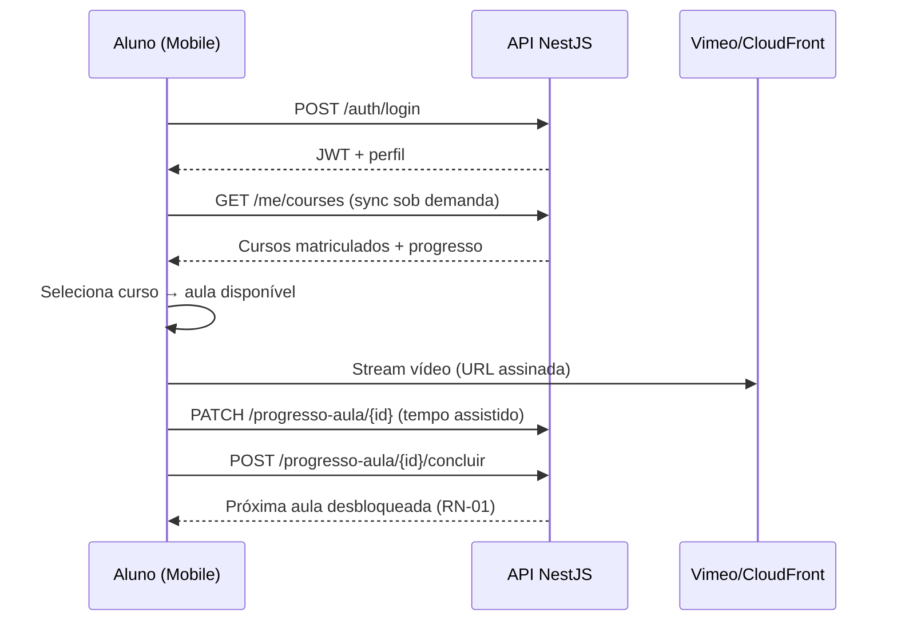
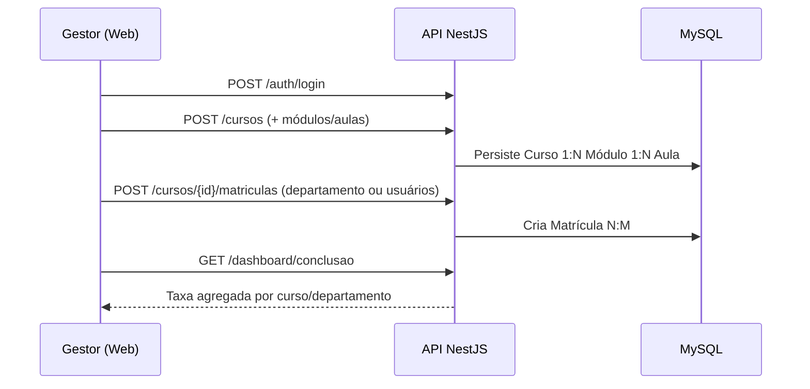

# PRD — EducaFlex

**Versão:** 1.0  
**Data:** 04/09/2026  
**Status:** Aprovado para desenvolvimento  
**Autor:** Product Management  
**Referências:** [ARQUITETURA.md](./ARQUITETURA.md) · [MODELO-DADOS.md](./MODELO-DADOS.md) · [ESTRATEGIA-QA.md](./ESTRATEGIA-QA.md) · [HISTORIAS-USUARIO.md](./HISTORIAS-USUARIO.md) · [ROADMAP.md](./ROADMAP.md) · [PLANO-BACKEND.md](./PLANO-BACKEND.md) · [PLANO-FRONTEND-MOBILE.md](./PLANO-FRONTEND-MOBILE.md)

---

## 1. Visão geral

### 1.1 Resumo executivo

O **EducaFlex** é uma plataforma de **treinamento corporativo** que permite colaboradores realizarem cursos pelo **celular** (Flutter), enquanto gestores de **RH/Administração** gerenciam cursos, matrículas e acompanham progresso via **painel web** (Next.js). A **v1 (MVP)** entrega autenticação de alunos e gestores, player de vídeo e leitura de artigos no mobile, cadastro de cursos/módulos/aulas no painel, matrícula individual ou por departamento, registro de tempo assistido e dashboard com taxa de conclusão. A **API REST** (NestJS) persiste em **MySQL 8+**; conectividade **somente online** com **sync sob demanda**.

Versões posteriores (v2+) adicionam testes de múltipla escolha, emissão automática de certificado PDF e ranking de gamificação.

### 1.2 Problema

Empresas de médio e grande porte precisam capacitar colaboradores de forma escalável e mensurável. Treinamentos presenciais ou em plataformas desconectadas dificultam o acompanhamento do RH, geram baixa adesão mobile e não garantem sequenciamento nem evidência de conclusão.

### 1.3 Objetivo do produto

Oferecer uma solução **mobile-first, gerenciável e mensurável** para:

- Consumir vídeoaulas e artigos corporativos no app mobile.
- Cadastrar e publicar cursos estruturados (curso → módulo → aula) no painel web.
- Matricular alunos individualmente ou por departamento.
- Registrar progresso e tempo assistido por aula.
- Exibir taxa de conclusão agregada no dashboard do gestor.

### 1.4 Público-alvo

| Segmento | Necessidade principal |
|----------|----------------------|
| **Funcionários (Alunos)** | Acessar treinamentos matriculados no celular, com fluxo sequencial claro |
| **Gestores de RH / Administração** | Criar cursos, matricular equipes, acompanhar conclusão |
| **Empresas médio/grande porte** | Plataforma centralizada de L&D com até ~100 usuários simultâneos (v1) |

### 1.5 Template de domínio

Vocabulário de domínio: **Usuário**, **Categoria**, **Curso** (catálogo/Serviço), **Módulo**, **Aula**, **Matrícula**, **ProgressoAula**, **Notificação**, **Arquivo/Anexo**, **Departamento**. Nomes consistentes entre backend, mobile e web conforme [MODELO-DADOS.md](./MODELO-DADOS.md).

---

## 2. Escopo do produto

### 2.1 MVP — v1 (Must Have)

| Camada | Tecnologia | Entregáveis v1 |
|--------|------------|----------------|
| **Mobile App** | Flutter (Dart) | Login, recuperar senha, onboarding, home de cursos matriculados, detalhe do curso/aula, player de vídeo, leitura de artigos, marcar aula concluída, perfil, lista de notificações (in-app), sync sob demanda |
| **Front-end Web** | React.js / Next.js | Login gestor, painel admin, CRUD curso/módulo/aula, matrícula individual e por departamento, dashboard taxa de conclusão, gestão básica de usuários |
| **Back-end / API** | Node.js (NestJS) | REST, JWT, regras de sequenciamento, progresso, tempo assistido, matrículas, agregações do dashboard |
| **Banco de dados** | MySQL 8+ | Entidades do domínio; migrations; seed de categorias e departamentos exemplo |
| **Login / Contas** | API + Mobile + Web | Autenticação aluno/gestor, perfis, recuperação de senha (e-mail transacional mockável) |
| **Painel admin** | Next.js | Gestão de cursos, alunos, departamentos e visualização de métricas |

**Essencial declarado pelo stakeholder (v1):**

- Autenticação e gestão de perfil de alunos e gestores
- Player de vídeo e leitura de artigos no app mobile
- Cadastro de cursos, módulos e aulas no painel web
- Dashboard com taxa de conclusão de alunos

### 2.2 Fora do MVP — v2+ (Roadmap)

| Item | Versão | Observação |
|------|--------|------------|
| **Testes de múltipla escolha** ao final dos módulos | v2 | Habilita nota mínima formal (Regra #1 completa) |
| **Emissão automática de certificado PDF** | v2 | Regra #2 — somente após 100% conclusão |
| **Ranking de gamificação** entre funcionários | v2+ | Pontuação, badges, leaderboard |
| Relatórios avançados / gráficos analíticos | v2+ | Além da taxa de conclusão agregada |
| Push notifications nativas (FCM/APNs) | v2 | v1: notificações in-app + e-mail mock |
| SSO / LDAP corporativo | v2+ | v1: login e-mail/senha |
| Multi-tenant (várias empresas) | v2+ | v1: instância única por empresa |
| Offline playback / download de aulas | v2+ | v1: somente online (RNF) |

### 2.3 Escopo total do produto (todas as versões)

| Camada | Inclusão |
|--------|----------|
| mobile/app | v1 |
| front-end web | v1 |
| back-end/API | v1 |
| banco de dados | v1 |
| login/contas | v1 |
| painel admin | v1 |

### 2.4 Regras de negócio do stakeholder

| # | Regra | v1 | v2+ |
|---|-------|----|-----|
| **RN-01** | Aluno só avança para próxima aula após concluir a anterior com nota mínima | Sequenciamento por conclusão + tempo mínimo assistido; **nota mínima** com quiz v2 | Quiz + nota mínima configurável |
| **RN-02** | Certificado PDF só após 100% conclusão do curso | Não emite certificado | Geração PDF automática |
| **RN-03** | Gestor matricula/remove alunos individualmente ou por departamento | ✅ | ✅ |
| **RN-04** | Registrar tempo assistido de cada vídeoaula | ✅ (heartbeat/periódico) | ✅ |
| **RN-05** | Curso publicado no painel aparece no catálogo mobile dos matriculados | ✅ sync sob demanda | ✅ |
| **RN-06** | Gestor (Administrador) cria cursos; aluno consome | ✅ | ✅ |
| **RN-07** | Aula concluída exige marcação explícita ou critério de tempo mínimo (≥ 90% duração) | ✅ | ✅ |

---

## 3. Papéis de usuário

### 3.1 Usuário final (Aluno)

| Atributo | Descrição |
|----------|-----------|
| **Quem** | Funcionário em treinamento corporativo |
| **Permissões** | Login, ver cursos matriculados, consumir aulas (vídeo/artigo), registrar progresso, editar perfil, ver notificações in-app |
| **Restrições** | Acessa apenas cursos em que está matriculado; não cria/edita cursos; obedece sequenciamento RN-01 |
| **Telas v1** | Login, Recuperar senha, Onboarding, Home/lista de cursos, Detalhe curso/aula, Player vídeo, Leitor artigo, Perfil, Notificações |

### 3.2 Administrador (Gestor RH)

| Atributo | Descrição |
|----------|-----------|
| **Quem** | Gestor de RH ou administrador de treinamentos |
| **Permissões** | CRUD cursos/módulos/aulas, matricular/remover alunos (individual ou departamento), ver dashboard de conclusão, gestão básica de usuários |
| **Restrições** | Não consome aulas como aluno (papel exclusivo v1); ações auditáveis |
| **Telas v1** | Login web, Dashboard, Painel admin, CRUD cursos, Gestão de usuários/matrículas, Relatório taxa de conclusão |

### 3.3 Matriz de permissões (v1)

| Ação | Aluno | Gestor |
|------|-------|--------|
| Login mobile/web | ✅ (mobile) | ✅ (web) |
| Consumir aula | ✅ | ❌ |
| Marcar aula concluída | ✅ | ❌ |
| Criar/editar curso | ❌ | ✅ |
| Matricular alunos | ❌ | ✅ |
| Ver dashboard conclusão | ❌ | ✅ |
| Editar próprio perfil | ✅ | ✅ |

---

## 4. Fluxos principais

### 4.1 Fluxo F1 — Aluno consome treinamento (v1)



**Passos:**

1. Aluno faz login no app.
2. Home exibe cursos matriculados (pull-to-refresh = sync sob demanda).
3. Aluno abre curso → vê módulos/aulas; aulas bloqueadas exibem indicador visual.
4. Aluno assiste vídeoaula ou lê artigo.
5. Sistema registra tempo assistido (RN-04).
6. Aluno marca aula como concluída (após critério RN-07).
7. API valida sequenciamento (RN-01) e desbloqueia próxima aula.

### 4.2 Fluxo F2 — Gestor cria curso e vincula departamento (v1)



**Passos:**

1. Gestor acessa painel web e autentica.
2. Cria curso com título, categoria, descrição.
3. Adiciona módulos e aulas (tipo vídeo ou artigo; URL vídeo ou conteúdo HTML/markdown).
4. Publica curso.
5. Matricula departamento inteiro ou alunos individuais (RN-03).
6. Dashboard reflete matrículas e progresso agregado.

### 4.3 Fluxo F3 — Recuperação de senha (v1, e-mail mockável)

1. Usuário solicita recuperação informando e-mail.
2. API gera token temporário e enfileira e-mail (adapter mock em dev).
3. Usuário redefine senha via link/token.
4. Login com nova credencial.

---

## 5. Telas e páginas

### 5.1 Mobile (Flutter) — v1

| Tela | Descrição | Prioridade |
|------|-----------|------------|
| **Login** | E-mail + senha; link recuperar senha | P0 |
| **Recuperar senha** | Solicitar reset + nova senha | P1 |
| **Onboarding** | Boas-vindas e tour inicial (1x) | P2 |
| **Home / lista principal** | Cards de cursos matriculados + % progresso | P0 |
| **Detalhe do item** | Estrutura módulos/aulas; status bloqueado/concluído | P0 |
| **Player vídeo** | Controles, barra progresso, registro tempo | P0 |
| **Leitor artigo** | HTML/markdown renderizado | P0 |
| **Perfil** | Nome, e-mail, departamento, logout | P1 |
| **Notificações** | Lista in-app (matrícula, curso novo) | P2 |

### 5.2 Web (Next.js) — v1

| Tela | Descrição | Prioridade |
|------|-----------|------------|
| **Login** | Autenticação gestor | P0 |
| **Dashboard web** | KPIs: taxa conclusão, alunos ativos, cursos publicados | P0 |
| **Painel admin — Cursos** | CRUD curso/módulo/aula | P0 |
| **Gestão de usuários** | Listar alunos/gestores; matricular/remover | P0 |
| **Relatórios / gráficos** | Gráfico taxa conclusão por curso e departamento | P1 |
| **Recuperar senha** | Fluxo web equivalente ao mobile | P1 |

---

## 6. Requisitos funcionais

### 6.1 Autenticação e perfis (RF-AUTH)

| ID | Requisito | v1 |
|----|-----------|-----|
| RF-AUTH-01 | Registro/login aluno e gestor com JWT | ✅ |
| RF-AUTH-02 | Papéis `ALUNO` e `GESTOR` com guards na API | ✅ |
| RF-AUTH-03 | Recuperação de senha via token + e-mail | ✅ (mock) |
| RF-AUTH-04 | Edição de perfil (nome, avatar opcional) | ✅ |
| RF-AUTH-05 | Logout e invalidação de sessão client-side | ✅ |

### 6.2 Cursos e conteúdo (RF-CURSO)

| ID | Requisito | v1 |
|----|-----------|-----|
| RF-CURSO-01 | CRUD curso com categoria, status rascunho/publicado | ✅ |
| RF-CURSO-02 | CRUD módulo ordenado dentro do curso | ✅ |
| RF-CURSO-03 | CRUD aula tipo `VIDEO` ou `ARTIGO` | ✅ |
| RF-CURSO-04 | Aula vídeo: URL streaming (Vimeo/CloudFront) + duração | ✅ |
| RF-CURSO-05 | Aula artigo: conteúdo rich text + anexos opcionais | ✅ |
| RF-CURSO-06 | Publicação reflete no catálogo mobile após sync | ✅ |

### 6.3 Matrículas e progresso (RF-PROG)

| ID | Requisito | v1 |
|----|-----------|-----|
| RF-PROG-01 | Matrícula individual N:M Aluno-Curso | ✅ |
| RF-PROG-02 | Matrícula em lote por departamento | ✅ |
| RF-PROG-03 | Remoção de matrícula (soft delete) | ✅ |
| RF-PROG-04 | Registro tempo assistido por aula vídeo | ✅ |
| RF-PROG-05 | Conclusão de aula com validação sequencial RN-01 | ✅ |
| RF-PROG-06 | Cálculo % conclusão curso = aulas concluídas / total | ✅ |

### 6.4 Dashboard (RF-DASH)

| ID | Requisito | v1 |
|----|-----------|-----|
| RF-DASH-01 | Taxa conclusão = alunos com 100% / total matriculados | ✅ |
| RF-DASH-02 | Taxa parcial por curso e departamento | ✅ |
| RF-DASH-03 | Contagem alunos ativos (login últimos 30 dias) | P1 |

### 6.5 Notificações (RF-NOTIF)

| ID | Requisito | v1 |
|----|-----------|-----|
| RF-NOTIF-01 | Notificação in-app ao matricular em curso | P2 |
| RF-NOTIF-02 | E-mail transacional matrícula (adapter mock) | P2 |
| RF-NOTIF-03 | Push notification nativa | v2 |

---

## 7. Requisitos não funcionais

| ID | Categoria | Requisito | Métrica / Limiar |
|----|-----------|-----------|------------------|
| RNF-001 | Conectividade | Somente online; sem modo offline de escrita | Escritas bloqueadas sem rede |
| RNF-002 | Sync | Sync sob demanda (pull-to-refresh, pós-escrita) | Dados atualizados em ≤ 3 s após sync |
| RNF-003 | Escala | Pequena: até ~100 usuários | p95 API < 500 ms em carga nominal |
| RNF-004 | Idioma | PT-BR exclusivo | 100% strings localizadas |
| RNF-005 | Privacidade | Padrão corporativo; senha bcrypt; JWT expiração | Sem PII em logs |
| RNF-006 | Streaming | Vídeo via Vimeo ou AWS CloudFront | Startup ≤ 2 s; rebuffer < 1% sessões |
| RNF-007 | Segurança | HTTPS; URLs de vídeo assinadas/temporárias | Token expira ≤ 4 h |
| RNF-008 | UI | Moderno; primária `#800000`; Material You mobile + web limpo | Conforme §12 |

---

## 8. Integrações externas

### 8.1 Matriz de integrações

| Integração | Uso | v1 | Estratégia v1 |
|------------|-----|----|----|
| **E-mail transacional** | Recuperar senha, aviso matrícula | Adapter | `EmailAdapter` interface; impl `MockEmailAdapter` (log/console); impl real SendGrid/SES v1.1 |
| **Push notifications** | Alertas mobile | Stub | `PushAdapter` no-op; notificações in-app via API |
| **Armazenamento de arquivos** | Anexos, thumbnails | Adapter | `StorageAdapter`; impl local/S3 mock; URLs públicas assinadas |
| **Streaming vídeo** | Vídeoaulas | Real ou mock | URLs Vimeo/CloudFront; dev: vídeo sample estático |

### 8.2 APIs, filas e secrets (v1)

| Componente | Descrição |
|------------|-----------|
| **Fila `email-queue`** | Bull/BullMQ ou in-process; processa envio assíncrono; mock não exige Redis em dev |
| **Fila `progresso-queue`** | Opcional: agrega heartbeat de tempo assistido em batch |
| **Secrets** | `JWT_SECRET`, `DATABASE_URL`, `VIMEO_TOKEN` / `CLOUDFRONT_KEY`, `EMAIL_API_KEY`, `STORAGE_BUCKET` via `.env` |
| **Mocks/stubs** | `MockEmailAdapter`, `NoOpPushAdapter`, `LocalStorageAdapter`; feature flag `INTEGRATIONS_MODE=mock|real` |

---

## 9. Modelo de dados (resumo)

> Detalhamento completo em [MODELO-DADOS.md](./MODELO-DADOS.md).

### 9.1 Entidades principais

| Entidade | Descrição |
|----------|-----------|
| **Usuario** | Aluno ou Gestor; papel, departamento, credenciais |
| **Categoria** | Classificação de cursos (Compliance, Técnico, etc.) |
| **Curso** | Serviço/catálogo; criado por Gestor |
| **Modulo** | Agrupamento ordenado de aulas |
| **Aula** | Unidade de conteúdo (vídeo ou artigo) |
| **Matricula** | N:M Usuario (Aluno) ↔ Curso |
| **ProgressoAula** | Status, tempo assistido, concluída em |
| **Notificacao** | Mensagens in-app |
| **Arquivo** | Anexo vinculado a aula ou curso |
| **Departamento** | Agrupamento organizacional para matrícula em lote |

### 9.2 Relações

```
Usuario (Gestor) 1:N Curso
Curso 1:N Modulo
Modulo 1:N Aula
Usuario (Aluno) N:M Curso via Matricula
Aluno 1:N ProgressoAula
Aula 1:N ProgressoAula
Curso N:1 Categoria
Usuario N:1 Departamento
```

---

## 10. API REST (contratos v1)

### 10.1 Autenticação

| Método | Endpoint | Descrição |
|--------|----------|-----------|
| POST | `/auth/login` | Login aluno/gestor |
| POST | `/auth/forgot-password` | Solicita reset |
| POST | `/auth/reset-password` | Redefine senha |
| GET | `/auth/me` | Perfil autenticado |
| PATCH | `/auth/me` | Atualiza perfil |

### 10.2 Cursos (gestor)

| Método | Endpoint | Descrição |
|--------|----------|-----------|
| GET/POST | `/cursos` | Listar/criar |
| GET/PATCH/DELETE | `/cursos/{id}` | Detalhe/editar/remover |
| POST | `/cursos/{id}/modulos` | Adicionar módulo |
| POST | `/modulos/{id}/aulas` | Adicionar aula |
| POST | `/cursos/{id}/matriculas` | Matricular (usuarios[] ou departamentoId) |
| DELETE | `/matriculas/{id}` | Remover matrícula |

### 10.3 Consumo (aluno)

| Método | Endpoint | Descrição |
|--------|----------|-----------|
| GET | `/me/courses` | Cursos matriculados + progresso |
| GET | `/me/courses/{id}` | Detalhe com aulas e status |
| GET | `/aulas/{id}/stream-url` | URL assinada vídeo |
| PATCH | `/progresso-aula/{aulaId}` | Atualiza tempo assistido |
| POST | `/progresso-aula/{aulaId}/concluir` | Marca conclusão |

### 10.4 Dashboard e admin

| Método | Endpoint | Descrição |
|--------|----------|-----------|
| GET | `/dashboard/conclusao` | Taxas agregadas |
| GET | `/usuarios` | Lista usuários (gestor) |
| GET | `/notificacoes` | Notificações do usuário |

---

## 11. Critérios de sucesso mensuráveis

| ID | Critério | Métrica verificável | Limiar v1 | Casos QA |
|----|----------|---------------------|-----------|----------|
| **CS-01** | Reprodução contínua de vídeos no mobile sem travamentos | Taxa de rebuffering em sessão de 10 min | < 1% rebuffer; startup ≤ 2 s | TC-VIDEO-001 |
| **CS-02** | Cadastro de curso no painel reflete no app | Tempo entre publicação web e visibilidade mobile após sync | ≤ 3 s após pull-to-refresh | TC-SYNC-001 |
| **CS-03** | Dashboard calcula corretamente % conclusão | Divergência entre cálculo manual e API | 0% divergência em amostra de 20 alunos | TC-DASH-001 |
| **CS-04** | Sequenciamento de aulas respeitado | Tentativa de pular aula bloqueada retorna 403 | 100% bloqueios corretos | TC-PROG-001 |
| **CS-05** | Tempo assistido registrado | Soma heartbeat vs tempo reportado | Erro ≤ 5 s em vídeo de 5 min | TC-PROG-002 |
| **CS-06** | Matrícula por departamento | Todos alunos do dept matriculados | 100% em dept de teste (N=10) | TC-MAT-001 |

> Procedimentos detalhados, DoD e matriz de rastreabilidade em [ESTRATEGIA-QA.md](./ESTRATEGIA-QA.md).

---

## 12. Diretrizes de UI/UX

| Aspecto | Diretriz |
|---------|----------|
| **Estilo** | Moderno, hierarquia clara, baixa poluição visual |
| **Cor primária** | `#800000` (bordô corporativo) |
| **Cards** | Espaçados, `rounded-xl`, sombra suave, elevação no hover |
| **Tipografia** | Peso médio (500–600) para títulos |
| **Mobile** | Material You; FAB destacado para ação principal (ex.: continuar curso) |
| **Web** | Navegação lateral ou top limpa; dashboard com cards KPI + gráfico simples |
| **Estados** | Aula bloqueada, em progresso e concluída com ícones/cores distintos |
| **Acessibilidade** | Contraste WCAG AA; labels em formulários |

---

## 13. Definition of Done (DoD) — MVP v1

- [ ] RF-AUTH, RF-CURSO, RF-PROG, RF-DASH P0 implementados e documentados.
- [ ] RN-01, RN-03, RN-04, RN-05, RN-07 validadas na API.
- [ ] CS-01 a CS-06 atendidos com evidência de teste.
- [ ] Adapters mock para e-mail, push e storage configuráveis.
- [ ] Migrations MySQL aplicáveis from scratch.
- [ ] Mobile Flutter + Web Next.js + API NestJS integrados em ambiente de staging.
- [ ] 100% casos P0 de [ESTRATEGIA-QA.md](./ESTRATEGIA-QA.md) passando.
- [ ] Strings 100% PT-BR.

---

## 14. Riscos e mitigações

| Risco | Impacto | Mitigação |
|-------|---------|-----------|
| Latência de streaming | CS-01 falha | CDN dedicado; URLs edge; testes em 4G |
| Divergência cálculo conclusão | CS-03 falha | Cálculo centralizado na API; testes unitários |
| Complexidade sequenciamento | Bugs RN-01 | State machine explícita em `ProgressoAula` |
| Integrações externas atrasam | Bloqueio e-mail | Adapters mock desde sprint 1 |

---

## 15. Glossário

| Termo | Definição |
|-------|-----------|
| **Aula** | Unidade mínima de conteúdo (vídeo ou artigo) |
| **Matrícula** | Vínculo aluno ↔ curso |
| **ProgressoAula** | Registro de avanço do aluno em uma aula |
| **Sync sob demanda** | Atualização de dados apenas quando usuário solicita ou após escrita |
| **Taxa de conclusão** | % de alunos matriculados que completaram 100% das aulas |

---

*Documento mestre de requisitos do EducaFlex. Implementação deve seguir rigorosamente este PRD, [ARQUITETURA.md](./ARQUITETURA.md), [MODELO-DADOS.md](./MODELO-DADOS.md) e backlog em [HISTORIAS-USUARIO.md](./HISTORIAS-USUARIO.md).*
