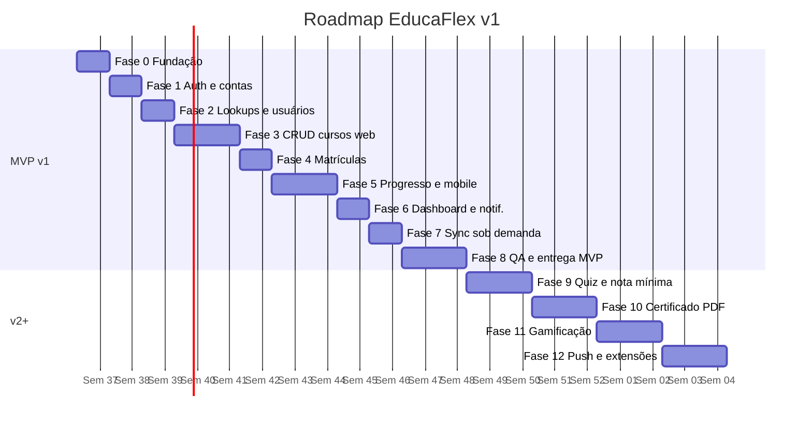
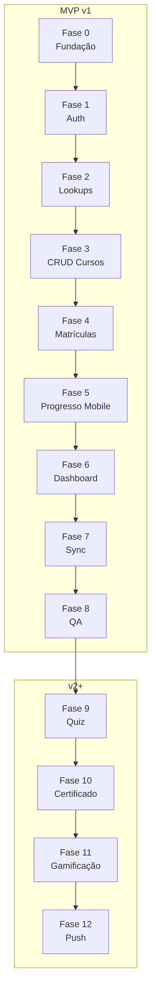

# ROADMAP — EducaFlex

**Versão:** 1.0  
**Data:** 04/09/2026  
**Status:** Aprovável para execução  
**Autor:** Engenharia de Entrega  
**Referências:** [PRD.md](./PRD.md) · [ARQUITETURA.md](./ARQUITETURA.md) · [MODELO-DADOS.md](./MODELO-DADOS.md) · [PLANO-BACKEND.md](./PLANO-BACKEND.md) · [PLANO-FRONTEND-MOBILE.md](./PLANO-FRONTEND-MOBILE.md) · [ESTRATEGIA-QA.md](./ESTRATEGIA-QA.md) · [TAREFAS.md](./TAREFAS.md)

---

## 1. Objetivo

Este documento consolida o **roadmap por fases** do **EducaFlex**, plataforma de treinamento corporativo mobile-first. A **v1 (MVP)** entrega autenticação de alunos e gestores, player de vídeo e leitura de artigos no app Flutter, cadastro de cursos/módulos/aulas no painel Next.js, matrícula individual ou por departamento, registro de tempo assistido, sync sob demanda e dashboard com taxa de conclusão. A **API REST** (NestJS) persiste em **MySQL 8+**; conectividade **somente online**.

Versões posteriores (v2+) adicionam testes de múltipla escolha, emissão automática de certificado PDF e ranking de gamificação.

**Escopo v1 (MVP):** mobile/app · front-end web · back-end/API · banco de dados · login/contas · painel admin

**Fora do escopo v1:** Quiz/múltipla escolha, certificado PDF automático, ranking/gamificação, push nativo FCM/APNs, SSO/LDAP, multi-tenant, offline playback, WebSocket/SSE, relatórios analíticos avançados.

---

## 2. Visão executiva

| Métrica | Valor |
|---------|-------|
| **Duração total MVP (v1)** | 10–12 semanas |
| **Marco MVP (release interna)** | Semana 12 |
| **Equipe sugerida** | 1 back-end · 1 mobile · 1 web · 0,5 QA |
| **Risco crítico** | Sequenciamento pedagógico (RN-01) + reprodução fluida de vídeo (CS-01) |
| **Backlog detalhado** | [TAREFAS.md](./TAREFAS.md) — 52 tarefas |
| **Estimativa bruta MVP** | ~280 pontos Fibonacci (paralelizável entre squads) |
| **Duração v2+ (estimativa)** | 8–10 semanas adicionais |

---

## 3. Mapa de fases — MVP (v1)

| Fase | Nome | Semanas | Objetivo | Marco |
|------|------|---------|----------|-------|
| **0** | Fundação | 1 | API operacional, schema MySQL migrado, scaffolds mobile e web | Health check + Swagger + DB seed |
| **1** | Autenticação e contas | 1–2 | Login aluno/gestor, JWT, recuperação de senha, guards por papel | Login end-to-end mobile e web |
| **2** | Lookups e usuários | 2–3 | Categorias, departamentos, gestão básica de usuários | Gestor lista alunos para matrícula |
| **3** | CRUD cursos (API + Web) | 3–5 | CRUD curso/módulo/aula, upload anexos, publicação | Curso RASCUNHO → PUBLICADO no painel |
| **4** | Matrículas | 5–6 | Matrícula individual e por departamento, bootstrap progresso | Dept N=10 matriculado (CS-06) |
| **5** | Progresso e consumo mobile | 6–8 | Player vídeo, artigos, sequenciamento, tempo assistido | Aluno conclui aula com RN-01/04/07 |
| **6** | Dashboard e notificações | 8–9 | Taxa de conclusão agregada, notificações in-app | Dashboard 0% divergência (CS-03) |
| **7** | Sync sob demanda | 9–10 | Pull-to-refresh, cache leitura, invalidação web | Publicação reflete em ≤ 3 s (CS-02) |
| **8** | QA e entrega MVP | 10–12 | Testes P0, polish, critérios CS-01 a CS-06 | Release interna v1 |

---

## 4. Mapa de fases — v2+ (roadmap)

| Fase | Nome | Semanas | Objetivo | Marco |
|------|------|---------|----------|-------|
| **9** | Quiz e nota mínima | 12–14 | Testes múltipla escolha ao final dos módulos; RN-01 completa | Nota mínima configurável bloqueia avanço |
| **10** | Certificado PDF | 14–16 | Emissão automática após 100% conclusão (RN-02) | PDF gerado e enviado por e-mail |
| **11** | Gamificação | 16–18 | Ranking, pontuação e badges entre funcionários | Leaderboard por departamento |
| **12** | Push e extensões | 18–20 | FCM/APNs, SSO/LDAP, relatórios avançados | Notificações push nativas operacionais |

---

## 5. Mapeamento das regras de negócio (stakeholder)

| Regra | Descrição | Atendimento v1 | Atendimento v2+ | Fase principal | Tarefas gate |
|-------|-----------|----------------|-----------------|----------------|--------------|
| **RN-01** | Aluno só avança após concluir aula anterior com nota mínima | Sequenciamento + conclusão + tempo mínimo 90% | Quiz + nota mínima configurável | v1: Fase 5 · v2: Fase 9 | T-072, T-076, T-110 |
| **RN-02** | Certificado PDF só após 100% conclusão do curso | Não emite certificado | Geração PDF automática | v2: Fase 10 | T-111 |
| **RN-03** | Gestor matricula/remove alunos individualmente ou por departamento | Matrícula individual + dept + soft delete | Mantido | v1: Fase 4 | T-060, T-061, T-063 |
| **RN-04** | Registrar tempo assistido de cada vídeoaula | Heartbeat PATCH a cada 15 s | Mantido | v1: Fase 5 | T-071, T-074 |
| **RN-05** | Curso publicado no painel reflete no catálogo mobile | Sync sob demanda HTTP | Mantido | v1: Fase 7 | T-053, T-091, T-093 |
| **RN-06** | Gestor cria cursos; aluno consome | Papéis ALUNO/GESTOR + guards cliente | Mantido | v1: Fase 1–3 | T-023, T-032, T-036 |
| **RN-07** | Aula concluída exige critério de tempo mínimo (≥ 90% duração) | Validação API + botão mobile | Mantido | v1: Fase 5 | T-071, T-074, T-075 |

---

## 6. Critérios de sucesso mensuráveis

| ID | Critério | Meta | Fase de verificação | Tarefas relacionadas |
|----|----------|------|---------------------|----------------------|
| **CS-01** | Reprodução contínua de vídeos no mobile sem travamentos | Startup ≤ 2 s; rebuffer < 1% em sessão 10 min | Fase 8 | T-074, T-104 |
| **CS-02** | Cadastro de curso no painel reflete no app após sync | ≤ 3 s após pull-to-refresh | Fase 7–8 | T-053, T-091, T-103 |
| **CS-03** | Dashboard calcula corretamente % conclusão dos alunos | 0% divergência em amostra de 20 alunos | Fase 6–8 | T-080, T-081, T-104 |
| **CS-04** | Sequenciamento pedagógico respeitado | 100% tentativas de pular retornam 403 | Fase 5–8 | T-072, T-076, T-100 |
| **CS-05** | Tempo assistido registrado com precisão | Erro ≤ 5 s em vídeo de 5 min | Fase 5–8 | T-071, T-074, T-100 |
| **CS-06** | Matrícula por departamento matricula 100% dos membros | Dept teste N=10 → 10 matrículas | Fase 4–8 | T-060, T-063, T-100 |

---

## 7. Detalhamento por fase — MVP (v1)

### Fase 0 — Fundação (Semana 1)

**Objetivo:** Estabelecer infraestrutura mínima para desenvolvimento paralelo entre back-end, mobile e web.

| Camada | Entregáveis | Tarefas |
|--------|-------------|---------|
| **Back-end / API** | Scaffold NestJS, health check, ValidationPipe, ExceptionFilter, Swagger base | T-001, T-005, T-006 |
| **Banco de dados** | Schema Prisma completo v1, migrations MySQL, seed categorias e departamentos, Docker Compose | T-002, T-003, T-007 |
| **Integrações** | Adapters mock (e-mail, push, storage, streaming) | T-004 |
| **Mobile** | Scaffold Flutter, tema `#800000`, HTTP client, models, navegação base | T-010–T-014 |
| **Front-end Web** | Scaffold Next.js, design system, layout admin base | T-015, T-016 |

**Dependências externas:** Nenhuma (integrações mockadas desde sprint 1).

**Critério de conclusão:**

- `GET /api/v1/health` retorna 200
- Migrations aplicam em MySQL local sem erro
- Seed idempotente com 5 categorias e departamentos exemplo
- Swagger acessível em `/api/docs`
- App Flutter e painel Next.js compilam com tema aplicado

---

### Fase 1 — Autenticação e contas (Semana 1–2)

**Objetivo:** Aluno e gestor autenticam-se, mantêm sessão JWT e recuperam senha via e-mail mockável.

| Camada | Entregáveis | Tarefas |
|--------|-------------|---------|
| **Back-end / API** | Login, perfil, forgot/reset password, JwtAuthGuard, RolesGuard | T-020–T-024 |
| **Mobile** | Telas Login, Recuperar senha, onboarding, secure storage JWT | T-030–T-032 |
| **Front-end Web** | Login gestor, forgot/reset, middleware JWT | T-035, T-036 |

**Dependências:** Fase 0 concluída (T-001, T-002, T-010, T-015).

**Regras de negócio atendidas:** RN-06 (papéis e guards).

**Critério de conclusão:**

- Login aluno/gestor retorna JWT com `papel`
- Token inválido retorna 401; papel incorreto retorna 403
- Reset senha funciona com `MockEmailAdapter`
- Mobile persiste sessão e redireciona por papel
- Gestor acessa painel web; aluno bloqueado no web

---

### Fase 2 — Lookups e usuários (Semana 2–3)

**Objetivo:** Gestor lista categorias, departamentos e alunos para preparar matrículas.

| Camada | Entregáveis | Tarefas |
|--------|-------------|---------|
| **Back-end / API** | GET `/categorias`, `/departamentos`, `/usuarios` | T-040, T-041 |
| **Front-end Web** | Integração lookups em formulários e filtros | T-042 |

**Dependências:** Fase 1 concluída (auth funcional).

**Critério de conclusão:**

- Gestor autenticado lista 5 categorias seed
- Gestor lista departamentos e filtra alunos por departamento
- Endpoints documentados no Swagger

---

### Fase 3 — CRUD cursos (API + Web) (Semana 3–5)

**Objetivo:** Gestor cria curso estruturado (curso → módulo → aula), faz upload de anexos e publica.

| Camada | Entregáveis | Tarefas |
|--------|-------------|---------|
| **Back-end / API** | CRUD curso/módulo/aula, upload presign, publicação | T-050–T-053, T-056 |
| **Front-end Web** | CourseEditorPage, ModuleLessonEditor, publicação | T-054, T-055 |

**Dependências:** Fase 2 concluída.

**Regras de negócio atendidas:** RN-05 (publicação), RN-06 (gestor-only CRUD).

**Critério de conclusão:**

- Gestor cria curso RASCUNHO → adiciona módulos/aulas → publica
- Aluno não acessa CRUD (403)
- Aula VIDEO exige `videoUrl` + `duracaoSeg`
- Upload anexo via `LocalStorageAdapter` mock funcional

---

### Fase 4 — Matrículas (Semana 5–6)

**Objetivo:** Gestor matricula alunos individualmente ou por departamento; progresso inicializado automaticamente.

| Camada | Entregáveis | Tarefas |
|--------|-------------|---------|
| **Back-end / API** | POST/DELETE matrículas, bootstrap progresso, notificação | T-060–T-062, T-064 |
| **Front-end Web** | EnrollmentPage com multi-select e dropdown departamento | T-063 |

**Dependências:** Fase 3 concluída (curso PUBLICADO disponível).

**Regras de negócio atendidas:** RN-03, CS-06.

**Critério de conclusão:**

- Matrícula individual cria registros sem duplicata
- Matrícula por departamento cria N registros (dept teste N=10)
- Remoção soft preenche `removido_em`
- Bootstrap `progresso_aula`: 1ª aula EM_PROGRESSO, demais BLOQUEADA

---

### Fase 5 — Progresso e consumo mobile (Semana 6–8)

**Objetivo:** Aluno consome vídeoaulas e artigos no mobile com sequenciamento, tempo assistido e conclusão.

| Camada | Entregáveis | Tarefas |
|--------|-------------|---------|
| **Back-end / API** | GET `/me/courses`, stream URL, PATCH progresso, POST concluir, sequenciamento | T-070–T-072, T-077 |
| **Mobile** | Home, detalhe curso, player vídeo, leitor artigo, bloqueio sequencial | T-073–T-076 |

**Dependências:** Fase 4 concluída (aluno matriculado).

**Regras de negócio atendidas:** RN-01, RN-04, RN-07, CS-04, CS-05.

**Critério de conclusão:**

- Aluno vê apenas cursos matriculados PUBLICADO
- Tentativa de pular aula bloqueada → 403
- Heartbeat tempo assistido a cada 15 s; erro ≤ 5 s em vídeo 5 min
- Botão concluir habilitado após ≥ 90% duração (vídeo) ou scroll completo (artigo)
- Próxima aula desbloqueada após conclusão

---

### Fase 6 — Dashboard e notificações (Semana 8–9)

**Objetivo:** Gestor visualiza taxa de conclusão agregada; aluno recebe notificações in-app.

| Camada | Entregáveis | Tarefas |
|--------|-------------|---------|
| **Back-end / API** | GET `/dashboard/conclusao`, GET/PATCH `/notificacoes` | T-080, T-082 |
| **Front-end Web** | DashboardPage com KPIs e ConclusaoChart | T-081 |
| **Mobile** | Lista notificações, perfil, logout | T-083 |

**Dependências:** Fase 5 concluída (progresso registrado).

**Regras de negócio atendidas:** CS-03.

**Critério de conclusão:**

- Dashboard taxa conclusão bate cálculo SQL manual (0% divergência N=20)
- Filtros por cursoId e departamentoId funcionam
- Notificações in-app listáveis e marcáveis como lidas
- p95 dashboard < 500 ms

---

### Fase 7 — Sync sob demanda (Semana 9–10)

**Objetivo:** Sincronização confiável via HTTP; leitura offline do último snapshot; publicação reflete no mobile.

| Camada | Entregáveis | Tarefas |
|--------|-------------|---------|
| **Back-end / API** | Query `updatedSince` em `/me/courses` | T-090 |
| **Mobile** | Cache Hive, pull-to-refresh, banner offline | T-091, T-092 |
| **Front-end Web** | Invalidação React Query pós-mutação | T-093 |

**Dependências:** Fases 3 e 5 concluídas.

**Regras de negócio atendidas:** RN-05, CS-02.

**Critério de conclusão:**

- Pull-to-refresh atualiza cursos matriculados
- Curso publicado visível no mobile em ≤ 3 s após sync
- Sem rede: último snapshot visível; escrita bloqueada com banner
- Web invalida cache após publicação/matrícula

---

### Fase 8 — QA e entrega MVP (Semana 10–12)

**Objetivo:** Validar critérios CS-01 a CS-06, corrigir P0 e preparar release interna v1.

| Camada | Entregáveis | Tarefas |
|--------|-------------|---------|
| **QA** | Testes P0 API, mobile e web; E2E fluxo completo; smoke performance | T-100–T-104 |
| **Documentação** | OpenAPI final, README operacional | T-006, README |

**Dependências:** Fases 0–7 concluídas.

**Critério de conclusão:**

- Todos os casos P0 da ESTRATEGIA-QA.md passam
- CS-01 a CS-06 verificados com evidência
- Swagger documenta 100% dos endpoints v1
- Release interna v1 aprovada pelo stakeholder

---

## 8. Detalhamento por fase — v2+ (roadmap)

### Fase 9 — Quiz e nota mínima (Semanas 12–14)

**Objetivo:** Implementar testes de múltipla escolha ao final dos módulos, completando RN-01 com nota mínima configurável.

| Camada | Entregáveis | Tarefas |
|--------|-------------|---------|
| **Back-end / API** | QuizModule, questões, tentativas, nota mínima | T-110 |
| **Mobile + Web** | UI quiz pós-módulo, feedback de nota | T-110 |

**Critério de conclusão:** Aluno não avança sem nota ≥ mínima configurada pelo gestor.

---

### Fase 10 — Certificado PDF (Semanas 14–16)

**Objetivo:** Emissão automática de certificado PDF após 100% conclusão do curso (RN-02).

| Camada | Entregáveis | Tarefas |
|--------|-------------|---------|
| **Back-end / API** | CertificadoModule, geração PDF, fila e-mail | T-111 |
| **Mobile + Web** | Download/visualização certificado | T-111 |

**Critério de conclusão:** PDF gerado somente com 100% aulas CONCLUIDA; enviado por e-mail mock/real.

---

### Fase 11 — Gamificação (Semanas 16–18)

**Objetivo:** Ranking de pontuação e badges entre funcionários.

| Camada | Entregáveis | Tarefas |
|--------|-------------|---------|
| **Back-end / API** | GamificacaoModule, pontos, leaderboard | T-112 |
| **Mobile** | Tela ranking por departamento | T-112 |

**Critério de conclusão:** Leaderboard atualizado após conclusão de aulas; isolamento por departamento.

---

### Fase 12 — Push e extensões (Semanas 18–20)

**Objetivo:** Notificações push nativas, SSO/LDAP e relatórios analíticos avançados.

| Camada | Entregáveis | Tarefas |
|--------|-------------|---------|
| **Back-end / API** | FCM/APNs adapter, SsoModule | T-113 |
| **Front-end Web** | Relatórios avançados além taxa conclusão | T-114 |

**Critério de conclusão:** Push entregue em device real; SSO opcional documentado.

---

## 9. Dependências cruzadas entre camadas

| Dependência | De | Para | Motivo |
|-------------|-----|------|--------|
| Auth mobile/web | API B1 (T-020–T-024) | Mobile F1 + Web F1 | Endpoints login e guards |
| CRUD web | API B3 (T-050–T-053) | Web F3 (T-054–T-055) | Contratos REST estáveis |
| Matrícula web | API B4 (T-060–T-062) | Web F4 (T-063) | Bootstrap progresso na API |
| Consumo mobile | API B5 (T-070–T-072) | Mobile F5 (T-073–T-076) | Stream URL e sequenciamento |
| Dashboard web | API B6 (T-080) | Web F6 (T-081) | Agregações centralizadas |
| Sync mobile | API + publicação | Fase 7 (T-090–T-093) | RN-05 e CS-02 |
| Quiz v2 | MVP v1 entregue | Fase 9 | Sequenciamento v1 estável |

---

## 10. Riscos e mitigações

| Risco | Impacto | Probabilidade | Mitigação | Fase |
|-------|---------|---------------|-----------|------|
| Latência streaming CDN | Alto | Média | MockStreamUrlAdapter dev; CDN real em staging; CS-01 obrigatório | 5, 8 |
| Sequenciamento incorreto | Alto | Média | State machine explícita ProgressoService; TC-PROG-001 P0 | 5 |
| Divergência cálculo dashboard | Alto | Baixa | Query SQL única; TC-DASH-001 N=20 | 6 |
| Divergência DTO mobile ↔ API | Médio | Média | Contratos OpenAPI; T-013 paridade MODELO-DADOS | 0–5 |
| Matrícula dept parcial | Médio | Baixa | Transação batch; TC-MAT-001 N=10 fixo | 4 |
| Escopo creep quiz na v1 | Alto | Média | PRD §2.2 explícito; quiz apenas v2 | 0–8 |
| JWT expirado sem UX clara | Baixo | Média | Redirect login em 401; T-032, T-036 | 1 |

---

## 11. Marcos e entregas

| Marco | Data alvo | Entregável | Critério |
|-------|-----------|------------|----------|
| **M0** | Semana 1 | Fundação operacional | Health + DB + Flutter + Next.js scaffold |
| **M1** | Semana 2 | Auth end-to-end | Login mobile e web funcional |
| **M2** | Semana 3 | Lookups prontos | Gestor lista alunos e departamentos |
| **M3** | Semana 5 | CRUD cursos completo | Curso publicado no painel |
| **M4** | Semana 6 | Matrículas operacionais | CS-06 verificável |
| **M5** | Semana 8 | Consumo mobile | Player + sequenciamento RN-01 |
| **M6** | Semana 9 | Dashboard | CS-03 verificável |
| **M7** | Semana 10 | Sync confiável | CS-02 verificável |
| **M8** | Semana 12 | **Release MVP v1** | CS-01 a CS-06 verificados |
| **M9** | Semana 14 | Quiz operacional | RN-01 completa |
| **M10** | Semana 16 | Certificado PDF | RN-02 atendida |
| **M11** | Semana 20 | v2+ completo | Gamificação + push |

---

## 12. Glossário de fases vs. planos técnicos

| Roadmap (este doc) | PLANO-BACKEND | PLANO-FRONTEND-MOBILE |
|--------------------|---------------|------------------------|
| Fase 0 | B0 Fundação | F0 Fundação + Design System (mobile + web) |
| Fase 1 | B1 Auth | F1 Auth Mobile + W1 Auth Web |
| Fase 2 | B2 Lookups/Usuários | W2 Lookups integrados |
| Fase 3 | B3 Cursos CRUD | W2 CRUD Cursos |
| Fase 4 | B4 Matrículas | W3 Matrículas |
| Fase 5 | B5 Progresso | F2–F3 Mobile consumo |
| Fase 6 | B6 Dashboard/Notif. | W4 Dashboard + F4 Perfil/Notif. |
| Fase 7 | B5.7 Sync incremental | F2 Sync + W invalidação |
| Fase 8 | B6 Qualidade | F5 + W5 Qualidade |
| Fase 9–12 | Módulos v2+ | UI v2+ |

---

## 13. Próximos passos imediatos

1. Executar **Fase 0** — tarefas T-001 a T-016 em paralelo (back-end + mobile + web).
2. Validar seed de categorias/departamentos e health check antes de iniciar auth.
3. Manter paridade de DTOs entre Prisma, API JSON, models Flutter e TypeScript desde T-002/T-013/T-016.
4. Configurar `INTEGRATIONS_MODE=mock` desde sprint 1 para e-mail, storage e streaming.
5. Consultar [TAREFAS.md](./TAREFAS.md) para sprint planning com estimativas, dependências e responsáveis.
