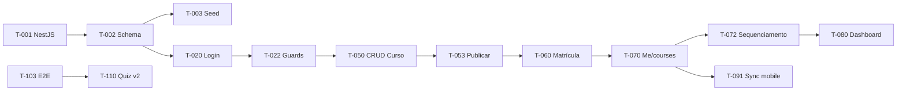

# TAREFAS — EducaFlex (Backlog Detalhado)

**Versão:** 1.0  
**Data:** 04/09/2026  
**Status:** Backlog aprovável para sprint planning  
**Autor:** Engenharia de Entrega  
**Referências:** [ROADMAP.md](./ROADMAP.md) · [PRD.md](./PRD.md) · [PLANO-BACKEND.md](./PLANO-BACKEND.md) · [PLANO-FRONTEND-MOBILE.md](./PLANO-FRONTEND-MOBILE.md) · [ESTRATEGIA-QA.md](./ESTRATEGIA-QA.md) · [MODELO-DADOS.md](./MODELO-DADOS.md)

---

## 1. Como ler este backlog

Cada tarefa contém:

| Campo | Descrição |
|-------|-----------|
| **ID** | Identificador único `T-NNN` |
| **Descrição técnica** | O que implementar, onde e como |
| **Critérios de aceite** | Condições verificáveis para considerar concluída |
| **Dependências** | IDs predecessoras obrigatórias |
| **Estimativa** | Pontos Fibonacci (1, 2, 3, 5, 8, 13) e dias úteis orientativos |
| **Responsável** | Papel accountable: Back-end, Mobile, Web ou QA |
| **Fase** | `MVP` (v1) ou `v2+` |

**Total backlog:** 52 tarefas · ~280 pontos MVP · ~55 pontos v2+

**Escopo MVP (v1):** mobile/app · front-end web · back-end/API · banco de dados MySQL · login/contas · painel admin

**Fora do MVP:** Quiz/múltipla escolha, certificado PDF, gamificação, push nativo FCM/APNs, SSO/LDAP, multi-tenant, offline playback, WebSocket/SSE.

---

## 2. Mapeamento das regras de negócio (stakeholder)

| Regra | Descrição | Atendimento v1 | Atendimento v2+ | Tarefas que implementam |
|-------|-----------|----------------|-----------------|-------------------------|
| **RN-01** | Aluno só avança após concluir aula anterior com nota mínima | Sequenciamento + conclusão + tempo ≥ 90% | Quiz + nota mínima configurável | T-072, T-076, T-100, T-110 |
| **RN-02** | Certificado PDF só após 100% conclusão do curso | Não emite certificado | Geração PDF automática | T-111 |
| **RN-03** | Gestor matricula/remove alunos individualmente ou por departamento | Matrícula individual + dept + soft delete | Mantido | T-060, T-061, T-063, T-100 |
| **RN-04** | Registrar tempo assistido de cada vídeoaula | Heartbeat PATCH a cada 15 s | Mantido | T-071, T-074, T-100 |
| **RN-05** | Curso publicado no painel reflete no catálogo mobile | Sync sob demanda HTTP | Mantido | T-053, T-091, T-093, T-103 |
| **RN-06** | Gestor cria cursos; aluno consome | Papéis ALUNO/GESTOR + guards | Mantido | T-023, T-032, T-036, T-050, T-054 |
| **RN-07** | Aula concluída exige tempo mínimo ≥ 90% duração | Validação API + botão mobile | Mantido | T-071, T-074, T-075, T-100 |

---

## 3. Resumo por fase

| Fase | Escopo | Tarefas | Pontos | Semanas |
|------|--------|---------|--------|---------|
| F0 — Fundação | Backend + DB + Mobile + Web scaffold | T-001–T-016 | 48 | 1 |
| F1 — Auth | API auth + Mobile + Web login | T-020–T-024, T-030–T-032, T-035–T-036 | 42 | 1–2 |
| F2 — Lookups | Categorias, departamentos, usuários | T-040–T-042 | 13 | 1 |
| F3 — CRUD Cursos | API + Web curso/módulo/aula | T-050–T-056 | 55 | 2 |
| F4 — Matrículas | API + Web matrícula | T-060–T-064 | 34 | 1 |
| F5 — Progresso Mobile | API progresso + Mobile player | T-070–T-077 | 68 | 2 |
| F6 — Dashboard | API + Web + Mobile notif./perfil | T-080–T-083 | 26 | 1 |
| F7 — Sync | Delta sync + cache + invalidação | T-090–T-093 | 21 | 1 |
| F8 — QA | Testes P0 + E2E + performance | T-100–T-104 | 26 | 2 |
| v2+ — Extensões | Quiz, certificado, gamificação, push | T-110–T-114 | 55 | 8+ |

---

## 4. Fase 0 — Fundação (MVP)

### T-001 — Scaffold projeto NestJS

| Campo | Valor |
|-------|-------|
| **Descrição técnica** | Criar projeto NestJS em `backend/` com estrutura modular (`src/modules/`, `src/common/`), configuração via `@nestjs/config`, prefixo global `/api/v1`, CORS configurável, health check e scripts `dev`/`build`/`start`. |
| **Critérios de aceite** | Projeto compila sem erro; `GET /api/v1/health` retorna `{ status: "ok" }`; `backend/.env.example` documentado com `DATABASE_URL`, `JWT_SECRET`, `INTEGRATIONS_MODE`, `PORT`. |
| **Dependências** | — |
| **Estimativa** | 3 pts · 1,5 dias |
| **Responsável** | Back-end |
| **Fase** | MVP |

---

### T-002 — Schema Prisma e migrations MySQL v1

| Campo | Valor |
|-------|-------|
| **Descrição técnica** | Definir schema Prisma com entidades v1 conforme MODELO-DADOS.md: `Departamento`, `Usuario`, `Categoria`, `Curso`, `Modulo`, `Aula`, `Matricula`, `ProgressoAula`, `Notificacao`, `Arquivo`. Enums `Papel`, `StatusCurso`, `TipoAula`, `StatusProgressoAula`. UUIDs CHAR(36), índices `(usuario_id, aula_id)` em progresso, UK matricula. Gerar migrations 001–008. |
| **Critérios de aceite** | `npx prisma migrate dev` aplica sem erro; 10 tabelas criadas com FKs RESTRICT; charset `utf8mb4_unicode_ci`; EXPLAIN query progresso usa índice composto. |
| **Dependências** | T-001 |
| **Estimativa** | 8 pts · 3 dias |
| **Responsável** | Back-end |
| **Fase** | MVP |

---

### T-003 — Seed categorias e departamentos

| Campo | Valor |
|-------|-------|
| **Descrição técnica** | Script seed idempotente (`prisma/seed.ts`): 5 categorias (Compliance, Técnico, Liderança, Segurança, Outros) e departamentos exemplo (TI, RH, Comercial, Operações). Usuários demo gestor e alunos para testes. Comando `npm run seed`. |
| **Critérios de aceite** | Seed executa múltiplas vezes sem duplicar; 5 categorias e ≥ 4 departamentos; usuário `gestor@educaflex.test` (GESTOR) e `ana.aluno@educaflex.test` (ALUNO) criados. |
| **Dependências** | T-002 |
| **Estimativa** | 3 pts · 1 dia |
| **Responsável** | Back-end |
| **Fase** | MVP |

---

### T-004 — IntegrationsModule com adapters mock

| Campo | Valor |
|-------|-------|
| **Descrição técnica** | Implementar `IntegrationsModule` com interfaces e adapters: `MockEmailAdapter`, `NoOpPushAdapter`, `LocalStorageAdapter`, `MockStreamUrlAdapter`. Flag env `INTEGRATIONS_MODE=mock|real`. Fila in-process `email-queue` para forgot-password. Secrets via env (`JWT_SECRET`, `STORAGE_BUCKET` stub). |
| **Critérios de aceite** | Adapters registrados via DI; modo mock loga e-mails em stdout; `MockStreamUrlAdapter` retorna URL válida com expiração 4 h; troca para `real` documentada sem quebrar build. |
| **Dependências** | T-001 |
| **Estimativa** | 5 pts · 2 dias |
| **Responsável** | Back-end |
| **Fase** | MVP |

---

### T-005 — Common layer (pipes, filters, guards stub)

| Campo | Valor |
|-------|-------|
| **Descrição técnica** | ValidationPipe global (whitelist, transform), HttpExceptionFilter com mensagens PT-BR, decorator `@CurrentUser()`, stub JwtAuthGuard e RolesGuard para Fase 1. |
| **Critérios de aceite** | Payload inválido retorna 400 com erros PT-BR; exceções retornam 500 genérico; campos não declarados no DTO rejeitados. |
| **Dependências** | T-001 |
| **Estimativa** | 3 pts · 1 dia |
| **Responsável** | Back-end |
| **Fase** | MVP |

---

### T-006 — OpenAPI / Swagger base

| Campo | Valor |
|-------|-------|
| **Descrição técnica** | Configurar `@nestjs/swagger` em `/api/docs` com tags (Auth, Cursos, Matriculas, Progresso, Dashboard, Notificacoes), security scheme Bearer JWT. Atualizar até 100% cobertura endpoints v1 na Fase 8. |
| **Critérios de aceite** | Swagger UI acessível em dev; Authorize Bearer funcional; schemas DTO alinhados MODELO-DADOS.md. |
| **Dependências** | T-001 |
| **Estimativa** | 2 pts · 1 dia |
| **Responsável** | Back-end |
| **Fase** | MVP |

---

### T-007 — Docker Compose MySQL dev

| Campo | Valor |
|-------|-------|
| **Descrição técnica** | Configurar `docker-compose.yml` com MySQL 8.4, volume persistente, healthcheck, porta 3306. Documentar no README procedimento de subida. |
| **Critérios de aceite** | `docker compose up -d mysql` sobe healthy; API conecta via `DATABASE_URL`; dados persistem entre restarts. |
| **Dependências** | — |
| **Estimativa** | 2 pts · 0,5 dia |
| **Responsável** | Back-end |
| **Fase** | MVP |

---

### T-010 — Scaffold projeto Flutter

| Campo | Valor |
|-------|-------|
| **Descrição técnica** | Criar app Flutter em `mobile/` com estrutura `lib/core/`, `lib/features/`, `lib/shared/`, dependências (Riverpod, GoRouter, Dio, flutter_secure_storage, Hive), `--dart-define=API_BASE_URL`. |
| **Critérios de aceite** | `flutter run` compila em emulador Android/iOS; estrutura conforme PLANO-FRONTEND-MOBILE; variável API configurável. |
| **Dependências** | — |
| **Estimativa** | 3 pts · 1,5 dias |
| **Responsável** | Mobile |
| **Fase** | MVP |

---

### T-011 — Design system mobile Material You

| Campo | Valor |
|-------|-------|
| **Descrição técnica** | Implementar `AppTheme` com paleta `#800000` (primary), tokens tipografia Inter/Roboto, `radiusCard` 12dp (`rounded-xl`), componentes base: `AppButton`, `AppTextField`, `CourseCard`, `LessonListTile`, `ProgressBar`, `EmptyState`, `OfflineBanner`, `FabContinue`. |
| **Critérios de aceite** | Tema aplicado globalmente; contraste WCAG AA; FAB `#800000` destacado; estilo Material You com cards arredondados e sombras suaves. |
| **Dependências** | T-010 |
| **Estimativa** | 5 pts · 2 dias |
| **Responsável** | Mobile |
| **Fase** | MVP |

---

### T-012 — HTTP client Dio com interceptors

| Campo | Valor |
|-------|-------|
| **Descrição técnica** | Configurar Dio com base URL `/api/v1`, interceptor JWT Bearer, tratamento 401 (logout/redirect), timeout configurável, exceções tipadas para UI. |
| **Critérios de aceite** | Requests autenticados incluem Authorization; 401 dispara callback sessão expirada; erro de rede retorna exceção tipada. |
| **Dependências** | T-010 |
| **Estimativa** | 3 pts · 1 dia |
| **Responsável** | Mobile |
| **Fase** | MVP |

---

### T-013 — Models e DTOs Flutter (paridade API)

| Campo | Valor |
|-------|-------|
| **Descrição técnica** | Classes Dart: `Usuario`, `Curso`, `Modulo`, `Aula`, `ProgressoAula`, `Matricula`, `Notificacao`, `ConclusaoCursoDto` com `fromJson`/`toJson` camelCase (`tempoAssistidoSeg`, `duracaoSeg`, etc.). Enums `Papel`, `StatusProgressoAula`, `TipoAula`. |
| **Critérios de aceite** | Round-trip serialização sem perda; paridade validada contra exemplos OpenAPI e MODELO-DADOS.md §1.4. |
| **Dependências** | T-010, T-006 |
| **Estimativa** | 5 pts · 2 dias |
| **Responsável** | Mobile |
| **Fase** | MVP |

---

### T-014 — Navegação GoRouter e Splash

| Campo | Valor |
|-------|-------|
| **Descrição técnica** | GoRouter: `/` (Splash), `/login`, `/forgot-password`, `/reset-password`, `/onboarding`, `/home`, `/courses/:id`, `/courses/:courseId/lessons/:id/video`, `/courses/:courseId/lessons/:id/article`, `/profile`, `/notifications`. Splash verifica JWT. |
| **Critérios de aceite** | Navegação entre rotas funciona; Splash redireciona em < 2 s; deep links básicos resolvidos. |
| **Dependências** | T-010 |
| **Estimativa** | 3 pts · 1 dia |
| **Responsável** | Mobile |
| **Fase** | MVP |

---

### T-015 — Scaffold Next.js painel gestor

| Campo | Valor |
|-------|-------|
| **Descrição técnica** | Criar app Next.js 14+ em `frontend/` com App Router, Tailwind, estrutura `app/`, `components/`, `lib/`, React Query, cliente API `/api/v1`, ESLint configurado. |
| **Critérios de aceite** | `npm run dev` compila; layout base com sidebar stub; variável `NEXT_PUBLIC_API_URL` documentada. |
| **Dependências** | — |
| **Estimativa** | 3 pts · 1,5 dias |
| **Responsável** | Web |
| **Fase** | MVP |

---

### T-016 — Design system web

| Campo | Valor |
|-------|-------|
| **Descrição técnica** | Tokens CSS/Tailwind: primary `#800000`, `rounded-xl` cards, shadow-sm hover elevation, tipografia Inter peso 600 títulos. Componentes: `Button`, `Input`, `AdminCard`, `SidebarNav`, `PageHeader`, `StatusBadge`, `DataTable`, `Skeleton`, `Toast`. |
| **Critérios de aceite** | Tema aplicado globalmente; sidebar enxuta; contraste WCAG AA; layout limpo sem poluição visual. |
| **Dependências** | T-015 |
| **Estimativa** | 5 pts · 2 dias |
| **Responsável** | Web |
| **Fase** | MVP |

---

## 5. Fase 1 — Autenticação e contas (MVP)

### T-020 — Endpoint POST /auth/login

| Campo | Valor |
|-------|-------|
| **Descrição técnica** | `AuthModule`: DTO `{ email, password }`, bcrypt compare, JWT payload `{ sub, email, papel }`, retorno `{ accessToken, usuario: UsuarioDto }`. Rate limit básico. |
| **Critérios de aceite** | Credenciais válidas retornam 200 + token com `papel`; inválidas retornam 401 mensagem genérica; password nunca na resposta. |
| **Dependências** | T-002, T-005 |
| **Estimativa** | 3 pts · 1 dia |
| **Responsável** | Back-end |
| **Fase** | MVP |

**Regras:** RN-06

---

### T-021 — GET/PATCH /auth/me e recuperação senha

| Campo | Valor |
|-------|-------|
| **Descrição técnica** | `GET /auth/me` retorna UsuarioDto; `PATCH /auth/me` atualiza `nome`, `avatarUrl`; `POST /auth/forgot-password` (sempre 202 anti-enumeração); `POST /auth/reset-password` com token hash DB expira 1 h; enfileira e-mail mock. |
| **Critérios de aceite** | Perfil atualizável; forgot sempre 202; reset com token válido altera senha; e-mail mock logado em stdout. |
| **Dependências** | T-020, T-004 |
| **Estimativa** | 5 pts · 2 dias |
| **Responsável** | Back-end |
| **Fase** | MVP |

---

### T-022 — JwtAuthGuard e RolesGuard

| Campo | Valor |
|-------|-------|
| **Descrição técnica** | Guards completos: `@Roles('GESTOR')`, `@Roles('ALUNO')`, decorator `@CurrentUser()` injeta `{ id, email, papel }`. Aplicar em rotas gestor-only e aluno-only. |
| **Critérios de aceite** | ALUNO recebe 403 em rotas CRUD curso; GESTOR recebe 403 em `/me/courses`; token ausente retorna 401. |
| **Dependências** | T-020, T-005 |
| **Estimativa** | 3 pts · 1 dia |
| **Responsável** | Back-end |
| **Fase** | MVP |

**Regras:** RN-06

---

### T-023 — Testes integração Auth

| Campo | Valor |
|-------|-------|
| **Descrição técnica** | Suite integration: login aluno/gestor → me → guards 403 cross-papel → forgot/reset → token inválido 401. |
| **Critérios de aceite** | Suite passa em CI; cobertura fluxos feliz e erro; execução < 45 s. |
| **Dependências** | T-020, T-021, T-022 |
| **Estimativa** | 3 pts · 1 dia |
| **Responsável** | Back-end |
| **Fase** | MVP |

---

### T-030 — Telas Login e Recuperar senha mobile

| Campo | Valor |
|-------|-------|
| **Descrição técnica** | `LoginScreen`, `ForgotPasswordScreen`, `ResetPasswordScreen` com AppTextField, validação local, chamadas API, feedback inline, labels PT-BR. |
| **Critérios de aceite** | Login aluno funcional; forgot exibe mensagem genérica; reset com token válido redireciona login; erros de rede exibem snackbar. |
| **Dependências** | T-011, T-012, T-020, T-021 |
| **Estimativa** | 5 pts · 2 dias |
| **Responsável** | Mobile |
| **Fase** | MVP |

---

### T-031 — Persistência JWT e sessão mobile

| Campo | Valor |
|-------|-------|
| **Descrição técnica** | `flutter_secure_storage` para token; provider Riverpod sessão; restaurar no Splash; logout limpa storage localmente (RF-AUTH-05). |
| **Critérios de aceite** | App reiniciado mantém sessão; logout remove token e redireciona login; token não exposto em logs. |
| **Dependências** | T-030, T-022 |
| **Estimativa** | 3 pts · 1 dia |
| **Responsável** | Mobile |
| **Fase** | MVP |

---

### T-032 — Guards navegação mobile e onboarding

| Campo | Valor |
|-------|-------|
| **Descrição técnica** | GoRouter redirect: rotas protegidas exigem token ALUNO; 401 redireciona login; `OnboardingScreen` exibido 1x (SharedPreferences flag). |
| **Critérios de aceite** | `/home` sem token → login; onboarding exibido na 1ª instalação; sessão expirada redireciona com mensagem. |
| **Dependências** | T-031, T-014 |
| **Estimativa** | 3 pts · 1 dia |
| **Responsável** | Mobile |
| **Fase** | MVP |

**Regras:** RN-06

---

### T-035 — Telas Login e Recuperar senha web

| Campo | Valor |
|-------|-------|
| **Descrição técnica** | Páginas `/login`, `/forgot-password`, `/reset-password` com formulários validados, feedback Toast, layout limpo centralizado. |
| **Critérios de aceite** | Login gestor funcional; forgot/reset paridade mobile; labels PT-BR; erros API exibidos. |
| **Dependências** | T-016, T-020, T-021 |
| **Estimativa** | 5 pts · 2 dias |
| **Responsável** | Web |
| **Fase** | MVP |

---

### T-036 — Middleware JWT e guards web

| Campo | Valor |
|-------|-------|
| **Descrição técnica** | Middleware Next.js: rotas `/admin/*` e `/dashboard` exigem JWT GESTOR; ALUNO redirecionado; persistência token; logout local; 401 redireciona login. |
| **Critérios de aceite** | Gestor acessa painel; token ausente bloqueia admin; logout limpa sessão. |
| **Dependências** | T-035, T-022 |
| **Estimativa** | 3 pts · 1 dia |
| **Responsável** | Web |
| **Fase** | MVP |

**Regras:** RN-06

---

## 6. Fase 2 — Lookups e usuários (MVP)

### T-040 — Endpoints GET /categorias e /departamentos

| Campo | Valor |
|-------|-------|
| **Descrição técnica** | `CategoriasModule` e `DepartamentosModule`: listagem seed; auth JWT; departamentos restrito GESTOR. Resposta `{ items: [...] }`. |
| **Critérios de aceite** | 5 categorias retornadas; departamentos seed listados; 401 sem token; departamentos 403 para ALUNO. |
| **Dependências** | T-003, T-022 |
| **Estimativa** | 2 pts · 0,5 dia |
| **Responsável** | Back-end |
| **Fase** | MVP |

---

### T-041 — Endpoints GET/POST /usuarios (gestor)

| Campo | Valor |
|-------|-------|
| **Descrição técnica** | `UsuariosModule`: listagem paginada com filtros `papel`, `departamentoId`; criação básica aluno pelo gestor (email, nome, departamentoId, senha temp). |
| **Critérios de aceite** | Gestor lista alunos filtrados; POST cria ALUNO; 403 para ALUNO; paginação funcional. |
| **Dependências** | T-022, T-040 |
| **Estimativa** | 5 pts · 2 dias |
| **Responsável** | Back-end |
| **Fase** | MVP |

---

### T-042 — Integração lookups no painel web

| Campo | Valor |
|-------|-------|
| **Descrição técnica** | Consumir categorias/departamentos/usuarios em selects e filtros do painel; cache React Query; skeleton loading. |
| **Critérios de aceite** | Dropdowns populados; filtros usuários por departamento; erro de rede exibe retry. |
| **Dependências** | T-040, T-041, T-036 |
| **Estimativa** | 3 pts · 1 dia |
| **Responsável** | Web |
| **Fase** | MVP |

---

## 7. Fase 3 — CRUD cursos (MVP)

### T-050 — CRUD curso API

| Campo | Valor |
|-------|-------|
| **Descrição técnica** | `CursosModule`: GET/POST `/cursos`, GET/PATCH/DELETE `/cursos/:id`. DTO `{ titulo, descricao?, categoriaId }`. Status RASCUNHO default; soft archive ARQUIVADO. Gestor-only. |
| **Critérios de aceite** | CRUD completo; gestorId inferido JWT; ALUNO recebe 403; DELETE arquiva sem DELETE físico. |
| **Dependências** | T-040, T-022 |
| **Estimativa** | 5 pts · 2 dias |
| **Responsável** | Back-end |
| **Fase** | MVP |

**Regras:** RN-06

---

### T-051 — CRUD módulo API

| Campo | Valor |
|-------|-------|
| **Descrição técnica** | POST `/cursos/:id/modulos`, PATCH/DELETE `/modulos/:id`. Campo `ordem` único por curso. Validação FK RESTRICT. |
| **Critérios de aceite** | Módulos ordenados; ordem duplicada rejeitada 422; cascata RESTRICT em aulas existentes. |
| **Dependências** | T-050 |
| **Estimativa** | 3 pts · 1 dia |
| **Responsável** | Back-end |
| **Fase** | MVP |

---

### T-052 — CRUD aula API e upload anexos

| Campo | Valor |
|-------|-------|
| **Descrição técnica** | POST `/modulos/:id/aulas` tipo VIDEO|ARTIGO; PATCH/DELETE `/aulas/:id`; POST `/aulas/:id/arquivos/presign` via StorageAdapter; VIDEO exige `videoUrl` + `duracaoSeg`; ARTIGO exige `conteudo`. |
| **Critérios de aceite** | Aulas criadas com validação tipo; presign retorna uploadUrl mock; videoUrl não exposto em GET aluno. |
| **Dependências** | T-051, T-004 |
| **Estimativa** | 8 pts · 3 dias |
| **Responsável** | Back-end |
| **Fase** | MVP |

---

### T-053 — Publicação curso

| Campo | Valor |
|-------|-------|
| **Descrição técnica** | PATCH `/cursos/:id` `{ status: PUBLICADO }`: preenche `publicadoEm`; valida ≥ 1 módulo e ≥ 1 aula; curso visível em `/me/courses` após matrícula. |
| **Critérios de aceite** | Publicação exige estrutura mínima; `publicadoEm` preenchido; RASCUNHO não visível ao aluno. |
| **Dependências** | T-052 |
| **Estimativa** | 3 pts · 1 dia |
| **Responsável** | Back-end |
| **Fase** | MVP |

**Regras:** RN-05

---

### T-054 — CourseEditorPage web

| Campo | Valor |
|-------|-------|
| **Descrição técnica** | Páginas `/admin/cursos`, `/admin/cursos/novo`, `/admin/cursos/:id` com `CourseForm`, listagem DataTable, ações criar/editar/arquivar/publicar, upload thumbnail. |
| **Critérios de aceite** | Gestor CRUD curso completo; status badge RASCUNHO/PUBLICADO/ARQUIVADO; validação cliente espelha API. |
| **Dependências** | T-050, T-016, T-036 |
| **Estimativa** | 8 pts · 3 dias |
| **Responsável** | Web |
| **Fase** | MVP |

**Regras:** RN-06

---

### T-055 — ModuleLessonEditor web

| Campo | Valor |
|-------|-------|
| **Descrição técnica** | Editor aninhado módulos → aulas dentro do CourseEditor; formulário aula VIDEO (videoUrl, duracaoSeg) e ARTIGO (conteudo rich text); upload anexo presign. |
| **Critérios de aceite** | Gestor adiciona/edita/remove módulos e aulas; ordem configurável; publicação habilitada com estrutura válida. |
| **Dependências** | T-051, T-052, T-054 |
| **Estimativa** | 8 pts · 3 dias |
| **Responsável** | Web |
| **Fase** | MVP |

---

### T-056 — Testes integração CRUD cursos

| Campo | Valor |
|-------|-------|
| **Descrição técnica** | Suite: gestor cria curso → módulo → aula VIDEO → publica; ALUNO 403 em CRUD; validações tipo aula; soft archive. |
| **Critérios de aceite** | Fluxo completo passa; casos negativos cobertos; documentado TC-CURSO-*. |
| **Dependências** | T-050, T-051, T-052, T-053 |
| **Estimativa** | 5 pts · 2 dias |
| **Responsável** | Back-end |
| **Fase** | MVP |

---

## 8. Fase 4 — Matrículas (MVP)

### T-060 — POST /cursos/:id/matriculas

| Campo | Valor |
|-------|-------|
| **Descrição técnica** | `MatriculasModule`: body `{ usuarioIds[] }` ou `{ departamentoId }`; curso PUBLICADO; retorno `{ criadas, ignoradas, matriculas }`; transação batch dept. |
| **Critérios de aceite** | Individual cria sem duplicata; dept N=10 cria 10 (CS-06); duplicata incrementa `ignoradas`; 404 curso/dept inexistente. |
| **Dependências** | T-053, T-041 |
| **Estimativa** | 8 pts · 3 dias |
| **Responsável** | Back-end |
| **Fase** | MVP |

**Regras:** RN-03, CS-06

---

### T-061 — DELETE /matriculas/:id (soft delete)

| Campo | Valor |
|-------|-------|
| **Descrição técnica** | Soft delete: preenche `removidoEm`; aluno deixa de ver curso em `/me/courses`; progresso preservado. |
| **Critérios de aceite** | DELETE retorna sucesso; matrícula com `removidoEm`; GET `/me/courses` exclui removidos. |
| **Dependências** | T-060 |
| **Estimativa** | 2 pts · 0,5 dia |
| **Responsável** | Back-end |
| **Fase** | MVP |

**Regras:** RN-03

---

### T-062 — Bootstrap progresso e notificação matrícula

| Campo | Valor |
|-------|-------|
| **Descrição técnica** | Ao matricular: INSERT `progresso_aula` para todas aulas; 1ª aula global EM_PROGRESSO, demais BLOQUEADA; INSERT `notificacao` in-app; enqueue e-mail mock. |
| **Critérios de aceite** | Progresso inicializado corretamente; notificação visível em GET `/notificacoes`; e-mail mock logado. |
| **Dependências** | T-060 |
| **Estimativa** | 5 pts · 2 dias |
| **Responsável** | Back-end |
| **Fase** | MVP |

---

### T-063 — EnrollmentPage web

| Campo | Valor |
|-------|-------|
| **Descrição técnica** | Página `/admin/cursos/:id/matriculas` com `EnrollmentPanel`: multi-select alunos, dropdown departamento, confirmação modal, listagem matriculados, remoção. |
| **Critérios de aceite** | Matrícula individual e dept funcional; confirmação antes de dept; remoção com ConfirmModal; feedback Toast. |
| **Dependências** | T-060, T-061, T-042, T-054 |
| **Estimativa** | 8 pts · 3 dias |
| **Responsável** | Web |
| **Fase** | MVP |

**Regras:** RN-03, CS-06

---

### T-064 — Testes integração matrículas

| Campo | Valor |
|-------|-------|
| **Descrição técnica** | TC-MAT-001: dept N=10; individual duplicata; bootstrap progresso; remoção soft; notificação criada. |
| **Critérios de aceite** | CS-06 verificado; suite passa CI; 0 duplicatas em batch dept. |
| **Dependências** | T-060, T-061, T-062 |
| **Estimativa** | 3 pts · 1 dia |
| **Responsável** | Back-end |
| **Fase** | MVP |

---

## 9. Fase 5 — Progresso e consumo mobile (MVP)

### T-070 — GET /me/courses e detalhe curso aluno

| Campo | Valor |
|-------|-------|
| **Descrição técnica** | `ProgressoModule`: GET `/me/courses` lista matriculados PUBLICADO com `% conclusao`; GET `/me/courses/:id` módulos, aulas, status progresso, sem videoUrl. |
| **Critérios de aceite** | Aluno vê apenas matriculados ativos; % conclusao calculado; RASCUNHO/ARQUIVADO excluídos. |
| **Dependências** | T-062, T-022 |
| **Estimativa** | 5 pts · 2 dias |
| **Responsável** | Back-end |
| **Fase** | MVP |

---

### T-071 — Stream URL, PATCH progresso e POST concluir

| Campo | Valor |
|-------|-------|
| **Descrição técnica** | GET `/aulas/:id/stream-url` (MockStreamUrlAdapter, expira 4 h); PATCH `/progresso-aula/:aulaId` `{ tempoAssistidoSeg }` monotônico; POST `/progresso-aula/:aulaId/concluir` valida ≥ 90% duracaoSeg (RN-07). |
| **Critérios de aceite** | Stream URL válida; tempo monotônico crescente; conclusão sem 90% retorna 422; CS-05 erro ≤ 5 s. |
| **Dependências** | T-070, T-004 |
| **Estimativa** | 8 pts · 3 dias |
| **Responsável** | Back-end |
| **Fase** | MVP |

**Regras:** RN-04, RN-07, CS-05

---

### T-072 — Sequenciamento ProgressoService

| Campo | Valor |
|-------|-------|
| **Descrição técnica** | `ProgressoService`: ordem global `modulo.ordem + aula.ordem`; bloqueio aula N+1 até N CONCLUIDA; ao concluir desbloqueia próxima EM_PROGRESSO; stream/concluir bloqueada → 403 `AULA_BLOQUEADA`. |
| **Critérios de aceite** | CS-04: 100% tentativas pular retornam 403; desbloqueio automático após conclusão; state machine conforme MODELO-DADOS §5. |
| **Dependências** | T-071 |
| **Estimativa** | 8 pts · 3 dias |
| **Responsável** | Back-end |
| **Fase** | MVP |

**Regras:** RN-01, CS-04

---

### T-073 — HomeScreen e CourseDetailScreen mobile

| Campo | Valor |
|-------|-------|
| **Descrição técnica** | `HomeScreen`: lista `CourseCard` com barra progresso, FAB Continuar, pull-to-refresh stub. `CourseDetailScreen`: `ModuleAccordion`, `LessonListTile` com status BLOQUEADA/EM_PROGRESSO/CONCLUIDA. |
| **Critérios de aceite** | Cursos matriculados renderizados; % progresso visível; aulas bloqueadas com ícone cadeado cor `locked`; empty state sem cursos. |
| **Dependências** | T-070, T-011, T-032 |
| **Estimativa** | 8 pts · 3 dias |
| **Responsável** | Mobile |
| **Fase** | MVP |

---

### T-074 — VideoPlayerScreen e heartbeat

| Campo | Valor |
|-------|-------|
| **Descrição técnica** | Player `video_player` + `chewie`; URL via stream-url; heartbeat PATCH a cada 15 s durante reprodução; botão concluir habilitado ≥ 90%; loading/error states. |
| **Critérios de aceite** | CS-01: startup ≤ 2 s; rebuffer < 1% sessão 10 min; CS-05: erro tempo ≤ 5 s; conclusão chama POST concluir. |
| **Dependências** | T-071, T-073 |
| **Estimativa** | 13 pts · 5 dias |
| **Responsável** | Mobile |
| **Fase** | MVP |

**Regras:** RN-04, RN-07, CS-01, CS-05

---

### T-075 — ArticleReaderScreen

| Campo | Valor |
|-------|-------|
| **Descrição técnica** | Leitor artigo rich text/HTML; scroll tracking; botão concluir após scroll ≥ 95%; anexos listados; integração POST concluir. |
| **Critérios de aceite** | Conteúdo renderizado; conclusão só após scroll completo; artigo concluído desbloqueia próxima aula. |
| **Dependências** | T-071, T-073 |
| **Estimativa** | 5 pts · 2 dias |
| **Responsável** | Mobile |
| **Fase** | MVP |

**Regras:** RN-07

---

### T-076 — Bloqueio sequencial UX mobile

| Campo | Valor |
|-------|-------|
| **Descrição técnica** | Toque em aula BLOQUEADA exibe snackbar explicativa RN-01; não navega para player/leitor; visual distinto (cor locked, ícone cadeado). |
| **Critérios de aceite** | 100% toques bloqueados impedem navegação; mensagem PT-BR clara; CS-04 verificável na UI. |
| **Dependências** | T-072, T-073 |
| **Estimativa** | 2 pts · 0,5 dia |
| **Responsável** | Mobile |
| **Fase** | MVP |

**Regras:** RN-01, CS-04

---

### T-077 — Testes integração progresso

| Campo | Valor |
|-------|-------|
| **Descrição técnica** | TC-PROG-001 sequenciamento 403; TC-PROG-002 heartbeat; conclusão 90%; desbloqueio próxima aula; stream bloqueada 403. |
| **Critérios de aceite** | CS-04 e CS-05 verificados via API; suite passa CI. |
| **Dependências** | T-071, T-072 |
| **Estimativa** | 5 pts · 2 dias |
| **Responsável** | Back-end |
| **Fase** | MVP |

---

## 10. Fase 6 — Dashboard e notificações (MVP)

### T-080 — GET /dashboard/conclusao

| Campo | Valor |
|-------|-------|
| **Descrição técnica** | `DashboardModule`: agregação taxa conclusão por curso/aluno/departamento; filtros `cursoId`, `departamentoId`; DTO `TaxaConclusaoDashboard`; query SQL MODELO-DADOS §9.2; p95 < 500 ms. |
| **Critérios de aceite** | CS-03: 0% divergência N=20 vs SQL manual; filtros funcionam; índices otimizados. |
| **Dependências** | T-072 |
| **Estimativa** | 8 pts · 3 dias |
| **Responsável** | Back-end |
| **Fase** | MVP |

**Regras:** CS-03

---

### T-081 — DashboardPage web

| Campo | Valor |
|-------|-------|
| **Descrição técnica** | Página `/dashboard` com AdminCard KPIs, `ConclusaoChart` (Recharts), filtros curso/departamento; exibe valores API sem recálculo local. |
| **Critérios de aceite** | Gráfico renderiza dados T-080; filtros atualizam chart; layout limpo `#800000` accents; TC-DASH-001 passa. |
| **Dependências** | T-080, T-016, T-036 |
| **Estimativa** | 8 pts · 3 dias |
| **Responsável** | Web |
| **Fase** | MVP |

**Regras:** CS-03

---

### T-082 — Notificações API

| Campo | Valor |
|-------|-------|
| **Descrição técnica** | GET `/notificacoes` paginado; PATCH `/notificacoes/:id/lida`; ordenação desc `createdAt`. |
| **Critérios de aceite** | Aluno lista notificações; marcar lida atualiza `lidaEm`; 403 cross-user. |
| **Dependências** | T-062 |
| **Estimativa** | 3 pts · 1 dia |
| **Responsável** | Back-end |
| **Fase** | MVP |

---

### T-083 — Notificações e perfil mobile

| Campo | Valor |
|-------|-------|
| **Descrição técnica** | `NotificationsScreen` lista in-app; badge contador AppBar; `ProfileScreen` com GET/PATCH me, logout, editar nome. |
| **Critérios de aceite** | Notificações listáveis e marcáveis lidas; perfil editável; logout funcional. |
| **Dependências** | T-082, T-021, T-031, T-073 |
| **Estimativa** | 5 pts · 2 dias |
| **Responsável** | Mobile |
| **Fase** | MVP |

---

## 11. Fase 7 — Sync sob demanda (MVP)

### T-090 — Delta sync updatedSince API

| Campo | Valor |
|-------|-------|
| **Descrição técnica** | Query `?updatedSince=` (ISO 8601) em GET `/me/courses`; retorna alterações matrícula/progresso/publicação do aluno autenticado. |
| **Critérios de aceite** | Delta retorna subset correto; contrato Swagger; isolamento por aluno. |
| **Dependências** | T-070 |
| **Estimativa** | 5 pts · 2 dias |
| **Responsável** | Back-end |
| **Fase** | MVP |

---

### T-091 — Cache Hive e pull-to-refresh mobile

| Campo | Valor |
|-------|-------|
| **Descrição técnica** | Persistir snapshot `CursoMatriculadoDto[]` e notificações em Hive; RefreshIndicator na Home; revalidação após login e pull-to-refresh; `lastSyncedAt`. |
| **Critérios de aceite** | CS-02: curso publicado visível ≤ 3 s após refresh; cache exibido offline leitura; sync indicator na AppBar. |
| **Dependências** | T-073, T-090 |
| **Estimativa** | 8 pts · 3 dias |
| **Responsável** | Mobile |
| **Fase** | MVP |

**Regras:** RN-05, CS-02

---

### T-092 — Banner offline mobile

| Campo | Valor |
|-------|-------|
| **Descrição técnica** | Detectar conectividade; `OfflineBanner` amarelo persistente; desabilitar conclusão/player write; leitura cache permitida (RNF-001). |
| **Critérios de aceite** | Banner visível offline; tentativa concluir exibe snackbar; reconexão habilita ações. |
| **Dependências** | T-091 |
| **Estimativa** | 3 pts · 1 dia |
| **Responsável** | Mobile |
| **Fase** | MVP |

---

### T-093 — Invalidação React Query web

| Campo | Valor |
|-------|-------|
| **Descrição técnica** | Após mutação CRUD curso, publicação e matrícula: invalidar queries relacionadas; optimistic update opcional; garantir dados frescos no painel. |
| **Critérios de aceite** | Publicação reflete imediatamente na listagem web; matrícula atualiza contadores; sem stale data após mutação. |
| **Dependências** | T-054, T-063 |
| **Estimativa** | 3 pts · 1 dia |
| **Responsável** | Web |
| **Fase** | MVP |

**Regras:** RN-05

---

## 12. Fase 8 — QA e entrega MVP

### T-100 — Testes P0 API

| Campo | Valor |
|-------|-------|
| **Descrição técnica** | Executar casos P0 ESTRATEGIA-QA.md: TC-AUTH-*, TC-CURSO-*, TC-MAT-*, TC-PROG-*, TC-DASH-*, TC-SYNC-*; corrigir bugs P0. |
| **Critérios de aceite** | 100% casos P0 API passam; CS-04, CS-05, CS-06 verificados; relatório QA assinado. |
| **Dependências** | T-077, T-064, T-080, T-090 |
| **Estimativa** | 5 pts · 2 dias |
| **Responsável** | QA |
| **Fase** | MVP |

**Regras:** RN-01, RN-03, RN-04, RN-07

---

### T-101 — Testes P0 mobile

| Campo | Valor |
|-------|-------|
| **Descrição técnica** | TC-MOB-*, TC-VIDEO-001 (CS-01), TC-ONL-*, fluxo aluno F1 completo; integration_test Flutter quando aplicável. |
| **Critérios de aceite** | CS-01 verificado 3/3 sessões; bloqueio sequencial UI; offline banner; evidências anexadas. |
| **Dependências** | T-074, T-076, T-091, T-092 |
| **Estimativa** | 5 pts · 2 dias |
| **Responsável** | QA |
| **Fase** | MVP |

---

### T-102 — Testes P0 web

| Campo | Valor |
|-------|-------|
| **Descrição técnica** | TC-WEB-*: CRUD curso, matrícula dept, dashboard paridade API, auth gestor, guards ALUNO bloqueado. |
| **Critérios de aceite** | CS-03 UI vs API 0% divergência; matrícula dept funcional; CRUD sem erro fluxo guiado. |
| **Dependências** | T-081, T-063, T-054 |
| **Estimativa** | 5 pts · 2 dias |
| **Responsável** | QA |
| **Fase** | MVP |

---

### T-103 — E2E fluxo gestor → aluno → dashboard

| Campo | Valor |
|-------|-------|
| **Descrição técnica** | TC-FLOW-002: gestor cria/publica/matricula → aluno consome/conclui → dashboard reflete; cronometrar CS-02 sync ≤ 3 s. |
| **Critérios de aceite** | Fluxo end-to-end sem erro P0; CS-02 e CS-03 verificados; roteiro documentado. |
| **Dependências** | T-100, T-101, T-102 |
| **Estimativa** | 5 pts · 2 dias |
| **Responsável** | QA |
| **Fase** | MVP |

**Regras:** RN-05, CS-02, CS-03

---

### T-104 — Smoke performance

| Campo | Valor |
|-------|-------|
| **Descrição técnica** | TC-PERF-001/002: p95 login, CRUD, dashboard, filtros; CS-01 métricas vídeo; baseline documentada. |
| **Critérios de aceite** | p95 API < 500 ms carga ~100 users simulado; dashboard p95 < 500 ms; métricas CS-01 registradas. |
| **Dependências** | T-100, T-080 |
| **Estimativa** | 3 pts · 1 dia |
| **Responsável** | QA |
| **Fase** | MVP |

---

## 13. Fase 9–12 — v2+ (roadmap)

### T-110 — QuizModule e nota mínima

| Campo | Valor |
|-------|-------|
| **Descrição técnica** | Migration tabelas `quiz`, `questao`, `alternativa`, `tentativa_quiz`; CRUD gestor; UI mobile pós-módulo; nota mínima configurável bloqueia avanço (RN-01 completa). |
| **Critérios de aceite** | Aluno não avança sem nota ≥ mínima; gestor configura quiz por módulo; tentativas registradas. |
| **Dependências** | MVP entregue (T-103) |
| **Estimativa** | 13 pts · 5 dias |
| **Responsável** | Back-end + Mobile + Web |
| **Fase** | v2+ |

**Regras:** RN-01 (completa)

---

### T-111 — Certificado PDF automático

| Campo | Valor |
|-------|-------|
| **Descrição técnica** | `CertificadoModule`: geração PDF após 100% aulas CONCLUIDA; fila e-mail; download mobile/web; template PDF com dados aluno/curso/data. |
| **Critérios de aceite** | RN-02: PDF só com 100%; não gera parcial; e-mail mock/real enfileirado; download funcional. |
| **Dependências** | T-110 |
| **Estimativa** | 13 pts · 5 dias |
| **Responsável** | Back-end + Mobile + Web |
| **Fase** | v2+ |

**Regras:** RN-02

---

### T-112 — GamificacaoModule e ranking

| Campo | Valor |
|-------|-------|
| **Descrição técnica** | Pontuação por conclusão; badges; GET `/gamificacao/ranking` por departamento; tela ranking mobile. |
| **Critérios de aceite** | Leaderboard ordenado por pontos; isolamento departamento; atualização após conclusão aula. |
| **Dependências** | T-111 |
| **Estimativa** | 13 pts · 5 dias |
| **Responsável** | Back-end + Mobile |
| **Fase** | v2+ |

---

### T-113 — Push notifications FCM/APNs

| Campo | Valor |
|-------|-------|
| **Descrição técnica** | Substituir `NoOpPushAdapter` por adapter real; registro device token mobile; envio push em matrícula e conclusão curso. |
| **Critérios de aceite** | Push recebido em device real Android/iOS; fallback in-app mantido; secrets FCM/APNs via env. |
| **Dependências** | MVP entregue |
| **Estimativa** | 8 pts · 3 dias |
| **Responsável** | Back-end + Mobile |
| **Fase** | v2+ |

---

### T-114 — Relatórios analíticos avançados web

| Campo | Valor |
|-------|-------|
| **Descrição técnica** | Páginas `/reports` com gráficos tempo médio conclusão, heatmap engajamento, export CSV; endpoints agregação v2. |
| **Critérios de aceite** | Gráficos renderizam dados históricos; filtros período; export funcional. |
| **Dependências** | T-080, MVP entregue |
| **Estimativa** | 8 pts · 3 dias |
| **Responsável** | Back-end + Web |
| **Fase** | v2+ |

---

## 14. Matriz de dependências críticas

---

## 15. Definition of Done (por tarefa)

| Critério | Obrigatório |
|----------|-------------|
| Código mergeado na branch principal de desenvolvimento | Sim |
| Critérios de aceite verificados | Sim |
| Testes unitários/integration quando aplicável | Sim (API) |
| Swagger atualizado (tarefas API) | Sim |
| Paridade DTO MODELO-DADOS.md (mobile/web) | Quando aplicável |
| Sem regressão P0 | Sim |

---

## 16. Alocação sugerida por sprint (MVP)

| Sprint | Semana | Tarefas | Foco |
|--------|--------|---------|------|
| S1 | 1 | T-001–T-016 | Fundação paralela backend + mobile + web |
| S2 | 2 | T-020–T-024, T-030–T-032, T-035–T-036 | Auth end-to-end |
| S3 | 3 | T-040–T-042, T-050–T-051 | Lookups + CRUD curso API |
| S4 | 4 | T-052–T-056 | Aulas + editor web |
| S5 | 5 | T-060–T-064 | Matrículas |
| S6 | 6–7 | T-070–T-077 | Progresso + mobile player |
| S7 | 8 | T-080–T-083 | Dashboard + notificações |
| S8 | 9 | T-090–T-093 | Sync sob demanda |
| S9 | 10–12 | T-100–T-104 | QA e release MVP |
